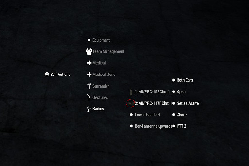

# Controls avançats

Abans de començar a explicar el funcionament de cada terminal,es important recordar i ampliar els coneixements sobre els controls predeterminats de l'ACRE2.

## Controls de teclat

### Push-to-talk

Com ja sabràs, per parlar per la radio s'utilitza la tecla Caps Lock, però això només es un de fins a tres controls de tipus "Push-to-talk" (PTT). Aquests controls extres et permeten parlar de manera simultància per diferents terminals sense haver d'estar canviant el terminal actiu. A més com veuràs en el següent apartat d'interacció, podràs assignar un PTT a cada radio manualment. Per defecte tens disponibles:

- **PTT1**: Caps Lock

- **PTT2**: Ctrl+Caps Lock

- **PTT3**: Alt+Caps Lock

### Canviar de canal rapidament

Pots canviar de canal rapidament de la radio primària (activa) utilitzant Ctrl+Up i Ctrl+Down.

### Canviar auricular rapidament

Una de les funcions útils es poder configurar per quin dels dos auriculars es reproduïrà el so de cada terminal. Això et permet configurar diversos terminals per a rebre comunicacions diferents i distingir-les per l'auricular on es reprodueixen. Pots canviar la configuració rapidament de la teva radio primària amb:

- Auricular dret: Shift+Ctrl+Right

- Auricular esquerra: Shift+Ctrl+Left

- Tots dos: Shift+Ctrl+Up

- Apagar auriculars: Shift+Ctrl+Down

### Canviar direcció de l'antena

Pots canviar la direcció de l'antena de la radio primària fent servir Ctrl+Alt+Up per a focalitzar o generalitzar l'emissió (Curs de JTAC).

### Canviar radio primària

Per canviar la radio primària, pots fer servir Shift+Alt+Caps Lock. Aniràs alternant entre les radios que tens a l'inventari.

## Interacció

A part dels controls, també tenim disponible un sub-menú d'interacció per a manipular els nostres terminals.

Si utilitzes interacció pròpia de l'ACE 3 veuràs que tens una opció "Radios". Si poses el cursor sobre aquesta opció es desplegaran una serie d'opcions addicionals, pasem a explicar que es cada cosa i per a que serveix.

{: .center}

### Llista de terminals disponibles

Primerament et surten ordenats els terminals que tens dins el teu inventari juntament amb el canal al qual estan configurats. Per defecte, el terminal que surt primer es el terminal primari. Si poses el cursor sobre d'ells veuràs que es despleguen una serie d'opcions:

- **Both Ears**: Aqui pots canviar la direcció del so dels auriculars tal i com hem explicat en el apartat anterior.
- **Open**: Obre l'interficie de la radio.
- **Set as Active**: Colocarà la radio com a radio primària.
- **Share**: Fa que la teva radio sigui accessible per a altres companys que estiguin a prop teu via el menú d'interacció externa. D'aquesta manera, un company pot prendre el telèfon de la teva radio i utilitzar-lo, mentres això succeeixi, la radio no estarà disponible per a tu.
- **PTT**: Permet canviar el PTT assignat a la radio en qüestió.

### Lower/Raise Headset

Activa o desactiva el mode de baix volum dels auriculars, això es pot utilitzar quan sigui necessari prioritzar les comunicacions a viva veu o per evitar molèsties en cas d'estar a malles secundàries en les quals la informació no sigui rellevant.

### Bend antena upwards

Canvia la direcció de l'antena per a focalitzar o generalitzar l'emissió (Curs de JTAC).
