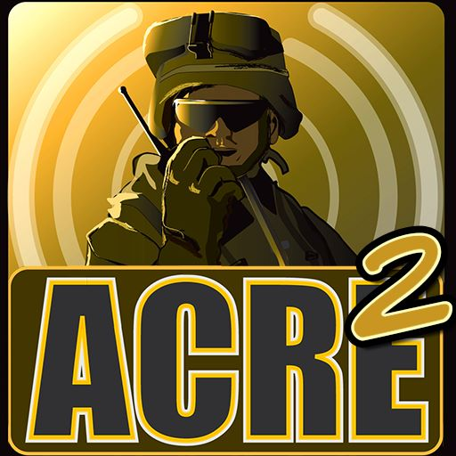

# Introducció

Advanced Combat Radio Environment 2 es la segona entrega del famós mod de comunicacions per a ArmA 3. Es tracta d'un assortit de sistemes que combinats milloren el realisme de les comunicacions a nivell militar. Algunes de les principals característiques son:

- Sistema de veu 3D, amb modulació de volum i detecció per la IA.

- Simulació detallada de diferents terminals de comunicació reals.

- Simulació de diferents models de propagació i interferències.

- Sistema de racks i intercom per a vehicles.

- Sistema de llenguatges configurable.

En aquest manual només cobrirem aquelles característiques considerades avançades i que son d'ús habitual per part del regiment.

{: .center}
