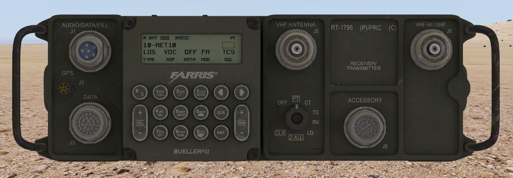

# AN/PRC-117F

El terminal LRR AN/PRC-117F es una radio de rack de llarg abast i de funcionament digital amb suport multibanda.  Fabricada per Harris Corporation, es un dels transmissors mes segurs del mercat i molt utilitzats per a radio-teleoperadors, en funcionament es molt similar a la AN/PRC-152 tot i que la seva potència es molt mes elevada.

De la mateixa manera, utilitza un sistema de presets. A diferència de la PRC-152 aqui s'anomenen "NET" o malla.

{: .center}

| **Característiques**        | **Descripció**     |
|-----------------------------|--------------------|
| **Canals**                  | 99 presets         |
| **Freqüències**             | 30 a 2000 MHz    |
| **Tipus de servei**         | Radio de camp de rack de llarg abast digital         |
| **Pes**                     | 3.7 kg             |
| **Abast en zona urbana**    | 10-20 km           |
| **Abast a camp obert**      | Horitzó            |
| **Potència estàndard**      | 20 W               |
| **Model de propagació estàndard**    | LOS             |

## Ús basic

- El dial PT ens permet encendre/apagar i canviar el mode de la radio, per defecte deixarem sempre PT.
- Per canviar el preset sel·leccionat cal utilitzar la tecla "**PRE**" amb els simbols "+" i "-".
- Per a modificar el volum s'ha d'utilitzar el botó "**VOL**" a l'esquerra del teclat alfanumèric.
- Per a veure la informació del preset actual s'ha de fer clic al botó "0" fins a 3 vegades.
- Per accedir al menú de configuracions opcionals s'ha de fer clic al botó "7" (**OPT**).
- Per accedir al menú principal de configuració de la radio s'ha de fer clic al botó "8" (**PGM**).
- Amb la tecla **CLR** cancel·lem la sel·lecció actual o resetegem una configuració.
- Amb la tecla **ENT** confirmem la sel·lecció actual.
- Amb les tecles de direcció canviem la sel·lecció actual o movem el cursor.
- Per entrar dades alfanumèriques s'utilitza el teclat amb numeros del 0 al 9.

## Configuració de presets

Tot i que habitualment amb els 99 presets que ja venen configurats en tindrem mes que suficient, hi ha algunes circumstàncies especials on configurar un preset sigui necessari o d'utilitat.

1. Per a fer-ho anirem tocarem la tecla **PGM** i sel·leccionarem "**NORM**".
2. Sel·leccionem "**NET**".
3. Seleccionarem el preset que volem modificar (teclat alfanumèric).
4. Seguidament ens demanarà si volem que estigui disponible a la llista, ho deixem en "YES".
5. Seguidament ens demanarà el model de propagació, li diem sempre a "**LOS**".
6. A partir d'aqui tindrem diferents opcions:

    - **FREQ**:  Ens permet canviar les freqüències d'emissió (TX) i recepció (RX) i ens demanarà si es un preset de només recepció o no.
    - **COMSEC**: No funciona.
    - **DATA**: No funciona.
    - **SQUELCH**: Ens permet modificar l'squelch de la mateixa manera que amb la PRC-152.
    - **TX POWER**: Potència d'emissió, per defecte sempre està al màxim.
    - **NAME**: Ens permet canviar el nom del preset.
