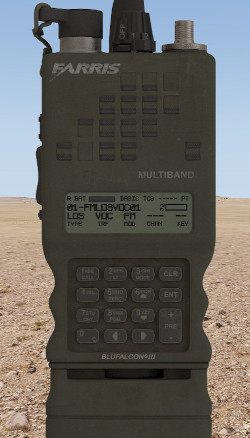

# AN/PRC-152

El terminal LRR AN/PRC-152 es una radio personal lleugera de llarg abast i de funcionament digital amb suport multibanda. Fabricada per Harris Corporation, es un dels transmissors mes segurs del mercat i molt utilitzats per a radio-teleoperadors, principalment de forces especials i grups d'operacions especials d'arreu del mon. Es directament compatible amb la AN/PRC-117F.

Utilitza un sistema de "presets" o canals que a part de les freqüències d'emissió i recepció ens permet configurar altres elements com la forma de propagació, l'squelch, etc.

{: .center}

| **Característiques**        | **Descripció**     |
|-----------------------------|--------------------|
| **Canals**                  | 99 presets         |
| **Freqüències**             | 30 a 511.99 MHz    |
| **Tipus de servei**         | Radio personal de curt/mitjà abast digital         |
| **Pes**                     | 1.22 kg            |
| **Abast en zona urbana**    | 3-5 km             |
| **Abast a camp obert**      | 5-7 km             |
| **Potència estàndard**      | 5 W                |
| **Model de propagació estàndard**    | LOS             |

## Ús basic

- El dial superior permet canviar entre els 5 primers presets.
- Per canviar el preset sel·leccionat cal utilitzar la tecla "**PRE**" amb els simbols "+" i "-".
- Per a modificar el volum s'ha de fer clic dret i esquerra sobre el botó lateral superior esquerra de la radio.
- Per a veure la informació del preset actual s'ha de fer clic al botó "0" fins a 3 vegades.
- Per accedir al menú de configuracions opcionals s'ha de fer clic al botó "7" (**OPT**).
- Per accedir al menú principal de configuració de la radio s'ha de fer clic al botó "8" (PGM).
- Amb la tecla **CLR** cancel·lem la sel·lecció actual o resetegem una configuració.
- Amb la tecla **ENT** confirmem la sel·lecció actual.
- Amb les tecles de direcció canviem la sel·lecció actual o movem el cursor.
- Per entrar dades alfanumèriques s'utilitza el teclat amb numeros del 0 al 9.

## Configuració de presets

Tot i que habitualment amb els 99 presets que ja venen configurats en tindrem mes que suficient, hi ha algunes circumstàncies especials on configurar un preset sigui necessari o d'utilitat.

1. Per a fer-ho anirem tocarem la tecla **PGM** i sel·leccionarem "**SYSTEM PRESETS**".

2. Veurem 3 opcions, només ens interessa la primera "**SYSTEM PRESET CONFIG**".

3. Seleccionarem el preset que volem modificar.

4. Seguidament ens demanarà de modificar la descripció del preset, li podem posar el que vulguem amb el teclat alfanumèric.

5. Seguidament ens demanarà el model de propagació, li diem sempre a "**VULOS**".

6. A partir d'aqui tindrem diferents opcions:

    - **RADIO OPTIONS**: Ens permet tornar a canviar la descripció del preset i el model de propagació.
    - **FREQUENCY**: Ens permet canviar les freqüències d'emissió (TX) i recepció (RX) i       ens demanarà si es un preset de només recepció o no.
    - **COMSEC**: No funciona.
    - **TRAFFIC**: No funciona.
    - **TX POWER**: Potència d'emissió, per defecte sempre està al màxim.
    - **SQUELCH**: Ens permet modificar l'squelch que serveix per establir la trucada entre els diferents transmissors. Només es útil modificar-lo si volem comunicar-nos amb una radio analògica. Només admet el mode CTCSS i ens permet ajustar la freqüència en KHz tant d'emissió com recepció.
    - **EXIT**: Desa el preset i torna al menú principal.
