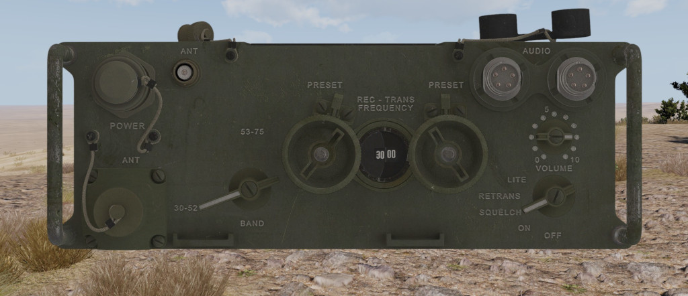

# AN/PRC-77

La ràdio LRR AN/PRC-77 es una radio de rack que opera en freqüències VHF FM i va entrar en servei el 1968 durant la Guerra de Vietnam. En l'actualitat s'utilitza poc, tanmateix segueix essent compatible amb la majoria de transmissors moderns i es menys pesada que models més actuals.

A diferència dels dos transmissors anteriors, aquest model disposa d'un panell completament analògic, però per contra molt més intuitiu i fàcil d'entendre tal i com es pot veure en la imatge.

A continuació detallem les característiques tècniques principals de la AN/PRC-77.

{: .center}

| **Característiques**        | **Descripció**     |
|-----------------------------|--------------------|
| **Canals**                  | 960 en dues bandes |
| **Freqüències**             | 30.00 a 52.95 i 53.00 a 75.95 MHz    |
| **Tipus de servei**         | Radio de camp de rack de llarg abast analògica         |
| **Pes**                     | 6.2 kg             |
| **Abast en zona urbana**    | 1-3 km             |
| **Abast a camp obert**      | 3-5 km             |
| **Potència estàndard**      | 4 W                |
| **Model de propagació estàndard**    | LOS             |

## Ús basic

- **Band**: Canvia la banda a la qual opera la radio, podem triar entre 30-52 MHz o 53-75 MHz.
- **Dial esquerra**: Permet sintonitzar la freqüència en l'àmbit dels MHz, amb clic dret i esquerra movem el dial, si mantenim apretat SHIFT avancem de 5 en 5 MHz.
- **Dial dret**: Permet sintonitzar la freqüència en l'àmbit dels KHz, funciona igual que l'anterior.
- **Preset**: Un cop canviada la freqüència si fem clic dret sobre les pestanyes de preset la desarem. Per a utilitzar-la més endavant simplement farem clic esquerra sobre les pestanyes.
- **Volume**: Permet modificar el volum de recepció.
- **Mode**: Permet encendre, apagar o utilitzar un mode especial. Per defecte s'ha d'utilitzar "Squelch".

## Modes

- **Off**: Radio apagada.
- **On**: Radio encesa.
- **Squelch**: Radio encesa en mode squelch (emetrà un paquet de trucada de 150 KHz), per defecte hem d'utilitzar sempre aquest mode.
- **Retrans**: Posa la radio en mode de retransmissió unicament. Això fa que la radio serveixi de repetidor de les comunicacions que entrin en la mateixa freqüència. No te utilitat actualment.
- **Lite**: Il·lumina temporalment el panell de freqüències. No te utilitat actualment.
