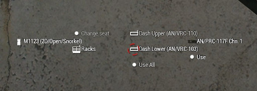

# Racks de vehicle

En molts vehicles disposem de "racks" que permeten connectar una radio de llarg abast per a amplificar la seva potència i permetre'n l'ús entre la tripulació del vehicle mitjançant el sistema d'intercom.

Hi ha diversos racks però els que ens interesen a nosaltres son:

- **AN/VRC-103**: Permet muntar una AN/PRC-117F que veurà incrementada la seva potència de 20W a 50W.
- **AN/VRC-110**: Permet muntar una AN/PRC-152 que veurà incrementada la seva potència de 5W a 50W.

Per a accedir als "racks" heu d'estar asseguts en una posició frontal del vehicle (conductor o copilot) i utilitzar interacció externa de l'ACE3. Us apareixerà la opció "Racks", dins d'aquesta veureu els racks disponibles del vehicle, normalment n'hi ha dos, un VRC-103 amb una radio PRC-117F ja muntada i un VRC-110 que permet connectar la vostra PRC-152 personal (si en porteu). No us oblideu de desconnectar el terminal abans de baixar del vehicle.

Des del menú d'interacció podeu activar l'ús de la radio amb les opcions "Use All" o "Use", un cop fet això, el terminal passarà a formar part de la llista de terminals personals i podreu interactuar amb ell com si fos qualsevol altre. També podreu canviar coses com la direcció de l'auricular, la direcció de l'antena, el PTT, etc.

{: .center}
