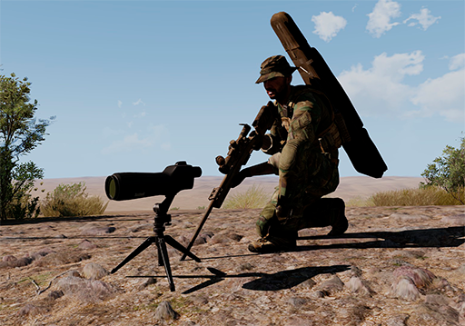
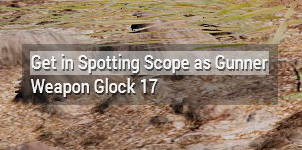
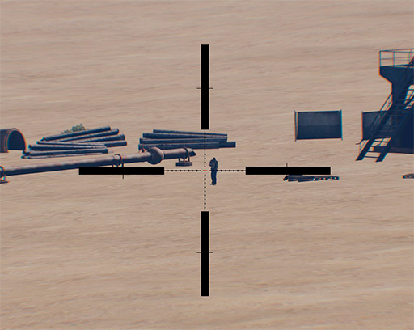

# ANNEX 1: Telescòpi portàtil (Spotting Scope)

El telescopi portàtil, també conegut com a Spotting Scope, es una eina que tenim disponible i que es molt útil per al rol d'observador, tot i que no sempre es pot dur a sobre principalment per qüestions logístiques.

Es tracta simplement d'un telescòpi que disposa d'una retícula Mildot convencional, però que a diferència d'una mira telescòpica te els avantatges d'estar recolzat amb un tripode i per tant evitar el moviment, i de tenir practicament el doble d'augments, la qual cosa ens permet d'observar amb molt detall on impacten les bales disparades.

Per a desplegar el telescopi ho farem com sempre des del menú de l'ACE d'equipament. Un cop seleccionat ens apareixerà cap on estiguem mirant però el podem moure amb interració externa (tipic arrosegar).

{: .center}

Per poder mirar a través d'ell hem d'entrar a dins com si es tractés d'una arma estàtica, amb el menú conceptual (roda del ratolí) i posteriorment "Get in Spotting Scope as Gunner".

Apareixereu bocaterrossa davant del telescòpi i per mirar a través d'ell només heu de polsar el botó dret del ratolí, tal com ho feu amb qualsevol altra òptica del simulador.

{: .center}

Veureu una retícula que us semblarà molt familiar, efectivament, es la mateixa retícula Mildot que ja hem vist en aquest manual. Amb les tecles +++++ i ++-++ calibrem el nivell de zoom del telescòpi.

{: .center}

Per a utilitzar-lo simplement heu de situar la creu central vermella sobre on heu vist l'impacte de la bala del vostre company, heu d'estar atents ja que normalment els trets tenen un efecte o un altre segons impactin, per exemple sobre la sorra solen aixecar una mica de pols, en canvi sobre una superfície metàl·lica solen desprendre unes espurnes.

Un cop tingueu la creu situada a on ha impactat la bala, només heu de comptar la desviació en mils respecte a on està l'objectiu fent servir els dos eixos.

!!! danger "Atenció"

	No hem de confondre el telescòpi amb un telèmetre, ja que aquest no disposa de cap funció per calcular distàncies. Sempre hem de dur un Vector 21 a part o algun altre tipus de telèmetre.
