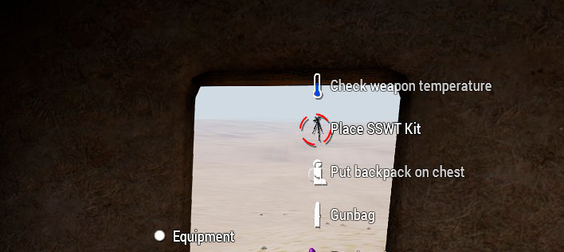
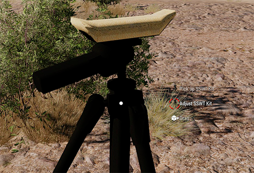
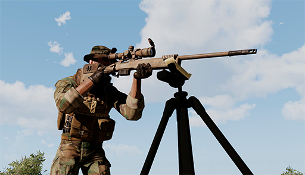

# ANNEX 2: Tripode SSWT

El tripode SSWT es un tripode especial per a franctiradors principalment pensat per recolzar el fusell i obtenir estabilitat des d'una posició en la qual per diferents circumstàncies no podem recolzar el fusell. Un bon exemple es quan ens trobem en la necessitat de disparar des d'una finestra d'un edifici i no volem exposar-nos recolzant el fusell amb l'ampit de la finestra.

La col·locació funciona de la mateixa manera que amb el telescopi portàtil, des del menú d'interacció a l'apartat d'equipament.

{: .center}

A part de les funcions habituals, també podem ajustar l'alçada del mateix interactuant amb ell tal com es veu en la següent imatge.

{: .center}

Per a utilitzar-lo simplement, acostem el fusell i premem la combinació de tecles per a recolzar l'arma com ho fem habitualment quan es a terra o sobre un mur.

{: .center}

