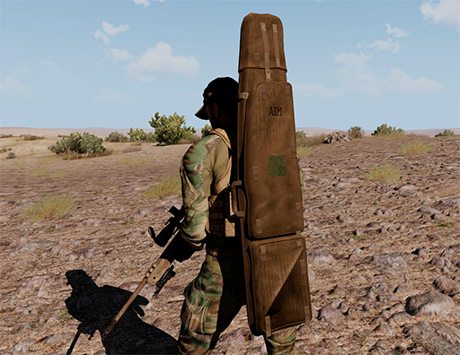
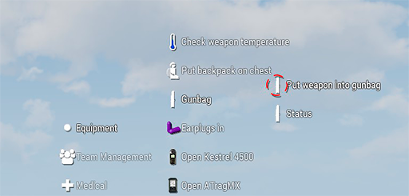
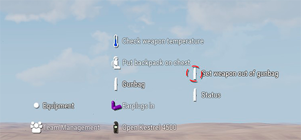

# ANNEX 3: Funda del fusell (Gunbag)

La funda del fusell es un tipus de motxilla que podrem trobar habitualment a qualsevol arsenal, està disponible en dos tipus de camuflatge, la reconeixereu amb el nom en anglès "Gunbag". A diferència de la majoria de motxilles aquesta disposa d'una funció especialment dissenyada per als franctiradors.

{: .center}

Si tenim la motxilla penjada i utilitzem la interacció pròpia, veurem que ens dona dues opcions, desar el fusell dins la bossa o comprovar si hi ha alguna arma dins. La funció de la bossa es simplement desar el fusell de precissió de manera que podem dur una arma secundària com un fusell d'assalt. Quan desem el fusell fent servir aquesta opció, veurem que a l'inventari no ocupa un lloc virtual, d'aquesta manera ens queda una mica d'espai per a desar també els estris de mesura i la munició.

{: .center}

De la mateixa manera que hem introduït el fusell, el podem treure tal com es veu en la següent imatge.

{: .center}

!!! danger "Precaució"

	Intenteu no fer malabarismes amb les armes de les que disposeu i la funda, ja que s'ha donat algun cas estrany en que han desaparegut fusells o munició. Intenteu no abusar d'aquestes opcions sobrecarregant el vostre inventari d'objectes.
