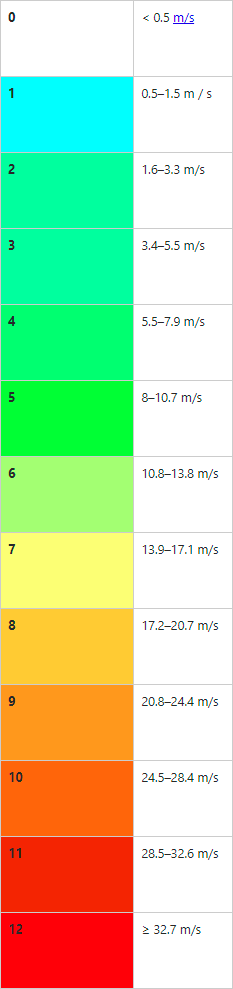

# ANNEX 4: Escala de Beaufort

L'escala de Beaufort és una mesura empírica de la intensitat del vent i es basa principalment en l'estat de la mar, les onades i la força del vent. El nom complet és Escala de Beaufort de la força del vent, tot i que és una mesura de la velocitat del vent i no de la força en el sentit científic. Va ser creada el 1805 per Francis Beaufort, qui li va donar el nom. L'escala bàsica té dotze graus, i existeix una versió ampliada per adonar dels ciclons i altres fenòmens extrems.

**Taula de colors adaptada a l'ArmA 3:**

{: .center}
