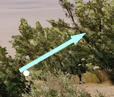
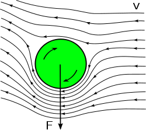
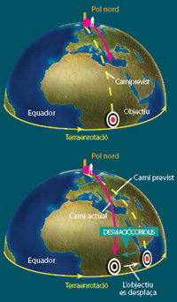
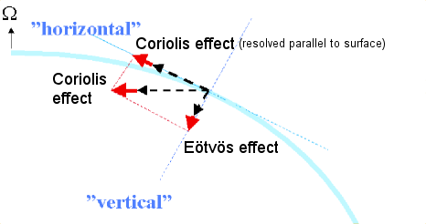

# Balística avançada

Al Primer Regiment Amfibi utilitzem el mod ACE 3 que incorpora un mòdul de balística avançada. Aquest mòdul simula diferents efectes de l'entorn que tenen incidència en la trajectoria de la bala.

Aquests efectes si bé son poc destacables a distància de fuseller, si ho son a distàncies llargues com les que utilitza generalment un franctirador.

En aquest apartat expliquem els principals efectes físics que es tenen en compte i algunes recomanacions sobre com corregir-los.

## Densitat de l'aire

L'aire, com l'aigua, actua com un fluid i provoca fricció amb els cossos que s'hi mouen. El nivell de fricció augmenta de manera proporcional a la densitat del mateix. La densitat de l'aire no es sempre la mateixa si bé es sol dir que l'aire te una densitat de 1,18 kg/m3, això només es vàlid a la temperatura de 25ºC. La densitat de l'aire pateix variacions que estan subjectes directament a tres paràmetres:

- Temperatura.
- Humitat relativa.
- Pressió baromètrica.

Quan més elevada sigui la densitat de l'aire més serà la fricció que provocarà a les bales i per tant aquestes perdran força de manera més rapida. En conseqüència hem de tenir en compte diferents factors a l'hora de regular el tret. 

Els paràmetres indicats es poden calcular amb l'ajuda d'un Kestrel 4500 o un MicroDAGR. Aquests paràmetres es faràn servir tant en la taula de rangs com en la calculadora ATragMX per a calcular les correccions que cal fer.

## Desviació per vent

La desviació degut al vent també es un element molt destacable que també es present en distàncies de fuseller però molt més en franctiradors.

Per a tenir en compte el vent podem fer-ho de tres maneres:

   1. **Aproximant a ull:** Fent servir el dit mullat en saliva (++shift+k++) podem notar d'on ve el vent i amb quina intensitat. La intensitat aparent ve donada amb codi de colors de l'Escala de Beaufort d'aquesta manera podem aproximar la velocitat del vent (molt útil per a correccions ràpides i per aplicar amb la taula de rangs. Consultar ANNEX 4 per a veure la taula d'aproximacions.

{: .center}

  2. **Fent servir el Kestrel 4500:** Sens dubte la millor manera es fent servir la estació meteorològica portàtil Kestrel 4500 que ens permet saber no només la direcció sinò també la velocitat en m/s. Amb aquesta dada podem calcular la desviació de forma molt més exacta ja sigui utilitzant la taula de rangs o un ATragMX.

Per corregir la desviació per vent cal tenir en compte l'anomenat *crosswind* que es el vent que va de lateral (el vent que ve de cara o de front no es comptabilitza com a desviació). L'aparell Kestrel es capaç de separar el vector del vent en les dues components, *headwind* i *crosswind*, en cas de no disposar de Kestrel, aquest valor es pot estimar segons l'angle que formi la direcció del vent respecte de l'azimut de l'arma.

Per exemple, si la fletxa està inclinada de manera que forma un angle de 45 graus (diagonal cap a munt o avall), podem estimar que el crosswind serà 1/2 del valor aproximat per l'Escala de Beaufort. Aquests càlculs, només son realment útils si no disposem de la calculadora a ma o si tenim temps de sobres per a fer-los. Normalment si la força del vent es dèbil, o la distància curta, es poden ignorar.

**Mètode del rellotge:**

* Si el vent ve de les 8 a les 10 o de les 2 a les 4: aplicar el 100% de la correcció (total).
* Si el vent ve de les 7, de les 11, de la 1, o de les 5: aplicar el 50% de la correcció (la meitat).
* Si el vent ve de les 12 o de les 6: no s'aplica cap correcció per vent.

Recordem l'EBC:

{: .center}

## Efecte Magnus o Spin Drift

Es un efecte físic descobert pel físic alemany Heinrich Gustav Magnus (d'aqui el nom) que explica com un cos en rotació i desplaçant-se a través d'un fluid (aire) crea un remolí d'aire al seu voltant, de manera que provoca un canvi de pressió en el sentit en el qual rota, de manera que fa que l'objecte tendeixi a desviar-se en aquesta direcció.

{: .center}

En balística aquest efecte es notori sobretot a grans distàncies, ja que la mateixa rotació de la bala fa que aquesta es desviï en la direcció en la qual esta girant. La compensació per aquest fet està inclosa per defecte en les dades balístiques de cada tipus de munició i segons la densitat de l'aire (calculadora balística).

## Efecte Coriolis

L'Efecte Coriolis es una acceleració aparent d'un cos que es mou de manera lliure (per exemple una bala) des del punt de vista d'un altre cos que està en rotació (nosaltres). Aquest efecte es degut a la rotació de la Terra i succeeix degut a que el tirador es troba adherit al sol del planeta i per tant en rotació amb el mateix i en canvi, la bala es mou de manera lliure, doncs no està en contacte amb el sol (únicament amb l'aire), això provoca un desplaçament o acceleració que provoca una desviació aparent de la bala (tot i que realment qui es mou som nosaltres).

{: .center}

Per a compensar la desviació per Coriolis cal utilitzar una calculadora balística (ATragMX) i introduïr la latitud on ens trobem (més endavant s'explicarà com obtenir-la) a més de l'azimut, de tal manera que la mateixa realitza les correccions adequades a cada cas. Això es veurà de manera més detallada a l'apartat de la calculadora.

## Efecte Eötvös

L'Efecte Eötvös es un efecte que contrarresta la força de la gravetat en el cas d'un cos en rotació, es tracta de restar a la força de la gravetat, la força centrífuga creada pel mateix objecte en rotació. D'aquesta manera i segon on ens trobem, una bala pot estar afectada per petites variacions de la força de la gravetat que poden provocar lleugeres desviacions en la paràbola a llargues distàncies.

Per a posar-ho en concordància amb l'Efecte Coriolis, l'Eötvös provoca una desviació, vertical, mentres que Coriolis es horitzontal. Ambdós efectes son provocats per la rotació del planeta.

{: .center}
