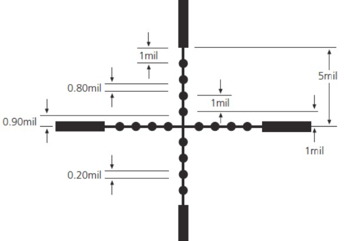
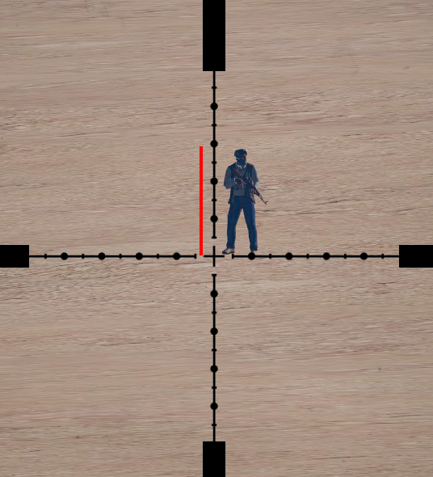
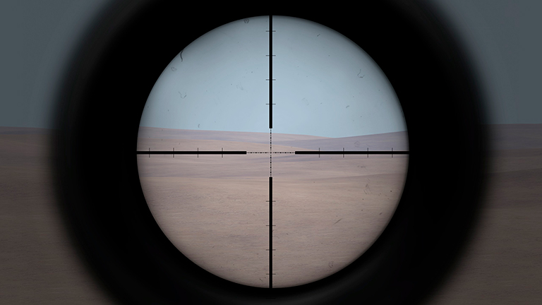
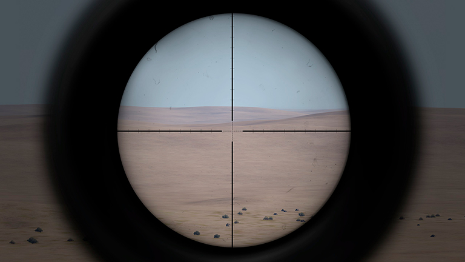
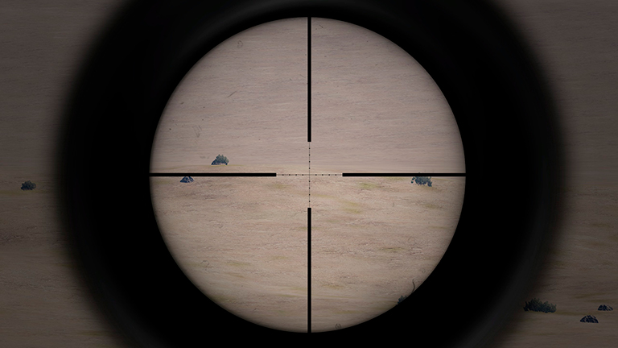
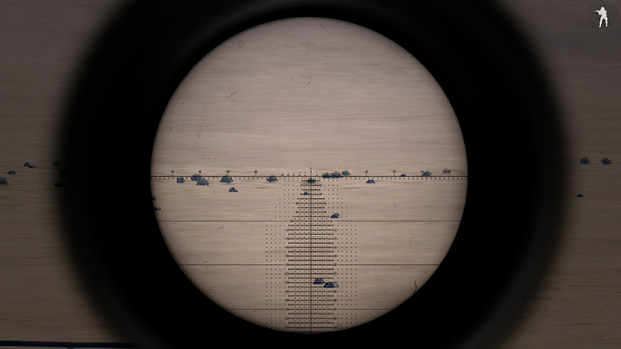
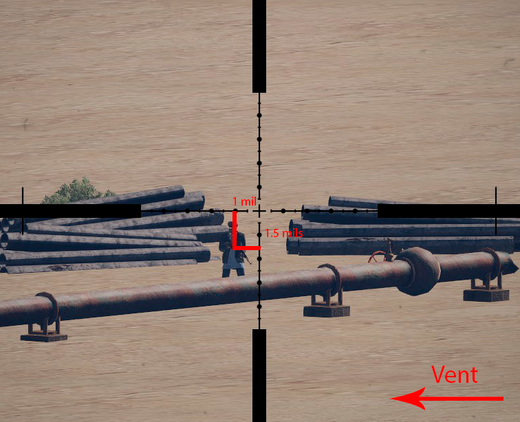
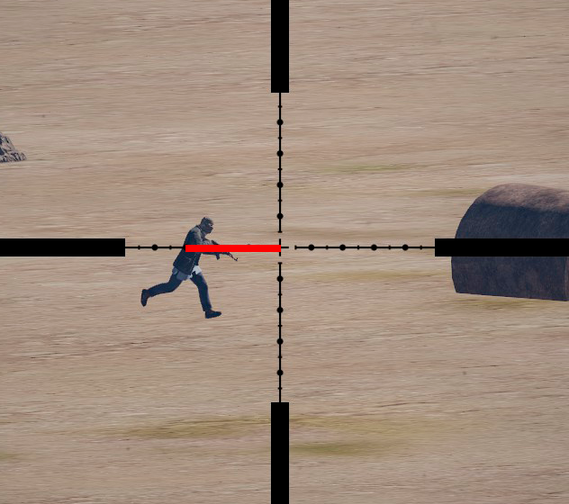
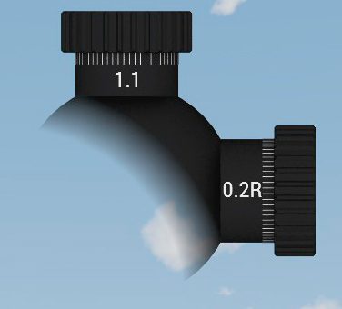
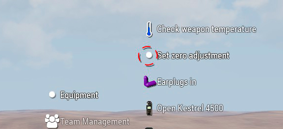

# Mires telescòpiques i zeroing

Una de les coses més importants del rol de franctirador es saber utilitzar correctament les mires telescòpiques i saber-les calibrar adequadament segons els paràmetres balístiques que s'han vist en l'anterior apartat. 

## El Miliradiant

Es una unitat de mesura angular que equival a 0.001 radiants, es a dir una mil·lèssima de radiant, el radiant es una unitat de mesura d'angles de manera similar als graus centesimals, de manera que 2π radiants equivalen a 360 graus centesimals. La mil·lèssima de radiant es comunment coneguda com a **"mil"** o **"mrad"**, la qual serveix per a calibrar les mires telescòpiques que incorporen un sistema de calibratge basat en aquesta unitat. Els miliradiants no només estan presents en l'àmbit dels franctiradors com haureu pogut deduir, sino que també serveixen per aspectes relacionats amb l'artilleria i els suports, fixeu-vos per exemple en la segona escala de la vostra bruixola.

El perque d'utilitzar aquesta unitat en l'ambit dels tiradors, es pel fet que es molt precisa, i ens permet filar molt prim, de manera que les desviacions dels trets a més distància, poden reduïr-se a uns pocs centímetres.

De la mateixa manera que veu estudiar a l'EBC, quan es dispara amb un fusell, la bala dibuixa una trajectòria parabòlica i perd altura a mesura que perd energia pel fregament amb l'aire, i cal compensar aquesta caiguda d'alguna manera. En rangs relativament curts, la compensació es manual o fent servir una reticula pre-calibrada com la ACOG, però a distàncies llargues, un sol grau angular podria suposar metres de desviació, es per això que utilitzem una unitat molt més petita.

En el següent gràfic podeu veure com una precisió de 0.1 mrad suposen només una desviació màxima de 2 cm a 200m. Si fos un tret a 1200 metres suposaria una desviació màxima 12 centímetres per cada mil·lèsima de radiant (sempre en condicions ideals i sense tenir en compte la precissió del fusell). Heus ací el motiu pel qual fem servir miliradiants.

En les mires Mil-Dot, els espais entre mils es podrien fer servir per calcular la distància a la que esta un blanc respecte un altre només sabent la distància a la que es troben.

{: .center}

Heu de conèixer que a part dels miliradiants existeix una altra unitat de mesura que s'utilitza en alguns exèrcits i s'inclou dins del Sistema Imperial d'Unitats, es tracta del **MOA** o "Minute Of Arc", minut d'arc. Aquesta unitat funciona de la mateixa manera que els miliradiants, però com que a l'ArmA 3 actualment no la fem servir, i per tant la obviarem, però que sapigueu que existeix i possiblement la veureu en alguns llocs (com per exemple a la calculadora balística).

## Mires telescòpiques Mil-Dot

La mira telescòpica amb reticula Mil-Dot es la més freqüent i la que nosaltres utilitzarem com a estàndard, degut tant al fet de la seva senzillesa com a que permet fer correccions en mils de manera molt rapida i sense necessitat d'estar recalibrant constament la mira.

La retícula esta formada per una creu amb uns eixos gruixuts als extrems i prims al centre i amb una serie de 8 punts negres per a cada eix.

Els punts negres serveixen per calcular les correccions en mils. De manera que un interval complet des del centre d'un dels punts fins al centre del següent, es mesura 1 mil. Les ratlles entre dos punts equivalen a 0.8 mils i el diametre de cada punt a 0.2 mils. El total des del centre de la reticula a cada una de les linies gruixudes es de 5 mils. Tot aixo ho podeu veure millor en la següent il·lustració.

{: .center}

!!! hint "Truc"

	Amb la retícula mildot podem estimar la distància del blanc en el cas que no tinguem telèmetre. Per a fer-ho hem d'estimar l'altura d'aquest (per a un soldat se sol utilitzar 180 centímetres), multiplicar-la per 1000 i dividir el resultat per el nombre de mils que ocupa i que ens indica la reticula al colocar la base de la creu al peu del blanc.

  {: .center}

### Mira telescòpica M8541

La retícula de la mira M8541 disposa dels punts que marquen els mils però també d'una serie de ratlles intermedies que permeten filar més prim, de manera que obtenim intervals de 0.5 mils. A partir de 5 mils, els eixos gruixuts presenten també ratlles cada 5 mils. Aquesta mira es interessant per a tirs a distàncies inferiors al kilòmetre.

{: .center}

### Mira telescòpica M8541A

També tenim la M8541A, versió llarga de l'anterior, també presenta el mateix format però amb molts mes augments.

{: .center}

### Mira telescòpica Leupold Mk. 4 ER/T M3

Finalment la reticula de la mira Leupold Mk. 4 ER/T M3 es la versió més senzilla (Mil-Dot clàssica) amb només marques de punts com en l'esquema del principi, també ideal per al rol de tirador designat.

{: .center}

## Mires telescòpiques Mil-Dot especials

### Mira telescòpica Leupold Mk. 4 ER/T M5

Tot i que no les utilitzarem de manera habitual, cal conèixer tot el que ens podem trobar mentres duem a terme el rol de franctirador. Tot i que hi ha més varietat de mires, entre les més freqüents es probable que us trobeu amb aquesta:

{: .center}

Aquesta mira en concret es una Leupold Mk. 4 ER/T M5 i es una mira especialment dissenyada per a molt llargues distàncies. Es basa en el fet de que, a diferència de les Mil-Dot normals que permeten una desviació màxima de 5 mils sense recalibrar, aquestes permeten fins a 35 mils per eix, per tant son ideals per evitar estar recalibrant tota l'estona a distàncies llargues. Tanmateix poden ser una mica complicades d'entendre per algú novell degut a que disposen de multitud de nombres, ratlles i punts que poden despistar al tirador. Es per això i pel fet de que rarament haureu de fer un tret amb més de 10 mils de desviació, que aquestes mires es reserven per ocasions especials.

## Correccions amb la retícula Mil-Dot

Partint del que hem explicat al punt anterior, amb la reticula Mil-Dot podem corregir el tret sense haver de calibrar manualment la mateixa. Utilitzant els dos eixos, el vertical per a la caiguda de la bala i l'horitzontal per a la desviació (ja sigui per vent o per moviment), podem ajustar el tret mantenint la mira en zero mils.

Per a fer-ho simplement situem cada eix a l'altura que ens convé tenint en compte que cada interval entre punt equival a 1 mil, així doncs, tracem dos eixos imaginaris sobre l'objectiu, de tal manera que el centre d'aquest sigui el punt on conflueixen tal com es veu en la imatge següent:

{: .center}

En aquest cas hem calculat que el vent ve de dreta a esquerra i no es gaire fort, per tant corregim la possible desviació de la bala 1 mil a la esquerra, movent el centre d'eixos 1 mil a la dreta per a compensar. També hem calculat que hem de corregir la caiguda de la bala en 1.5 mils degut a la distància de l'objectiu i la temperatura, tot fent servir la taula de rangs que veurem al següent capítol.

Cal entendre que no tansols podem ajustar el tret horitzontalment per a compensar l'acció del vent, també ho podem fer per compensar el moviment relatiu d'un cos de manera horitzontal, tal com es pot veure en la següent imatge: 

{: .center}

En aquests casos sol ser imprescindible utilitzar la retícula per a ajustar el tret degut a que per la naturalesa de la situació no ens es possible calibrar rapidament la mira. Cal que tingueu en compte que les imatges son purament il·lustratives, per a ajustar el tret cal que ho feu tenint en compte tots els paràmetres que veureu al llarg del manual.

També cal indicar que tot i que hi ha mètodes per encertar blancs en moviment (retícula, taula de rangs, calculadora) tots ells requereixen de molta pràctica i habilitat. No us preocupeu si no sou capaços d'encertar un blanc en moviment a la primera, es habitual fins i tot en tiradors veterans.

## Calibrar la mira

Per a calibrar la mira telescòpica tenim els dos dials (torretes), el superior i el lateral. El dial superior calibra l'elevació vertical, mentres que el lateral calibra la desviació horitzontal. 

Per a moure el dial superior, que es el que més utilitzarem a la pràctica, utilitzem les tecles ++page-down++ i ++page-up++. Cada **click** que fem equivaldrà a 0.1 mils, també podem utilitzar ++shift+page-up++ o ++shift+page-down++ per avançar 1 mil de cop. Es important destacar que per a compensar una caiguda de bala que s'expressa en mils negatius, a la mira ho hem de fer amb mils positius tal com hem comentat anteriorment i no s'ha de confondre. Si intentem calibrar l'elevació de forma negativa veurem que apareix una "D" al costat, aquesta "D" ens indica que estem forçant la caiguda de bala (drop) en la mira directament (no es recomanable calibrar en negatiu tret d'algun cas concret, com trets a molta curta distància o amb caiguda positiva degut al vent o fenòmens externs).

!!! hint "Click"

	S'anomena "click" a cada vegada que calibrem un dels dos dials i sona el classic "click", un click equival normalment a una dècima de miliradiant (a no ser que s'especifiqui el contrari prèviament). S'utilitza molt quan s'opera en binomi per a transmètre més ràpidament les correccions d'observador a franctirador.

Per moure el dial lateral es fa de la mateixa manera pero afegint la tecla ++ctrl++ al principi, per exemple ++ctrl+page-up++ o ctrl+page-down++. En aquest cas observarem que apareix una R o una L al costat del nombre de mils, això ens indica si estem calibrant la desviació cap a la dreta (R) o cap a l'esquerra (L). Penseu que la desviació horitzonal només es calibra per compensar desviació per vent o degut al moviment del blanc.

{: .center}

En el cas que vulguem definir un nou zeroing de la mira, podem utilitzar les opcions d'interacció "Set zero adjustment" per a "gravar" el valor actual de mils com a "ZERO" o "Reset zero adjustment" per tornar a la configuració per defecte.

{: .center}

