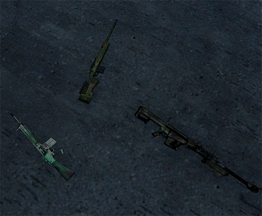
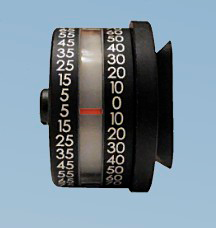
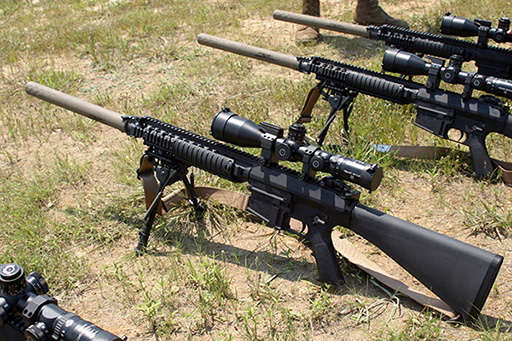
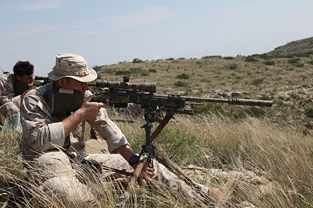
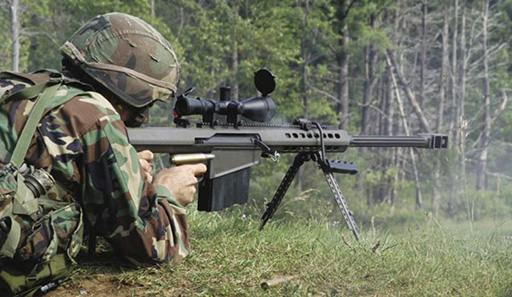

# Armament

Anomenem fusell de precisió a tot aquell fusell que per les seves característiques permet el tir acurat a distàncies mes llargues que un fusell d'assalt convencional, normalment iguals o superiors als 600m en condicions ideals.

Existeixen una gran varietat de fusells de precisió per a tots els propòsits, des dels més senzills i de semblança als fusells d'assalt, als més pesats, complexos i potents, capaços de fer tirs a una gran distància.

En aquesta especialització, ens centrarem però en tres d'ells, els quals tenim disponibles al nostre arsenal i son d'un ús habitual. Es tracta del Mk 11 Mod 0, del M40A6 i del famós M107 Barret.

També revisarem els diferents tipus de munició que tenim disponibles per a cada fusell i quan utilitzar-los.

{: .center}

### Escollir l'armament segons la situació

* **MTE (Multiple Target Engagement):** Es tracta de situacions on tenim multiples objectius a diferents distàncies o no, de manera que no es necessari "un tir un mort" ni tampoc necessàriament tirs a llarga distància. Habitualment per aquest tipus d'ocasions ens servirà un fusell de tipus *marksman* o M107 a llarga distància pel fet que ofereixen rapidesa al ser semiautomàtics i la precissió absoluta no es vital.

* **HVT (High Valuable Target):** Es tracta de situacions on hem d'abatre d'un sol tret un sol objectiu. En aquest cas prevaldrà l'ús de fusells de precisió com l'M40 o M107 i a distàncies mitjes i llargues.

* **HC (Hostage Crisis):** Aquestes situacions normalment requereixen de tir precís a distàncies curtes per tant depen molt de la zona on ens trobem podria ser interessant l'ús de fusells de *marksman*.

### Transportador (Protractor)

Tenim disponible un transportador per a calcular l'angle d'inclinació de l'arma (només funciona en fusells compatibles amb ACE3). Per a mostrar el transportador simplement hem de premer ++ctrl+shift+t++ mentre tenim l'arma alçada. El transportador desapareixerà quan abaixis el fusell o te'l pengis.

{: .center}

## Fusells

### Mk11 Mod 0

{: .center}

Es un fusell *marksman* semiautomàtic del calibre 7,62 basat en l'SR-25 manufacturat per Knight's Armament Company. Es tracta de la versió adaptada als usos i costums dels Marines dels Estats Units i especialment dissenyat per al rol de tirador designat, tot i que també s'utilitza molt en el rol de franctirador.

Els punts forts del fusell son principalment que es lleuger i fàcil de manegar, disposa d'un ampli carregador amb fins a 20 cartutxos, es semiautomàtic i permet tir precís fins vora els 800m.

| **Característiques**                | **Descripció**                                                                                                 |
|-------------------------------------|----------------------------------------------------------------------------------------------------------------|
| **Longitud de l'arma:**             | 1.118 mm                                                                                                      |
| **Canó:**  | 610 mm                                                                                                       |
| **Pes:**                            | 4,88 kg                                                                                                        |
| **Munició:**                        | 7.62×51mm NATO en carregadors de 20 cartutxos.           |
| **Rang màxim efectiu:**                 | 800 m                                                                                                                |
| **Rang màxim:** | 1.300 m                                                                      |
| **Acció:**          | Semi-automàtic                                                                                                      |

**Úsos:** 

Es ideal per al rol de tirador designat, per a franctiradors en entorns MOUT i per a situacions de MTE, degut a que te una elevada cadència de foc tenint en compte el tipus de fusell i tambe molt poc retrocés.

**Tipus de munició:**

- **M118**: Llarga distància FMJ. Ideal per a infanteria.
- **M62 (Tracer)**: Munició traçadora. Visible durant la nit.
- **M993 AP**: Alta penetració. Ideal per objectius a cobert en blindats o vehicles lleugers, per a rebentar pneumàtics o perforar dipòsits de combustible.

### M40A5

{: .center}

L'M40 es un fusell de precisió d'acció de forrellat fabricat per l'empresa Remington i modificat posteriorment per la unitat USMC 2112. Realment el fusell original es el Remington 700 però que, que un cop modificat, es transforma en el M40. 

Es el fusell de precisió per excelència al Cos de Marines dels Estats Units i el que fan servir habitualment els Scout Snipers del mateix cos.

Per les seves característiques, es força lleuger, te una precissió absoluta molt superior a l'Mk 11 i utilitza el calibre 7.62 de la mateixa manera que l'Mk 11, principalment amb el cartutx .308 . Depenent del tipus de munició que s'utilitzi i la temperatura ambient, passa que el rang d'aquest fusell sigui lleugerament superior al Mk 11 en certes circumstàncies, tanmateix el fet que sigui d'acció de forrellat i més pesat, fan que es reservi principalment per al rol de franctirador.

| **Característiques**                | **Descripció**                                                                                                 |
|-------------------------------------|----------------------------------------------------------------------------------------------------------------|
| **Longitud de l'arma:**             | 1.124 mm                                                                                                      |
| **Canó:**  | 610 mm                                                                                                       |
| **Pes:**                            | 7,5 kg                                                                                                        |
| **Munició:**                        | 7.62×51mm NATO en carregadors de 5 o 10 cartutxos o un a un.         |
| **Rang màxim efectiu:**                 | 800 m                                                                                                                |
| **Rang màxim:** | 1.300 m                                                                      |
| **Acció:**          | Forrellat                                                                                                     |

**Úsos:** 

Es ideal per al rol de franctirador a distàncies mitjanes, ideal per a utilitzar-se en binomi i per a tirs molt precissos, força superiors als de l'Mk 11. Ideal doncs per a situacions HVT i HC.

**Tipus de munició:**

Els mateixos que la Mk11 Mod 0.

### M107 Barrett (M82)

{: .center}

Es un fusell de precisió semiautomàtic de calibre .50 i antimaterial fabricat per Barrett Firearms Manufacturing. Tot i la seva designació antimaterial, es utilitzat principalment contra infanteria i es considera un calibre .50 "lleuger". Es famós mundialment amb el simple nom de "Barrett", degut a l'aparició en nombrosos videojocs i en el cinema.

El seu tamany i el seu potent tir el fan un dels fusells de precisió més pesats del mercat juntament amb el CheyTac M200 Intervention o el McMillan TAC-50, per exemple. Els seus usos son variats, es pot fer servir per inutilitzar vehícles i blindats lleugers amb munició Raufoss Mk 221 explosiva, però també per a infanteria amb munició blindada.

El seu punt més fort però es la distància a la qual pot operar, que deixa força enrera qualsevol altre rifle de precisió. I es que amb la suficient habilitat, es poden abatre contactes fins a 1.800m, tot i que el seu abast total està calculat als astronòmics 6.812m. Per contra, el pes del fusell i, sobretot, de la munició, fan que sigui dificil de transportar i operar en entorns tancats. A més l'arma te un gran retrocés, per la qual cosa s'ha d'operar sempre recolzada i a poder ser fent servir el bipode que incorpora.

Tot i ser un fusell indicat per al rol de franctirador, també es pot utilitzar en el de tirador designat si les necessitats ho ameriten, i fins i tot com a suport a l'infanteria regular muntada.

| **Característiques**                | **Descripció**                                                                                                 |
|-------------------------------------|----------------------------------------------------------------------------------------------------------------|
| **Longitud de l'arma:**             | 1.448 mm                                                                                                      |
| **Canó:**  | 500 mm                                                                                                       |
| **Pes:**                            | 14 kg                                                                                                        |
| **Munició:**                        | 12,7 x 99 OTAN en carregadors de 10 cartutxos.        |
| **Rang màxim efectiu:**                 | 1.800 m                                                                                                                |
| **Rang màxim:** | 6.812 m                                                                      |
| **Acció:**          | Semi-automàtic                                                                                                     |

**Úsos:** 

Es ideal per al rol de franctirador a distàncies llargues, perfecte per a utilitzar-se en binomi. Es ideal per a les situacions MTE i HVT però no HC, degut a que la seva munició es massa potent i perillosa i podria posar en perill la integritat física dels captius. També es capaç d'abatre blancs a cobert i dins de vehicles. Es útil per inutilitzar vehicles amb poc blindatge.

**Tipus de munició:**

- **M33:** Munició antipersonal blindada.
- **Raufoss Mk 211:** Munició antimaterial amb alt explosiu. Ideal per infanteria a cobert darrere parets o murs o dins de vehicles i blindats lleugers.
