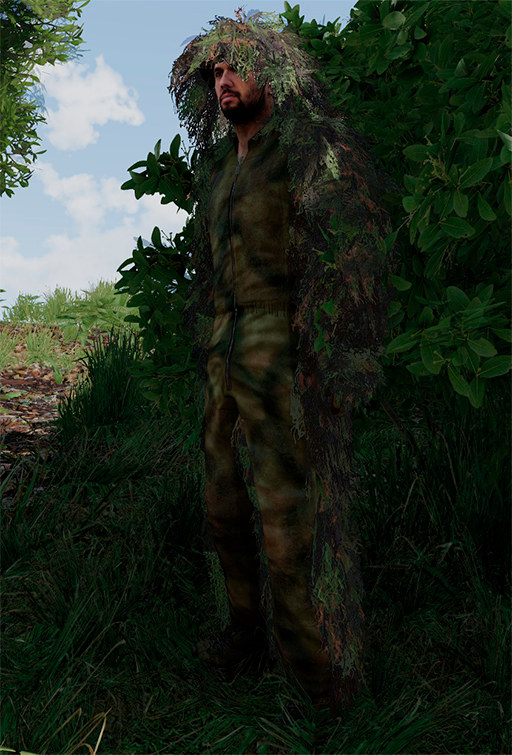

# Doctrina, moviment i camuflatge

En aquest apartat passarem directament a determinar els elements específics que afecten al franctirador. Tota la teoria sobre camuflatge, ocultació i orientació i supervivència es troba al manual de l'EBC, i es molt recomanable repassar aquests apartats abans de realitzar el curs de franctirador.

### Un tir, un mort

En un entorn ideal, el franctirador ha de ser capaç de realitzar un tret precís que provoqui la neutralització instantània de l'objectiu. 

### Crea àrees de denegació

Un franctirador ben posicionat pot aturar un regiment sencer. Cerca posicions que et permetin vigilar una àrea com més àmplia possible millor.

### Flanqueja l'enemic i canvia de posició

El franctirador no es un element estàtic, al contrari, flanqueja l'enemic i es mou constantment per a obtenir noves posicions de tir des d'on aquest no s'ho esperi. No sempre es possible fer-ho, però quan es pot, es important canviar de lloc constantment durant el combat. Quedarse molta estona disparant des d'una mateixa posició incrementa dramàticament les possibilitats de ser descobert.

### Sigues pacient

El franctirador s'ha de moure a poc a poc, evitant ser vist en tot moment. Utilitza els elements sobre camuflatge que has après i el sentit comú per a aconseguir sorprendre l'enemic.

### Elimina primer els objetius més importants

Per ordre de prioritat, recorda l'EBC.

### Dispara per l'esquena sempre que puguis

Tot i que pot semblar 'deshonrós' es la millor arma d'un franctirador, el poder escolar-te per les línies enemigues i disparar des de la rereguarda enemiga, causa un desconcert enorme a l'enemic, a mes trigaràn molt més temps en adonar-se d'on et trobes.

### Pren avantatge de l'entorn

Emmascara els teus trets amb sons de l'entorn, utilitza matolls com a ocultació, els arbres sempre son bons contra les bales, busca roques, llocs on recolzar el fusell de manera efectiva, etc.

### Posa't a la pell de l'enemic

Intenta comprendre el que està pensant l'enemic despres de cada tir, per deduïr si es perillós disparar o no, fixa't en la seva gesticulació, en la forma en com parlen, etc.

### El millor tripode

Si no tens cap lloc on recolzar el fusell, la millor forma d'aconseguir un tret estable mantenint el camp de visió es jeure a terra.

### Dispara des de camps de visió reduïts

Sempre que puguis utilitza forats amb camp de visió reduït a l'hora de disparar, per exemple: forats en parets, finestres petites, espais entre dos matolls, etc. Tot i que limiten el teu camp de visió, t'oculten practicament totalment de l'enemic.

### Minimitza les conversacions
 
Utilitza el llenguatge no verbal, els gestos i minimitza les comunicacions per radio i els dialegs amb els companys. Redueix el volum de veu.
 
### Prepara el moviment
 
Sempre que es pugui, planeja dues rutes d'aproximació i de retirada amb anterioritat, analitzant el terreny i obtenint tota la informació possible sobre el mateix. Les rutes de retirada han de ser diferents de les d'aproximació sempre que sigui possible.
 
### Evasió
 
Evita els obstacles, instal·lacions enemigues i patrulles durant la ruta d'aproximació. Si has d'entrar en combat, fes-ho al teu favor: a distàncies on el teu fusell arribi, però no el de l'enemic i a cobert.
 
### Observa a cobert
 
Mai ho facis a camp obert o en zones de perill, busca roques, murs, tàlvegs o qualsevol element que et mantingui en seguretat.
 
### Oïda
 
Estigues alerta en tot moment dels sorolls de l'entorn. Avança uns metres, atura't, escolta, observa, avança uns quants metres mes, atura't, escolta, observa i així fins que arribis al teu objectiu.
 
### Avança ajupit
 
Minimitza l'exposició de la teva silueta tot i estar en ocultació, mou-te ajupit o arrossegan-te.
 
### La ruta mes llarga es la mes segura
 
Moltes vegades tendim a arriscar-nos massa per arribar abans a l'objectiu i pasem per zones de perill. En el cas del franctirador, preval la seguretat, per tant si hem d'agafar una ruta més llarga en pro de la nostra seguretat, ho farem.
 
### La nit
 
Durant la nit, no baixis la guardia ni et confiis, al contrari segueix les mateixes directrius que durant el dia,aprofundint el moviment deliberat i l'oïda.
 
### Escull la posició de tir
 
Detecta amb anterioritat, aquells punts fàcilment identificables que poden ser utils per a establir un niu de tiradors (fast find). 
 
Un cop trobat el punt i determinat el temps que creus que t'hi estaràs. Considera el següent:
 
* Hi ha lloc per al franctirador i l'observador?
* Ofereix estabilitat per al tir? (terrenys amb pendents pronunciades no son bons llocs)
* El camp de visió es prou ampli?
* En cas de rebre foc, es una posició segura o a cobert?
* La ruta de retirada es segura?

### Aguanta la respiració abans de disparar

Tot i que això no es limita a aquest rol en concret, cal recordar que mentre s'efectua el tir cal aguantar la respiració durant uns instants per guanyar estabilitat i precisió. Sempre sense passar-nos ja que en aquest cas perdriem l'estabilitat.

### Determina la necessitat de desplegar elements defensius o de suport
 
Determina si es necessari crear un 'foxhole' o pou de tiradors, colocar un sac de sorra per a recolzar el fusell, desplegar un tripode per al mateix, colocar mines direccionals a la rereguarda, etc.
 
**Elements de suport tipics:**
 
- Pala de campanya.
- Tripode.
- Sac de sorra.
- Tenalles.
- Mina direccional M18A1 Claymore.
 
### Utilitza elements avançats per al reconeixement
 
Una de les tasques principals dels franctiradors es proporcionar reconeixement. En moltes ocasions amb el seu equipament per defecte es suficient però cal tenir en compte que podem comptar amb material mes avançat.
 
RQ-11 Raven: Es un dron desplegable en forma d'avió que es llença amb la mà. S'utilitza una consola per a fer-lo servir.
 
HuntIR: Es un tipus de dispositiu compatible amb el llançador de 40mm M203 i M320 que conté una petita càmara amb multimode top-down i no controlable amb un paracaigudes que permet un reconeixement temporal pero exhaustiu del terreny utilitant una tauleta.
 
En aquest curs no entrarem en detall en el funcionament d'aquests dispositius, doncs son elements secundaris pels quals es crearà una documentació específica.
 
### Guia els suports
 
Una altra tasca important a llarg termini es tenir la capacitat de demanar suports d'artilleria o CAS i fer les funcions d'un Joint Fires Observer. Tanmateix al ser un rol complex, no entrarem tampoc en detall en aquest curs i el contingut es reserva per al curs de JTAC / JFO.
 
### Realitza múltiples càlculs i pren notes
 
Es important que el franctirador prengui les calibracions a diferents distàncies i diferents objectius i les anoti a una llibreta (tingues paper i boli a ma). D'aquesta manera quan s'entri en combat, es podrà actuar amb molta més fluidesa.
 
Pots utilitzar l'addon 9 Liners and Notepad per a aquest propòsit, però tanmateix sempre es bo tenir paper i boligraf a punt.

### Camuflatge facial

Sempre que puguis i que l'entorn ho permeti, utilitza l'estoig de maquillatge per pintar-te la cara. 

### Uniforme Ghillie

* **Què és?** Es un tipus d'uniforme que es caracteritza per oferir un camuflatge complet, tant disruptiu com mimètic, basicament es un uniforme cobert amb tires de roba i vegetació artificial o no, que fan que (sempre que s'utilitzi en el medi adequat) el franctirador quedi completament integrat en l'entorn.
  
* **En quins entorns es vàlid?** Es vàlid en entorns rurals principalment, però cal tenir en compte el tipus de Ghillie per a que s'adapti al tipus de vegetació d'aquella zona geogràfica. En tenim per a zones desèrtiques, per jungla, per vegetació mediterrània, etc.
  
* **Quan es fa servir?** Quan s'opera de manera separada de la resta de tropes i a prop de la zona d'operacions.
  
* **Quan NO s'ha de fer servir mai?** Quan es va enganxat a un element d'infanteria convencional, ja que et fa un objectiu prioritari. També quan preveus que t'hauràs de moure en entorns urbans o que et mouràs en vehícle.

{: .center}

### Camuflar equipament

* En algunes ocasions podràs camuflar les teves armes o dispositius òptics amb pintura de colors o vegetació. En aquest cas tingues en compte els punts de l'apartat anterior.
  
* No deixis rastre del teu pas: no tiris objectes al terra que puguin alertar l'enemic a posteriori.
  
* Si et mous en vehícle, assegura't d'ocultar-lo. No l'aparquis al vell mig de la carretera.
  
* Si has de deixar equipament endarrerit a la zona d'operacions, coloca-ho tot dins una motxilla i deixa-la sota un matoll o un avet.

