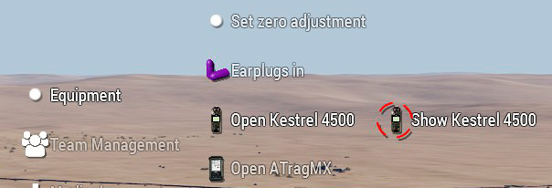
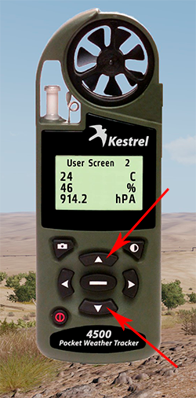
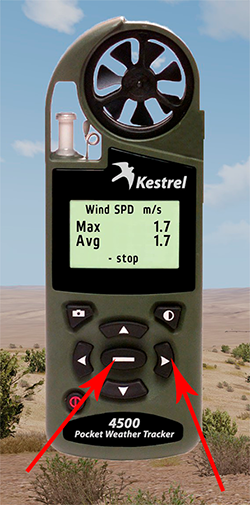

# Kestrel 4500

## Funcionament

El Kestrel 4500 es una estació meteorològica de butxaca molt completa que ens permet mesurar una gran quantitat de paràmetres atmosfèrics com per exemple la velocitat i direcció del vent, la temperatura, la humitat, la pressió atmosfèrica, etc. 

Aquestes característiques el fan un element indispensable per a qualsevol franctirador i ens permetrà efectuar càlculs balístics amb una precissió quasibé absoluta. 

L'aparell el podrem trobar en qualsevol armeria i prèviament a utilitzarlo, ens l'hem d'equipar, recordeu que la majoria d'aparells de l'ACE3 no funcionen si els tenim dins la motxilla, així que la opció més correcta que dur-los a l'uniforme o al porta-carregadors.

Per a utilitzar-lo tenim dues opcions, les dues estan dins del menú d'interacció pròpia, en l'apartat equipament. Com podem veure tenim la opció principal que posa "Open Kestrel 4500", aquesta opció ens mostra l'aparell de manera semblant a com funciona amb les radios de l'ACRE2 de manera que podem fer clic als botons i veure les dades en pantalla. L'altra opció que es derivada d'aquesta última es "Show Kestrel 4500" i ens permetrà tenir obert l'aparell en forma de miniatura i podrem veure les dades bàsiques però no hi podrèm interactuar (això últim es útil per quan s'està calibrant l'arma o fent càlculs amb la calculadora balística.

Sempre podem interactuar amb ell seleccionant-lo amb ++shift+home++ i despres ++home++ per commutar entre els dos modes.

{: .center}

Si obrim el Kestrel de manera estàndard veurem que podem passar de pantalla fent clic als botons de les fletxes amunt i avall tal com es mostra en la següent imatge.

{: .center}

!!! hint "Important"

	Per tal d'obtenir unes lectures més precisses en quant a velocitat del vent, ens hem d'assegurar que quan l'obrim, aquest ens vingui de cara. Tanmateix al fer els càlculs sobre vent creuat, hem d'estar mirant cap a on està el nostre objectiu. Tot això es degut a que l'angle de l'anemòmetre (petit ventilador de sobre l'aparell)importa.

El Kestrel també incorpora una opció disponible per a la majoria de pantalles, que ens permet obtenir els valors mínim, mitjà i màxim de cada variable meteorològica simplement fent clic a les fletxes a esquerra o dreta.

En casos com la velocitat del vent, també podem controlar quan comença a fer el càlcul i quan volem que pari, així com esborrar les dades calculades per tornar a començar. Aquesta opció es pot controlar al el botó central.

{: .center}

## Pantalles

**TEMP:** Temperatura de l'aire en graus centígrads.

**CHILL:** Temperatura de sensació tèrmica (per efecte del vent), en graus centígrads.

**HUMIDITY:** Humitat relativa de l'aire en %. Necessària per a càlculs balístics.

**HEAT INDEX:** Temperatura de xafogor en graus centígrads.

**DEW POINT:** Temperatura del punt de condensació de l'aigua, es la temperatura a la qual s'ha de baixar per a que la humitat relativa sigui del 100% i es produeixi precipitació o boira.

**WET BULB:** Temperatura de l'aigua en les condicions actuals (sense alteracions externes).

**BARO:** Pressió baromètrica de l'aire en hectopascals. Necessària per a càlculs balístics. Hem de saber que 1 hectopascal equival a 1 milibar, degut a que en alguns llocs ens demanaràn la pressió en milibars enlloc d'hectopascals.

**ALTITUDE:** Altitud baromètrica sobre el nivell del mar, en metres.

**DENS ALT:** Altitud sobre el nivell del mar a la que trobariem la densitat de l'aire actual si apliquessim els valors de l'ISA (International Standard Atmosphere).

**User Screen 1:** Aquesta pantalla ens mostra les dades sobre el vent, per ordre, direcció del vent en graus magnètics i en lletra. Altitud baromètrica en metres i velocitat del vent en metres per segon. Es indispensable per als càlculs balístics.

**User Screen 2:** Aquesta pantalla ens mostra les tres dades de la densitat de l'aire, per ordre, temperatura de l'aire en graus centígrads, humitat relativa en % i pressió baromètrica en hectopascals. També indispensable per als càlculs balístics.

**Data i hora:** Ens mostra la data, el dia de la setmana i la hora actual en horari local.

**Direction:** Direcció del vent en graus magnètics i lletra. Útil per als càlculs balístics.

**Wind SPD:** Velocitat absoluta del vent en metres per segon. Útil per als càlculs balístics.

**CROSSWIND:** Velocitat del vent lateral, aquesta dada es important ja que ens indica la velocitat de la component lateral del vent i la que realment afectarà a la desviació del tret. Es important tenir en compte, que aquest valor serà vora al 0 si el vent ens ve de cara. A sota ens indica les condicions sobre les quals s'ha fet el càlcul, es a dir velocitat real i direcció.

**HEADWIND:** Velocitat del vent de cara, aquesta dada normalment es irrellevant degut a que en els càlculs balístics el vent que ve de cara no es te en compte en la desviació de la bala.