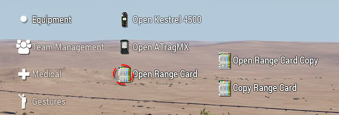
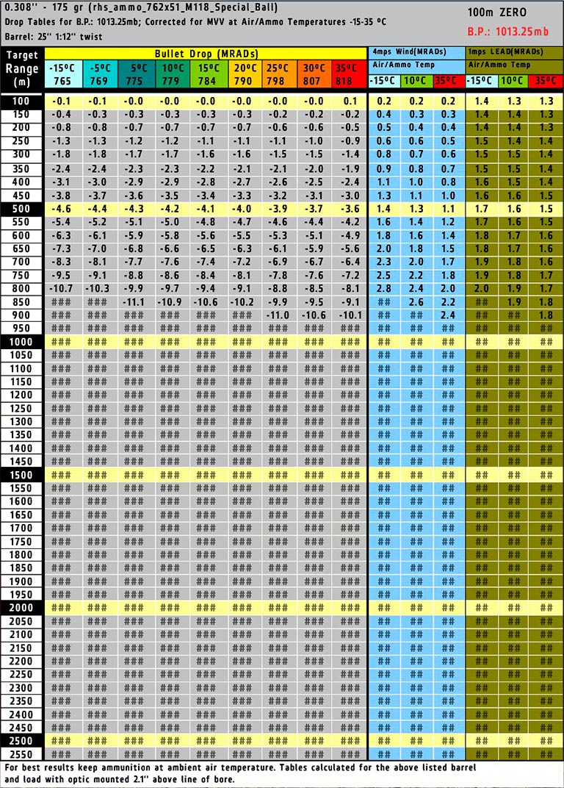
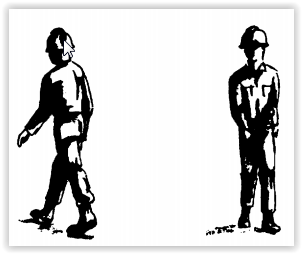

# Taula de rangs

La taula de rangs es la eina bàsica i imprescindible de tot tirador. Es tracta d'una fitxa que conté una serie de calculs aproximats que ens permet fer correccions rapidament sense haver de fer servir eines mes avançades.

Per obrir la fitxa simplement cal dur una a l'inventari i fer servir la interacció propia de l'ACE 3 tal com es veu en la següent imatge:

{: .center}

A part de la opció d'obrir la fitxa per a nosaltres, també podem utilitzar Open Range Card Copy i Copy Range Card per a copiar i consultar la fitxa d'un altre membre, pot ser útil en els casos de binomis de franctiradors.

A l'obrir la fitxa aquesta carregarà per defecte tota la informació respecte al tipus de munició que tenim carregada al nostre fusell. Compte perque no totes les municions son compatibles.

Si tot i així veus la fitxa practicament buida o només amb una filera de valors, pot ser que no estigui habilitada la Balística Avançada de l'ACE 3 dins la missió a la que estas (per defecte totes les nostres missions han de dur-la activada sempre). 

Si tot es correcte, has de veure una pàgina com aquesta:

{: .center}

Tranquil, que es més fàcil del que sembla. Explicarem aqui quina informació conté cada part:

### Capçalera

La primera linia conté el calibre, el pes en grams de la bala i entre parentesis el classname de la munició (això últim es important).

A la segona línia indica les condicions atmosfèriques generals per les quals son vàlids els càlculs, com per exemple la pressió atmosfèrica (B.P) en milibars (1 mb = 1 hPa). 

La tercera linia conté dades referents a l'ànima del canó de l'arma per a calcular la rotació de la bala (Rifle Twist), ho veurem a l'apartat de la calculadora.

A la part dreta tenim el valor zero de la munició si no calibrem la mira (0 mils).

I tot just a sota i en vermell, un altre cop la pressió atmosfèrica per la qual es valida la taula. 

### Target Range

Conté els intervals de distància corresponents a cada càlcul.

### Bullet Drop

La primera fila de la columna conté les temperatures per les quals corresponen els valors de caiguda de bala (en vertical) el valor que acompanya la temperatura, es la velocitat inicial de la bala (Muzzle Velocity).

Els valors en vertical corresponen als mils de caiguda que presenta la bala a cada distància concreta. El valor es negatiu ja que representa la caiguda en miliradiants i per tant es el valor que hem de compensar al calibrar la mira, de manera positiva (mils de correcció = valor de la taula * -1).

Les caselles amb tres coixinets signifiquen que no es garanteix el tir efectiu (no vol dir que no arribi el tret).

### Columna Wind

La columna Wind conté unes aproximacions a grans trets de les desviacions horitzontals causades per unes condicions hipotètiques de temperatura i velocitat del vent (4 mps).

El fet de que el vent sigui molt variable i que la força del vent creuat sigui dificil de calcular sense un Kestrel. Resulta només util per aproximacions i correccions.

### Columna Lead

La columna LEAD (deriva) indica la desviació horitzontal a la que hem de calibrar la mira per tocar blancs en moviment. Els calculs estan fets en base a un hipotètic cos que es mogui a 1 m/s de manera constant. A partir d'aquestes dades podem aproximar el numero de mils necessaris.

Nota: Per a unitats a peu, podem estimar que una unitat caminant es mou a 1 m/s, una trotant a 2 m/s i una corrent en sprint a 3-4 m/s.

Per tal d'afinar al màxim l'aproximació, tindrem en compte els següents conceptes:

* **FULL LEAD:** si l'objectiu es mou totalment en perpendicular respecte nosaltres, apliquem el valor de LEAD total.
  
* **HALF LEAD:** si l'objectiu es mou dibuixant una diagonal respecte a nosaltres, apliquem la meitat del valor LEAD.
  
* **NO LEAD:** si l'objectiu es mou en paral·lel a nosaltres no apliquem cap correcció per LEAD.

Esquerra FULL LEAD, dreta HALF LEAD.

{: .center}

Esquerra HALF LEAD, dreta NO LEAD.

{: .center}

### Peu:

Al peu ens indica el valor "bore" de la mira amb la que s'ha caculat la taula, aquesta dada es important per a càlculs avançats com veurem en l'apartat de la calculadora.