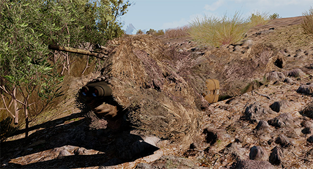

# Telèmetre Vector 21

{: .center}

## Funcionament

El Vector 21 es un telèmetre multifunció especialment dissenyat per al rol de franctirador tot i que es útil en molts d'altres. Es tracta d'un dispositiu òptic amb x7 augments que incorpora un làser i una serie d'indicadors interns.

Aquest aparell, de semblança a uns binocles i força lleuger, no només serveix per observar i obtenir distàncies, sinò que a més incorpora tota una sèrie de funcionalitats que s'han de conèixer ja que son de molta utilitat a l'hora de realitzar els càlculs balístics amb la calculadora ATragMX per exemple. Es doncs, una eina molt potent a l'abast de tothom i de la qual en sabem ben poc quan ens hi adentrem una mica.

Les principals funcionalitats de les quals disposa l'aparell son:

* Obtenir la distància a l'objectiu.
* Obtenir l'azimut a l'objectiu.
* Obtenir l'angle d'inclinació.
* Obtenir la distància vertical i horitzontal a l'objectiu.
* Obtenir la distància entre dos objectius.
* Obtenir l'angle entre dos objectius.
* Obtenir les components dels vectors de distància de manera separada.
* Canviar les magnituds entre peus i metres.
* Canviar entre graus magnètics i miliradiants (mils).

Cal tenir en compte que el làser del telèmetre ha d'estar apuntat a algun cos sòlid que permeti que aquest reboti correctament. No es recomanable apuntar-lo sobre un objectiu humà o sobre la vegetació, així com vidres i objectes transparents. Utilitzeu sempre objectes sòlids i propers al vostre objectiu, idealment, parets o murs, el terra, un vehicle, etc.

## Opcions

### Distància a l'objectiu

1. Mentres mires a través del telèmetre presiona la tecla ++r++ fins que aparegui el cercle vermell.
2. Un cop aparegui, deixes anar la tecla i apareixerà la distància al costat.

{: .center}

### Azimut a l'objectiu

Prem la tecla ++tab++ fins que aparegui l'azimut en pantalla.

{: .center}

### Distancia i azimut a l'objectiu alhora

1. Prem les tecles ++r++ i ++tab++ alhora fins que aparegui el cercle vermell.
2. Un cop aparegui deixes anar els dos botons i sortirà l'azimut i la distància un al costat de l'altra.

{: .center}

### Components horitzontal i vertical del vector

1. Toca una vegada la tecla ++r++ i seguidament prem-la de nou uns instants fins que surti el cercle vermell.
2. Un cop aparegui la deixes anar i apareixeràn les componentes del vector (distància horitzontal i vertical).

{: .center}

### Azimut i angle d'inclinació

1. Toca una vegada la tecla ++tab++ i seguidament prem-la de nou uns instants fins que aparegui el cercle vermell.
2. Un cop aparegui la deixes anar i apareixerà l'azimut i l'angle d'inclinació.

{: .center}

### Distancia entre dos punts

1. Prem la tecla ++r++ fins que aparegui el cercle vermell.
2. Un cop aparegui, toques la tecla ++tab++ mentres mantens apretada la ++r++.
3. Veuràs que apareix "1-P" a la pantalla, significa que has fixat el primer punt.
4. Seguidament mou el cercle vermell al següent punt i deixa anar la tecla ++r++.

{: .center}

### Components horitzontal i vertical del vector entre dos punts

1. Prem la tecla ++r++ fins que aparegui l'azimut.
2. Un cop aparegui toques la tecla ++tab++ mentres mantens apretat ++r++.
3. Veuràs que apareix "1-P" a la pantalla, significa que el primer punt ja el tens fixat.
4. Mou el cercle vermell al segon punt i deixa anar la tecla ++r++.

{: .center}

### Distancia horitzontal i azimut entre dos punts

1. Prem la tecla ++tab++ fins que aparegui l'azimut.
2. Un cop aparegui toca la tecla ++r++ mentres mantens apretat ++tab++.
3. Veuràs que apareix "1-P" a la pantalla, significa que el primer punt ja el tens fixat. 
4. Mou el cercle vermell al segon punt i deixa anar el ++tab++.

{: .center}

### Caiguda de la bala

1. Prem la tecla ++tab++ fins que aparegui l'azimut.
2. Toca la tecla ++r++ mentres mantens apretat el ++tab++.
3. Veuràs que apareix "1-P" a la pantalla, significa que el primer punt ja el tens fixat. 
4. Mou el cercle vermell a on ha caigut la bala i deixa anar el ++tab++.
5. Els digits de l'esquerra mostren la correcció esquerra (L)/dreta (r) en metres. Mentres que els digits de la dreta mostren els valors de correcció llarga (A = afegir)/curta (d = caiguda) en metres.
6. Si prems la tecla ++r++ també es mostraràn els valors de correcció d'alçada (UP i dn).

{: .center}

### Canviar unitats de mesura

1. Toca la tecla ++tab++ 5 vegades consecutives (rapidament).
2. Veuràs que apareix breument el text "Unit set".
3. Prem ++r++ fins que apareguin les unitats desitjades.
4. Toca un altre cop ++tab++ 5 vegades consecutives per desar els canvis.