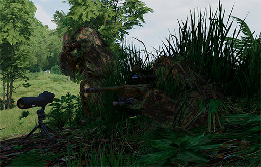

# El binomi de franctiradors

Tot i que no es obligatori, habitualment els franctiradors operen en binomis. Els binomis de franctiradors tenen unes característiques especials, ja que cada rol realitza una serie de tasques molt concretes. Per norma general aquests dos rols son el franctirador i l'observador. Cal esmentar que l'observador no pot ser un soldat qualsevol, sinò que ha de ser un franctirador expert i es el líder del binomi.

{: .center}

## Franctirador (Sniper):

* Es el membre amb menys experiència del binomi.
* Porta el fusell de precisió i en te cura.
* Porta la munició i la gestiona segons els efectes de cada tipus.
* Calibra i utilitza el fusell de precisió contra elements a llarga distància.
* Porta la taula de rangs. *
* Observa i reconeix.
* Decideix la ruta a seguir durant l'aproximació a la posició de tir.
* Decideix la ruta a seguir d'una posició de tir a una altra durant el combat.
* Decideix la ruta de retirada.

## Observador (Spotter):

* Es el membre amb més experiència del binomi i el líder.
* Porta un fusell d'assalt amb o sense llançagranades.
* Porta un tripode (opcional).
* Porta una pala de campanya (opcional).
* Porta un telescòpi d'observació.
* Porta un Vector 21.
* Porta un Kestrel 4500. *
* Porta un DAGR.
* Porta una calculadora balística ATragMX. *
* Observa, reconeix i adquireix blancs per al tirador.
* Prioritza els blancs.
* Realitza els càlculs balístics.
* Observa els efectes dels tirs i comunica les correccions adeqüades al tirador.
* Fa d'home punta durant el moviment en binomi.
* Cobreix al seu binomi en entorns tancats.

*Aquests elements es habitual que els dugui tant el tirador com l'observador, simplement s'ha disposat així perque normalment qui fa els càlculs balístics i les correccions es l'observador i qui obté la informació sobre la munició a utilitzar es el tirador.

