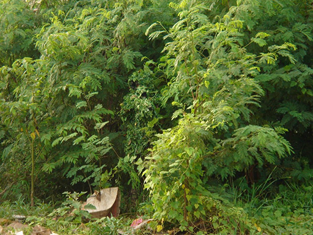

# Introducció

Abans de començar ja et pots anar treient la imatge del matoll amb potes i disparant un M107 Barrett com si fos una escopeta. Ja ho has fet? Doncs comencem.

Quan comences a descobrir el mon de l'ArmA es típic que el primer rol que vulguis adoptar sigui el de franctirador. Els videojocs i les pel·licules de Hollywood han fixat una imatge quasi heroica als franctiradors, pintant-los com homes amb habilitats per sobre de la majoria, practicament perfectes, i això es evident que sumat al fet que a l'ArmA sigui un dels rols més importants de la infanteria, doncs fa que sigui un dels més demandats.

Com sempre, cal reflexionar bé sobre el que significa la paraula franctirador i el que realment comporta ser-ho. Primer hem d'entendre que franctirador es un tipus concret de tirador (que n'hi ha més com veurem en aquest curs), el nom prové de la guerra Franco-Prussiana (1870-1871), on una part dels soldats francesos, equipats amb rifles més precissos eren anomenats "franc-tireurs" literalment "tiradors francs". Tanmateix el terme actual de franctirador es refereix a un soldat d'infanteria amb habilitats especials per al camuflatge, el reconeixement i l'ús de fusells de precisió per a abatre objectius seleccionats.

Realment es tracta d'un rol de tot menys glamurós, es tracta de ser capaç de passar-te hores arrosegan-te com un cuc per boscos interminables i esperar, esperar i esperar. El rol es podria resumir en esperar. Fer un tret precís no només depen de la teva puntería com veuràs durant aquest curs. També veuràs que el tirador no es un llop solitari i li agrada la companyia...

En aquest curs d'especialització se t'instruirà per a que puguis exercir tots els rols del tirador amb total eficàcia i professionalitat, basat en el curs d'Scout Snipers del Cos de Marines dels Estats Units.

 {: .center}

