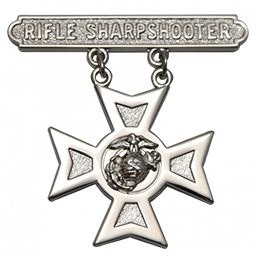
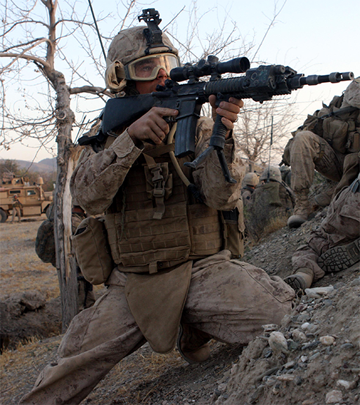
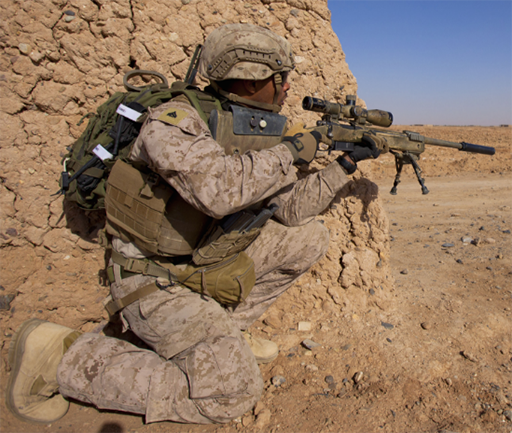

# Tipus de tiradors

Tot i que quan parlem de tirador ens referim realment a qualsevol soldat que porti una arma de foc i sigui capaç d'utilitzar-la, dins el vocabulari general es sol utilitzar per a distingir els tiradors de precissió dels fusellers o altres rols. Tot i que no existeix una única classificació, en aquest curs utilitzarem la del Cos de Marines dels EUA. 

## Tirador distingit (Sharpshooter): 

També anomenat Sharpshooter, no es un rol en si mateix sinò una classificació. Dins els marines es consideren tiradors distingits tots els soldats que superin les proves de tir d'habilitat anuals. Segons el nivell, es condecora al soldat amb una medalla d'un tipus determinat. No només hi ha proves amb fusell sino que també amb pistola.

Anteriorment també s'els anomenava així als marines que duien una mira de tipus ACOG amb augments ja que podien fer foc més precís, però despres de la generalització en l'ús d'aquest tipus de dispositius optics, el terme va quedar en desús.

{: .center}

## Tirador selecte o designat (Designated Marksman):

Es tracta d'un tipus de tirador que opera a nivell d'esquadra i en aquest cas si que es un rol concret i no pas una classificació. Normalment es tracta de soldats que porten un fusell de precisió amb una mira telescòpica i amb capacitat per a oferir foc precís i observació en rangs de distància superiors als d'un fusell d'assalt convencional.

El seu equipament sol ser molt semblant al d'un soldat normal de la seva esquadra i no tenen perque tenir entrenament avançat o una gran punteria. De fet habitualment son antics aspirants al rol de franctirador que no superen les qualificacions per a ser-ho.

{: .center}

## Franctirador o tirador d'èlit (Sniper):

Es tracta d'un rol que combina l'observació i el reconeixement amb el foc extremadament precís fins a distàncies molt llargues. Es un dels rols mes complexos ja que requereix de molta autodisciplina i paciència, així com molta pràctica i experiència que s'adquireix amb el pas del temps. El franctirador ha de ser capaç d'adaptar-se a qualsevol situació i saber operar ja sigui individualment o en binomi (franctirador + observador), de la mateixa manera, un franctirador pot fer de tirador designat si la situació ho requereix i ha de ser capaç de guiar suports, ja sigui artilleria o CAS.

L'equipament varia molt en funció de la missió, però tant pot anar equipat com un soldat regular, com dur un uniforme tipus Ghillie, i pot utilitzar fusells de qualsevol calibre.

{: .center}

