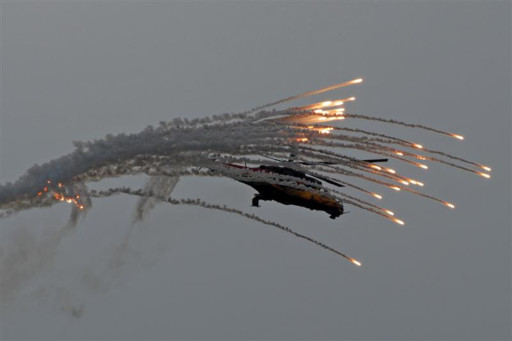

# Fonaments anti-aeris

En aquest apartat comentarem breument els elements que s'han de tenir en compte a l'hora d'utilitzar un sistema de defensa anti-aèria portàtil (MANPADS) per a que aquest sigui realment efectiu.

Primerament hem de diferenciar entre dos tipus d'aeronaus:

* **Aeronaus d'ala fixa**, com podrien ser avions caça, bombarders, transport, drons, etc.
* **Aeronaus d'ala rotatòria**, on entrarien els helicòpters.

Els sistemes MANPADS estan principalment pensats per a abatre aeronaus d'ala rotatòria, tot i que també es possible abatre aeronaus d'ala fixa. Això es degut principalment a dos factors: la velocitat i el rang.

Mentre que les aeronaus d'ala fixa solen anar a velocitats supersòniques en combat, les d'ala rotatòria ni s'hi acosten. Per altra banda l'alçada sobre el nivell del terra i les capacitats de maniobrar també son diferents, fent que el ventall durant el qual es possible fixar un objectiu sigui més ampli en les d'ala rotatòria.

En ambdós casos, cal tenir en compte principalment l'angle relatiu, ja que els sistemes MANPADS només fixaràn l'objectiu si es troba dins el seu rang. Es tracta doncs d'objectius d'oportunitat.

## Consells

* No disparar a aeronaus que volin a més de 3.000 metres d'alçada.
* Ni a aeronaus que volin a menys de 100 metres d'alçada.
* No disparar a aeronaus que volin a Mach 1 o més si l'angle d'aquestes es diferent a 90º respecte l'operador del sistema.
* Evitar disparar a aeronaus que vinguin de cara a nosaltres a menys de 1.000 metres de distància (comptant alçada).
* Evitar disparar a aeronaus que s'allunyen de nosaltres si es troben a més de 2.000 metres de distància.
* Evitar disparar si l'aeronau es troba llançant contramesures.
* Esperar sempre a que ho deixi de fer.

{: .center}
