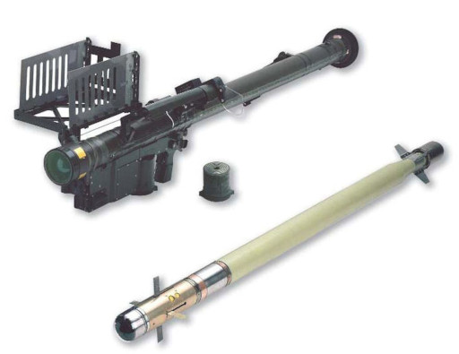

# FIM-92 Stinger

El FIM-92 Stinger es un míssil terra-aire passiu guiat per infrarroigs produït per l'empresa Raytheon per a l'ús en les diferents branques militars dels Estats Units d'America. Es tracta d'un míssil lleuger del tipus MANPADS (Man-Portable Air-Defense System), es a dir missils AA que poden ser operats per un soldat sense necessitat de vehicles ni sistemes externs. Es capaç d'abatre aeronaus de tot tipus dins el seu rang d'acció.

{: .center}

| **Característiques**        | **Descripció**     |
|-----------------------------|--------------------|
| **Llançador**               |                    |
| -- **Longitud**             | 152 cm             |
| -- **Pes**                  | 15,19 kg           |
| **Projectil**               |                    |
| -- **Calibre**              | 70 mm              |
| -- **Velocitat de sortida** | -                  |
| -- **Longitud**             | -                  |
| -- **Pes**                  | -                  |
| -- **Rang màxim**           | 5.500 metres       |
| -- **Altura màxima**        | 3.800 metres       |

## Ús de l'Stinger

* Sel·leccionar el sistema FIM-92 Stinger.
* Apuntar l'aeronau amb la mira. lateral.
* Si està dins el nostre rang, el sistema començara a pitar, primer amb un to més lent.
* Quan el sistema hagi bloquejat el blanc, el to canviarà de freqüència.
* Disparar.

Cal recordar que tot i ser un llançador anti-aeri, també te efecte "backblast", per la qual cosa cal realitzar de la mateixa manera el protocol sis línies amb l'ajut d'un assistent.
