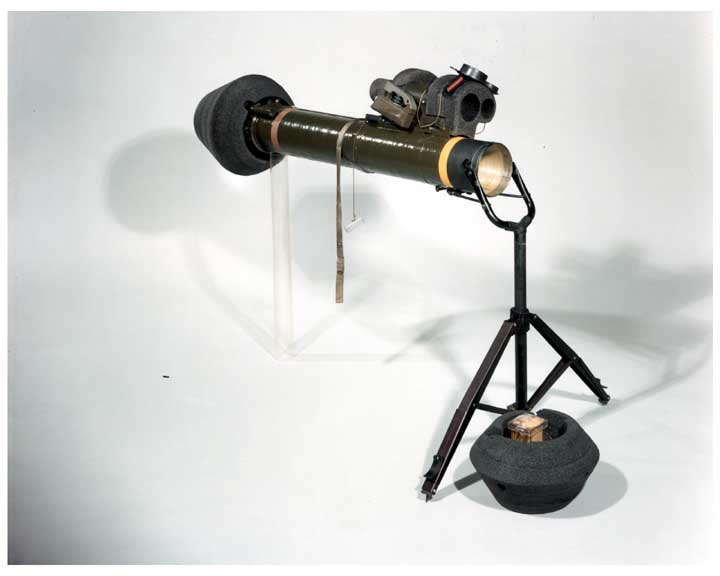

# M47 Super Dragon

El sistema M47 Super Dragon es un sistema de destrucció anti-blindatge pesat amb capacitat per ser operat per un sol soldat. Compta amb un sistema de guiatge SACLOS amb unes característiques que el fan únic, ja que els canvis de trajectoria del missil es realitzen amb la detonació d'una serie de càrregues al voltant del projectil. Desenvolupat per Raytheon, va entrar en servei l'any 1975 i va ser utilitzat àmpliament per les unitates de l'USMC. Va ser retirat el 2001 en favor del seu successor, el FGM-148 Javelin.

{: .center}

| **Característiques**        | **Descripció**     |
|-----------------------------|--------------------|
| **Llançador**               |                    |
| -- **Longitud**             | 115 cm             |
| -- **Pes**                  | 21,4 kg            |
| **Projectil**               |                    |
| -- **Calibre**              | 140 mm             |
| -- **Velocitat de sortida** | 200 m/s            |
| -- **Longitud**             | N/A                |
| -- **Pes**                  | N/A                |
| -- **Rang mínim**           |                    |
| -------- **Entrenament**    | 100 metres         |
| -------- **Combat**         | 75 metres          |
| -------- **Armat**          | 75 metres          |
| -- **Rang màxim**           | 1.500 metres       |
| -- **Rang màxim efectiu**   | 1.000 metres       |

## Projectils

El sistema conté el propi missil M47 Dragon amb capacitat HEAT. Un cop disparat es descarta el tub.

## Ús del Dragon

* Muntem el bipode del Dragon amb interacció de l'ACE (CSW).
* Muntem el sistema de guiatge SU-36/P (CSW).
* Entrem com a artillers del sistema TOW amb interacció d'ACE.
* Apuntem.
* Centrem la mira sobre l'objectiu i disparem.
* Mentres el missil es a l'aire, movem la mira sobre l'objectiu per ajustar la trajectòria.

**Nota**: cal ajustar la trajectòria del míssil amb celeritat ja que normalment el temps sol ser de pocs segons (depenent de la distància de l'objectiu). Els ajustaments han de ser suaus, per evitar que el míssil es desvii massa.

**Explicació del sistema Stadia**:

Els operadors del Dragon han d'utilitzar la reticula Stadia per a saber si l'objectiu es troba dins el rang efectiu.

* Si l'objectiu està perpendicular respecte a nosaltres:
{: .center}
* Si l'objectiu està oblic respecte a nosaltres, però la major part que veiem d'ell es del flanc del vehicle:
{: .center}
* Si esta oblic respecte a nosaltres, però la major part que veiem d'ell es la part frontal o darrera del vehicle:
{: .center}
* Si l'objectiu es troba en paral·lel a nosaltres:
{: .center}
