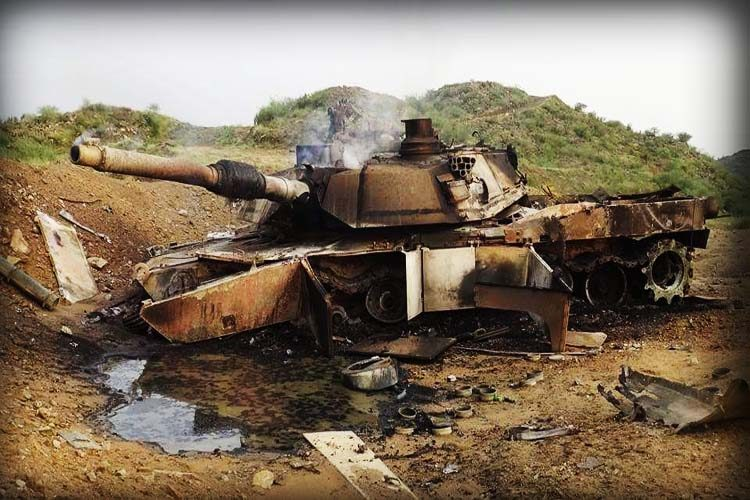

# Fonaments anti-blindatge

En aquest apartat tractarem breument els fonaments necessaris per a destruïr o inhabilitar qualsevol vehicle blindat.

## Tipus de vehicles blindats

**IMV**: Son vehicles, principalment tot terrenys, amb cert nivell de blindatge que s'utilitzen principalment pel transport de tropes, dins dels IMV trobem els MRAP que tenen un blindatge superior. En algunes ocasions poden anar artillats. Son IMV: els Humvee americans o els Tigr russos per exemple. Principalment poden ser destruïts o inutilitzats amb qualsevol tipus d'ojiva.

**APC** (vehicle blindat de transport de tropes): Son vehicles lleugerament blindats de transport de tropes, habitualment tenen una forma semblant a la d'un tanc i poden dur rodes o cadenes. Van molt lleugerament armats, habitualment només amb metralladores o inclús sense. Son APC: M113, AAV, algunes versions de l'Stryker i algunes versions dels BTR, BMP i BMD rusos, per posar uns exemples. Es poden destruïr o inutilitzar amb ojives HEAT simples.

**IFV** (vehicle blindat de suport a l'infanteria): Son semblants als APC amb la diferència que enlloc de metralladores solen dur canons de 20 o 30mm i alguns fins i tot més. També en molts casos van equipats amb ATGM. També poden fer de transport de tropes tot i que en alguns casos tenen força menys espai. Son IFV el LAV-25, M2A1 Bradley i BMP, entre altres. Hi ha models de IFV que son caça-tancs i van equipats amb un canó de calibre molt elevat, no s'han de confondre amb tancs. Es poden destruïr o inutilitzar amb qualsevol tipus d'ojiva HEAT tret d'algun cas en que porten blindatge reactiu.

**MBT** (tanc de batalla principal): La majoria de tancs moderns son del tipus MBT, son tancs pesats pensats per anar acompanyats d'infanteria o IFV, disposen de blindatge molt pesat i habitualment reactiu. Es poden distingir per la seva forma característica, per l'envergadura, per l'ús exclusiu de cadenes i sobretot pel canó de gran calibre que porten incorporat. Son MBT, l'M1 Abrams estatunidenc, el T-90 rus, el Leopard 2 alemany i el Challenger 2 britànic entre de molts altres. Per a destruïr-los caldràn ojives HEAT d'alt calibre o de tandem.

**Altres**:

Actualment existeixen diversos vehicles que no entren en la categoria de tancs però que si que son vehicles blindats. Es el cas de l'artilleria autopropulsada, com per exemple els M109A7 Paladin de forma molt semblant a un MBT o sistemes SAM mòbils com el ZSU-23-4 Shilka rus. El blindatge no sol ser més important que el d'un APC per tant amb qualsevol ojiva HEAT es poden destruïr.

## Punts dèbils

Tot i que depen molt del tipus de vehicle blindat, per norma general els punts dèbils només son importants a l'hora d'enfrontar-se a tancs (MBT). Per norma general els punts dèbils son (per ordre d'efectivitat):

* **Sobre el tanc**: es normalment on menys blindatge hi ha, tanmateix només es pot utilitzar amb alguns tipus de llançadors que tenen atac top-down o si l'especialista es troba en un punt elevat.

* **Darrera el tanc**: es el punt dèbil més habitual en la majoria de tancs i la prioritat a l'hora de disparar.

* **Eix de la torreta**: disparar a l'eix de rotació de la torreta pot matar l'artiller i inutilitzar el canó, tanmateix sol ser un blanc complicat.

* **Cadenes**: tot i ser un punt dèbil, en el millor dels casos només immobilitzarà el tanc.

* **Escotilles**: s'ha d'evitar disparar a escotilles a no ser que es tingui molta habilitat.

* **Laterals**.

S'ha d'evitar disparar:

* **A la part frontal** del tanc.
* **En angles que no siguin rectes** (oblics), ja que pot causar el rebot del projectil.
* En zones cobertes per **blindatge reactiu**.
* En zones on la superficie del tanc sigui **corba o irregular**.

## Contramesures

* **Blindatge reactiu**: Els sistemes de blindatge reactiu es basen en una especie de capses de forma quadrada o rectangular que van enganxades a la superfície del blindat. Aquestes capses compten amb un sistema de sensors que detecta quan un projectil s'acosta i detonen una petita càrrega explosiva direccional que destrueix el projectil quan aquest es troba a una distància segura (de forma simil·lar a com funciona una mina Claymore).
Per a superar aquest tipus de blindatge i arribar a tocar la xapa, s'utilitzen projectils amb doble ojiva en tandem o projectils termobàrics d'alta potència, en el cas dels projectils en tandem, la primera càrrega inutilitza el blinatge reactiu mentre que la segona penetra directament sobre el blindatge nu.
Cal entendre que cada capsa de blinatge reactiu, un cop utilitzada deixa un forat per on podria penetrar una ojiva HEAT estàndard.

* **Pantalles de fum**: La majoria de vehicles blindats compten amb un sistema integrat de pantalles de fum. Aquestes pantalles son especialment efectives contra ATGM de tipus SACLOS i contra llança-coets convencionals. La millor manera d'evitar errar el llançament, es esperar a que es dissipi el fum, ja que sol ser de curta duració, i els blindats tenen un nombre limitat d'aquest tipus de contramesura.

{: .center}
