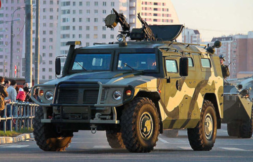
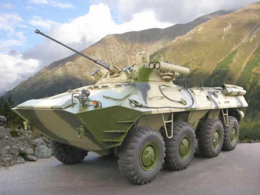
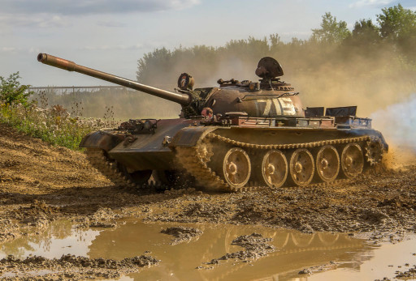
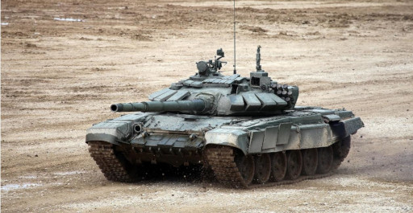
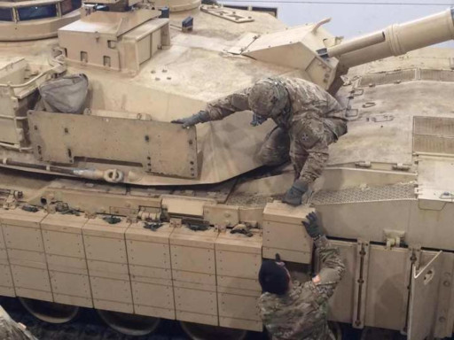
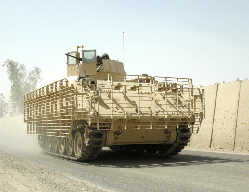
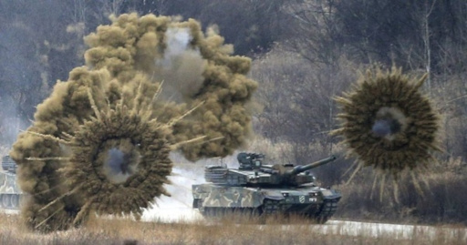

# Fonaments anti-blindatge

En aquest apartat tractarem breument els fonaments necessaris per a destruïr o inhabilitar qualsevol vehicle blindat.

## Tipus de vehicles blindats

### Sense o molt poc blindatge

Son vehicles, principalment tot terrenys, amb molt poc nivell de blindatge o gens, que s'utilitzen principalment pel transport de tropes o material, trobem els diferents tipus de IMV, camions, etc. Per exemple: els Humvee, Tigr, pickups artillades, camions de tot tipus. Principalment poden ser destruïts o inutilitzats amb qualsevol tipus d'ogiva.

{: .center}
*Tigr*

### Blindats lleugers

Son vehicles lleugerament blindats de transport de tropes, de suport, tancs lleugers, etc. Podem trobar dins aquesta categoria: M113, AAV, algunes versions de l'Stryker i algunes versions dels BTR, BMP i BMD rusos, també podriem considerar blindats lleugers els diferents vehicles de la categoria MRAP. Es poden destruïr o inutilitzar amb ogives HEAT simples.

{: .center}
*BTR-90*

### Blindats mitjans

Son blindats amb un blindatge mitjà que poden anar equipats també amb blindatge reactiu o gàbies, poden ser de tipus molt variats. Alguns exemples son: M2A1 Bradley, algunes versions de l'Stryker, T-55 i altres tancs mitjans similars. Es poden destruïr o inutilitzar amb qualsevol tipus d'ogiva HEAT tret d'algun cas en que porten blindatge reactiu i per tant es preferible que sigui tandem.

{: .center}
*T-55*

### Blindats pesats

La majoria de tancs moderns son blindats pesats, tot i que aquest tipus de blindatge no es exclusiu dels tancs. Alguns exemples son: l'M1A1 Abrams, el T-72, el Leopard 2, i el Challenger 2, entre de molts altres. Per a destruïr-los calen ogives HEAT d'alt calibre o de tandem.

{: .center}
*T-72*

## Punts dèbils

Tot i que depen molt del tipus de vehicle, per norma general hi ha una serie de punts dèbils en quan a blindatge que cal tenir en compte. Per norma general aquests punts dèbils son (per ordre d'efectivitat):

* **Sobre el blindat**: es normalment on menys blindatge hi ha, tanmateix només es pot utilitzar amb alguns tipus de llançadors que tenen atac top-down o si l'especialista es troba en un punt elevat.

* **Darrera el blindat**: es el punt dèbil més habitual en la majoria de tancs i la prioritat a l'hora de disparar.

* **Eix de la torreta**: disparar a l'eix de rotació de la torreta pot matar l'artiller i inutilitzar el canó, tanmateix sol ser un blanc complicat.

* **Cadenes o rodes**: tot i ser un punt dèbil, en el millor dels casos només immobilitzarà el blindat.

* **Escotilles**: s'ha d'evitar disparar a escotilles a no ser que es tingui molta habilitat.

* **Laterals**.

S'ha d'evitar disparar:

* **A la part frontal** del blindat.
* **En angles que no siguin rectes** (oblics), ja que pot causar el rebot del projectil.
* En zones cobertes per **blindatge reactiu**.
* En zones on la superficie del blindat sigui **corba o irregular**.

## Contramesures

### Blindatge reactiu

Els sistemes de blindatge reactiu es basen en una especie de capses de forma quadrada o rectangular que van enganxades a la superfície del blindat. Aquestes capses compten amb un sistema de sensors que detecta quan un projectil s'acosta i detonen una petita càrrega explosiva direccional que destrueix el projectil quan aquest es troba a una distància segura (de forma simil·lar a com funciona una mina Claymore).
Per a superar aquest tipus de blindatge i arribar a tocar la xapa, s'utilitzen projectils amb doble ogiva en tandem o projectils termobàrics d'alta potència, en el cas dels projectils en tandem, la primera càrrega inutilitza el blinatge reactiu mentre que la segona penetra directament sobre el blindatge nu.
Cal entendre que cada capsa de blinatge reactiu, un cop utilitzada deixa un forat per on podria penetrar una ogiva HEAT estàndard.

{: .center}

### Gàbies

Hi ha alguns vehicles blindats que poren al seu voltant una serie d'estructures de ferro que s'anomenen gàbies. Aquestes estructures estan separades de la superficie del vehicle i tenen que com funció principal que el projectil exploti o inclús es trenqui abans d'impactar amb la superície del vehicle. Cal doncs, evitar disparar apuntant sobre aquestes estructures.

{: .center}

### Pantalles de fum

La majoria de vehicles blindats compten amb un sistema integrat de pantalles de fum. Aquestes pantalles son especialment efectives contra ATGM de tipus SACLOS i contra llança-coets convencionals. La millor manera d'evitar errar el llançament, es esperar a que es dissipi el fum, ja que sol ser de curta duració, i els blindats tenen un nombre limitat d'aquest tipus de contramesura.

{: .center}
