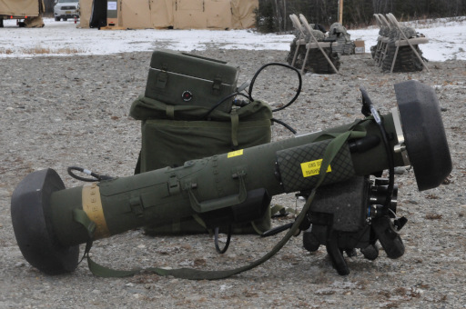

# FGM-148 Javelin

El Javelin es un missil antiblindatge guiat per calor tipus "dispara i oblida" i d'un sol ús fabricat per Raytheon i Lockheed Martin que pot ser operat per un sol infant a peu. Es tracta d'un dels missils mes emprats en els conflictes bèl·lics actuals per les diferents branques de les forces d'infanteria dels Estats Units d'Amèrica, entre elles, els Marines.

El sistema esta format per dos components: el llançador amb el missil precarregat i el CLU. El llançador es un tubde color verd que conté un missil Javelin, un cop utilitzat aquest es descarta ja que no pot esser recarregat. Tot i que està dissenyat per minimitzar el 'backblast', incorporant una solució salina a la part de darrera i amb un sistema d'impuls prèvi a la ignició del propel·lent, segueix essent una arma perillosa.

El CLU o Command Launch Unit, es un aparell força pesat i costós que va enganxat al tub i que permet adquirir els objectius i fixar-los. Consta amb una pantalla central, amb funcionalitats de zoom i diversos modes FLIR, diversos modes de llançament i el sistema de blocatge.

Una de les seves principals peculiaritats i que el fan realment rellevant, es la possibilitat de sel·leccionar atac "top-down", que es basicament que el missil segueix una paràbola pronunciada i impacta just a sobre l'objectiu.

{: .center}

| **Característiques**        | **Descripció**     |
|-----------------------------|--------------------|
| **Llançador**               |                    |
| -- **Longitud**             | 120 cm             |
| -- **Pes**                  | 18,2 kg            |
| **Projectil**               |                    |
| -- **Calibre**              | 127 mm             |
| -- **Velocitat de sortida** | -                  |
| -- **Longitud**             | -                  |
| -- **Pes**                  | -                  |
| -- **Rang mínim**           |                    |
| -------- **Entrenament**    | 100 metres         |
| -------- **Combat**         | 75 metres          |
| -------- **Armat**          | 75 metres          |
| -- **Rang màxim**           | 4.750 metres       |
| -- **Rang màxim efectiu**   | 4.750 metres       |

## Projectil

El Javelin disposa d'una única ojiva anti-tanc amb efecte tandem.

## Ús del Javelin

* Seleccionar l'FGM-48 Javelin.
* Observar objectiu amb el CLU (apuntar).
* Canviar a mode FLIR ++n++.
* Fer zoom al màxim sobre l'objectiu ++num-minus+num-plus++.
* Sel·leccionar mode de tir directe o "top-down" ++ctrl+tab++.
* Fixar el blanc ++alt+spc++.
* Sonarà un soroll i la pantalla es focalitzarà a l'objectiu. Un cop fixat apareixeràn dues linies perpendiculars sobre l'objectiu i el sò canviarà.
* Disparar.

### Notes

* No es poden fixar cossos freds, han de desprendre calor.
* Tècnicament es possible fixar soldats individuals i inclús animals.
* El mode "top-down" es especialment útil contra MBT, ja que els ataca pel punt més dèbil.
