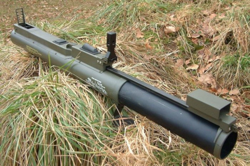

# M72 LAW

El LAW es un llançador anti-blindatge lleuger dissenyat per a combat proper, compacte i d'un sol ús de la mateixa manera que l'AT-4. A diferència d'aquest últim però, el LAW es un llançador especialment fabricat per a reduïr la mínim el pes fins al punt que es fins a 3 vegades mes lleuger que l'AT-4. El tub del LAW ve plegat, de manera que la seva longitud es molt reduïda i pot cabre força bé dins una motxilla gran.

{: .center}

| **Característiques**        | **Descripció**     |
|-----------------------------|--------------------|
| **Llançador**               |                    |
| -- **Longitud**             | 88,1 cm            |
| -- **Pes**                  | 2,3 kg             |
| **Projectil**               |                    |
| -- **Calibre**              | 60 mm              |
| -- **Velocitat de sortida** | 145 m/s            |
| -- **Longitud**             | -                  |
| -- **Pes**                  | -                  |
| -- **Rang mínim**           |                    |
| -------- **Entrenament**    | 50 metres          |
| -------- **Combat**         | 10 metres          |
| -------- **Armat**          | 10 metres          |
| -- **Rang màxim**           | 1000 metres        |
| -- **Rang màxim efectiu**   | 200 metres         |

## Projectil

El projectil del LAW conté una petita ojiva HEAT de 60 mm i es poc efectiu contra grups d'infanteria o edificis.

## Ús del LAW

* Seleccionar el LAW.
* Prémer ++r++ per a desplegar el tub i aixecar la mira.
* Apuntar a l'objectiu amb la retícula de la mira.
* Disparar.
