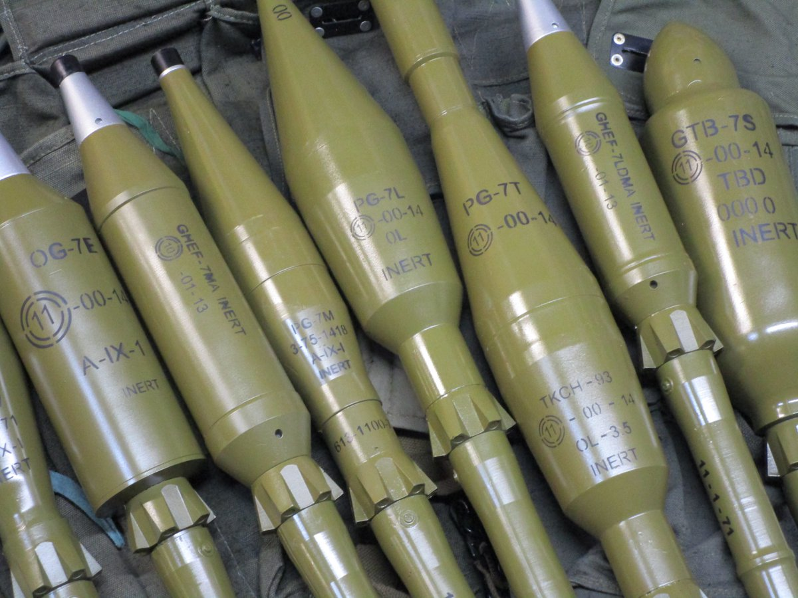

# Tipus d'ojives

Una ojiva, es la part d'un projectil que porta la càrrega explosiva, n'hi ha de molts tipus segons el porpòsit que tinguin. Cal tenir molt en compte que no totes les ojives serveixen per a destruïr o danyar vehicles blindats.

**HE**: Alt explosiu, es tracta d'una càrrega simple de TNT, sense metralla ni cap dispositiu penetrant. S'utilitza de manera ofensiva contra vehicles lleugers, APCs, IFV i contra edificis.

**HEDP**: Alt explosiu de doble propòsit, es tracta d'una càrrega de TNT envoltada per una gran quantitat de boles de ferro que causen un gran dany per fragmentació. Es útil contra vehicles lleugers, grups nombrosos d'infanteria, edificis i fortificacions. També pot inutilitzar o destruïr alguns blindats lleugers com APC o IFV. Cal deixar una distància de seguretat adient tenint en compte la distància del blanc per evitar danys propis.

**HEAT/HEAA**: Alt explosiu anti-tanc, es tracta d'una càrrega de TNT combinada amb una punta de termita que penetra lleugerament en el blindatge i detona dins. Es el tipus d'ojiva anti-blindatge més habitual i serveix per a destruïr o inutilitzar qualsevol tipus de vehicle blindat, excepte en el cas que disposi de blindatge reactiu.

**HP**: Alt penetrant, es tracta d'un projectil de ferro especialment pensat per perforar blindatges pesats, tot i que no causa grans danys si no toca cap punt vital del mateix. Es útil contra parts sensibles com dipòsits de combustible o munició o per a matar la tripulació.

**Termobàric / Novel Explosive (NE)**: Es tracta d'una càrrega explosiva barrejada amb un combustible de crema molt ràpida, que causa una ona de xoc que ho devasta tot, es especialment efectiu contra masses d'infanteria, edificis i fortificacions.

**Tandem**: Es tracta realment de projectils que contenen dues o més ojives consecutives que detonen en tandem, una darrera l'altra. Actualment s'utilitzen principalment contra blindats pesats amb blindatge reactiu.

{: .center}
