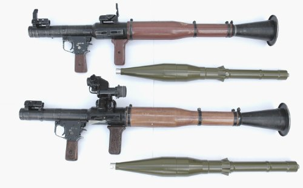
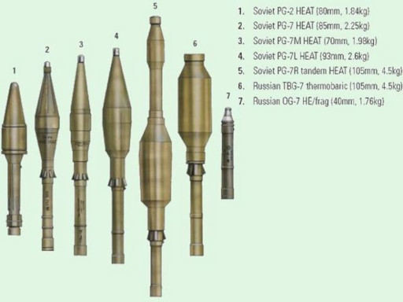

# RPG-7

El Ruchnoy Protivotankoviy Granatomyot literalment "llança-granades anti-tanc de ma" o més comunment conegut com a RPG que en anglès també es coneix com a Rocket-Propelled Grenade launcher, en la seva versió RPG-7 es el llança-coets anti-tanc reutilitzable més famós del mon, de fabricació soviètica i actualment russa, produït per l'empresa Bazalt. Es tracta d'un dels llançadors mes senzill d'operar i sobretot, més lleuger, el seu ús es extensissim tant en exèrcits regulars de tot el mon com de milicies o grups terroristes. El seu disseny senzill i minimalista i, sobretot, el seu baix preu, el fan en una de les armes mes cotitzades als camps de batalla moderns, capaç de destruïr un MBT amb blindatge reactiu de milions de dòlars amb un projectil d'uns pocs milers. Una de les característiques que fan de l'RPG-7 el llançador anti-tanc més icònic es la seva versatilitat, amb gran quantitat de tipus d'ojives per a tots els propòsits.

{: .center}

| **Característiques**        | **Descripció**     |
|-----------------------------|--------------------|
| **Llançador**               |                    |
| -- **Longitud**             | 95 cm              |
| -- **Pes**                  | 7 kg (amb PGO-7)   |
| **Projectil**               |                    |
| -- **Calibre**              | 40 mm              |
| -- **Velocitat de sortida** | 115 m/s            |
| -- **Longitud**             | -                  |
| -- **Pes**                  | -                  |
| -- **Rang mínim**           |                    |
| -------- **Entrenament**    | 100 metres         |
| -------- **Combat**         | 75 metres          |
| -------- **Armat**          | 75 metres          |
| -- **Rang màxim**           | 700 metres         |
| -- **Rang màxim efectiu**   | 330 metres         |

## Projectils

**PG-7VL**: Anti-tanc i anti-bunker d'ús general.

**PG-7VR**: Anti-tanc contra blindatge reactiu (tandem).

**TBG-7V**: Anti-bunker pesat (termobàric).

**OG-7V**: Anti-personal (fragmentació).

Existeixen altres variants antigues que ja no estan en producció.

{: .center}

## Ús de l'RPG

* Seleccionar l'RPG-7.
* Recarregar el projectil amb ++r++.
* Calibrar i apuntar amb ++page-up++ i ++page-down++ (o fent servir una mira PGO).
* Treure el fiador.
* Disparar.
