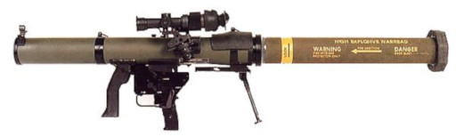

# Mk. 153 SMAW

El Mark 153 Shoulder-Launched Multipurpose Assault Weapon, més conegut com SMAW es un llançador anti-blindatge i anti-bunker desenvolupat per l'empresa McDonnell Douglas i utilitzat àmpliament dins el Cos de Marines dels Estats Units d'Amèrica. La seva fortalesa es basa principalment en el sistema anomenat "spotting rifle" que ve incorporat amb el llançador. Aquest sistema es un petit rifle enganxat al lateral del tub que s'alimenta d'una munició traçadora especial. Aquesta munició permet comprobar amb antel·lació on caurà el coet un cop disparat i realitzar els ajustaments necessaris si cal. Al contrari que el MAAWS, per a utilitzar l'SMAW es imprescindible utilitzar el visor telescòpic incorporat.

{: .center}

| **Característiques**        | **Descripció**     |
|-----------------------------|--------------------|
| **Llançador**               |                    |
| -- **Longitud**             | 137 cm (carregat)  |
| -- **Pes**                  | 13,39 kg           |
| **Projectil**               |                    |
| -- **Calibre**              | 83 mm              |
| -- **Velocitat de sortida** | 220 m/s            |
| -- **Longitud**             | 60 cm              |
| -- **Pes**                  | 4,5 kg             |
| -- **Rang mínim**           |                    |
| -------- **Entrenament**    | 50 metres          |
| -------- **Combat**         | 10 metres          |
| -------- **Armat**          | 10 metres          |
| -- **Rang màxim**           | 1800 metres        |
| -- **Rang màxim efectiu**   | 500 metres         |

## Projectils

L'SMAW disposa de tres tipus d'ojives: HEAA (HEAT), HEDP i NE (Termobàric)

## Ús de l'SMAW

* Seleccionar l'Mk. 153.
* Recarregar el projectil amb ++r++.
* Posar el fiador.
* Canviar al mode Spotting Rifle ++f++.
* Recarregar la munició de l'Spotting Rifle ++r++.
* Calibrar i apuntar.
* Disparar amb l'Spotting Rifle.
* Corregir el tret si escau.
* Canviar al mode Mk. 153 SMAW ++f++.
* Disparar.

Nota: les ratlles de la retícula de la mira telescòpica indiquen una desviació de 100m.
