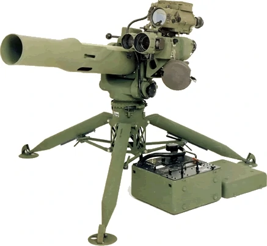
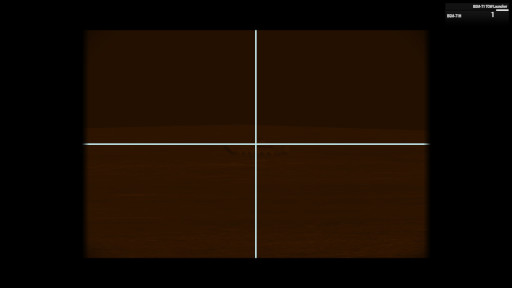

# BGM-71 TOW

El TOW es un míssil antiblindatge filo-guiat d'ús col·lectiu de tipus SACLOS. Es tracta d'un missil pesat que per les seves característiques ha d'anar sobre un suport de tipus trípode o muntat sobre un vehicle. El seu funcionament es basa en el sistema de guiatge SACLOS (de l'anglès Semi-Automatic Command to Line Of Sight) en la seva variant filo-guiada, que significa que el míssil es guiat en part pel mateix operador del sistema mitjançant un cable molt fi, mentre el missil es troba en trajectòria i ajustant-la movent la mira. El sistema de llançament inclou diversos modes visuals i FLIR de tipus fusió i un potent zoom. Es molt útil contra blindats pesats tipus MBT amb blindatge reactiu, objectius en moviment, i contra edificis o bunkers.

{: .center}

| **Característiques**        | **Descripció**     |
|-----------------------------|--------------------|
| **Llançador**               |                    |
| -- **Longitud**             | 116 cm             |
| -- **Pes**                  | 21,4 kg            |
| **Projectil**               |                    |
| -- **Calibre**              | 152 mm             |
| -- **Velocitat de sortida** | 320 m/s            |
| -- **Longitud**             | 116 cm             |
| -- **Pes**                  | 21,4 kg            |
| -- **Rang mínim**           |                    |
| -------- **Entrenament**    | 100 metres         |
| -------- **Combat**         | 75 metres          |
| -------- **Armat**          | 75 metres          |
| -- **Rang màxim**           | 3.750 metres       |
| -- **Rang màxim efectiu**   | 3.750 metres       |

## Projectils

Diposem de dos tipus de míssil TOW, el BGM-71E que es antiblindatge amb ojiva tandem i el BGM-71H que es termobàric d'alta potència.

## Ús del TOW

* Entrem com a artillers del sistema TOW (menú contextual).
* Canviem el tipus de míssil si escau (menú contextual).
* Apuntem.
* El mode de zoom també activa el mode termal si el necessitem ++num-minus++ i ++num-plus++.
* Centrem la mira sobre l'objectiu i disparem.
* Mentres el missil es a l'aire, movem la mira sobre l'objectiu per ajustar la trajectòria.

**Nota**: cal ajustar la trajectòria del míssil amb celeritat ja que normalment el temps sol ser de pocs segons (depenent de la distància de l'objectiu). Els ajustaments han de ser suaus, per evitar que el míssil es desvii massa.

{: .center}
