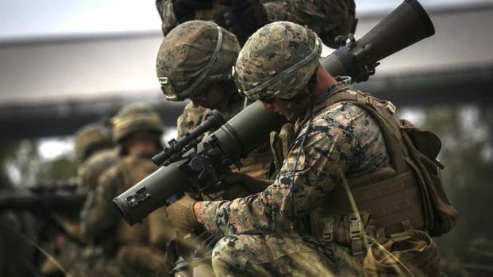

# Introducció

En la guerra convencional contemporània, es habitual trobar-se en situacions en que la infanteria ha de fer front a vehicles, armes i situacions de tota mena. Moltes d'aquestes situacions, son impossibles de combatre amb l'ús de fusells o metralladores i requereixen d'una potència de foc superior.

Aqui es on entren en joc els anomenats llançadors, que no son sinò armes de foc sofisticades que utilitzen projectils habitualment d'un calibre i potència molt superior a les d'un fusell normal. N'hi ha de totes les mides i de tota mena, des dels mes senzills i fàcils de fer servir fins als mes sofisticats i cars.

Els primers llançadors es van començar a utilitzar durant la Segona Guerra Mundial, d'allà be el famós M1 Bazooka (cal comentar que només s'anomena d'aquesta manera aquest model de llançador concret), el Panzershreck o el lleuger Panzerfaust alemanys. La seva utilitat principal era permetre a la infanteria, combatre els poderosos tancs que s'utilitzaven en grans quantitats.

Des de llavors han sorgit una gran quantitat de variants, algunes d'elles especialitzades en un tipus d'objectiu concret.

Aquest document està pensat per a donar els coneixements necessaris per a l'operació correcta dels sistemes de llançadors personals.

Els rols que podràs ocupar amb prioritat un cop superada la qualificació son:

* Anti-tanc lleuger
* Especialista anti-tanc
* Especialista anti-aeri
* Assistent d'especialista anti-tanc
* Assistent d'especialista anti-aeri

Per a optar a superar la qualificació, s'ha d'haver obtingut prèviament el Curs d'Infanteria Bàsic (C.I.B).

{: .center}
