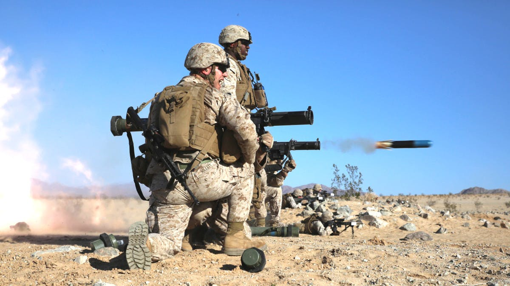

# Rols

Operar aquest tipus d'armament es habitual que requereixi de més d'un home, es el que s'anomenen armes d'ús col·lectiu o "Crew-Served Weapons" (CSW). Això es degut principalment a l'elevat pes dels projectils i de la necessitat de manenir la seguretat en tot moment. Aquestes funcions son les mateixes en el cas dels rols anti-tanc o anti-aeris. Cal tenir en compte que es possible que es necessiti més d'un assistent per cada especialista depenent del tipus de sistema emprat.

Les responsabilitats de l'especialista son:

* Porta el llançador i en te cura.
* Porta part dels projectils.
* Escull el tipus de projectil a utilitzar en cada cas.
* Coneix i aplica els protocols de seguretat.
* Coneix els diferentis tipus d'objectius i els seus punts dèbils.

Les responsabilitats de l'assistent son:

* Porta part de la munició.
* Distingeix i classifica els objectius.
* Ofereix assistència en l'ús del llançador.
* Cobreix a l'especialista.
* Assisteix a l'especialista en l'aplicació dels protocols de seguretat.

{: .center}
