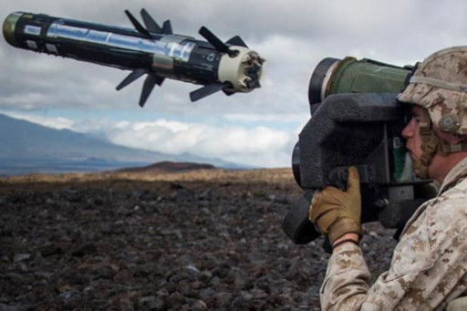

# Llança-coets vs Llança-missils

Sovint se solen confondre aquests dos conceptes, entenem per a llança-coets un tipus de llançador que dispara projectils no guiats, mentres que un llança-missils dispara projectils guiats.

Dins dels llança-coets existeixen dos tipus principalment:

* **Llançadors de projectils propulsats per coet**. Un exemple es el famós RPG-7V rús.

* **Rifles sense retrocés** o llançadors de projectils propulsats per càrrega explosiva. Aquests es diferencien en que els projectils son similars a petits obusos i son propulsats per una càrrega explosiva que detona dins el tub del llançador (de la mateixa manera que un cartutx de bala).

Les principals diferències estan subjectes al cost i el propòsit dels sistemes emprats, no cal dir que un llança-coets es molt més econòmic que un llança-missils, així com el cost dels mateixos projectils que s'empren.

Pel que fa als llança-missils trobem principalment dos tipus:

* **Guiats per cable**. El projectil es guiat manualment per l'artiller mitjançant un cable.
* **Guiats per calor** (IR). El projectil segueix de manera autònoma una firma de calor (emissió infrarroja).

Cal dir que els llança-missils s'els coneix amb les sigles ATGM i s'han fet molt habituals en els conflictes moderns.

{: .center}
