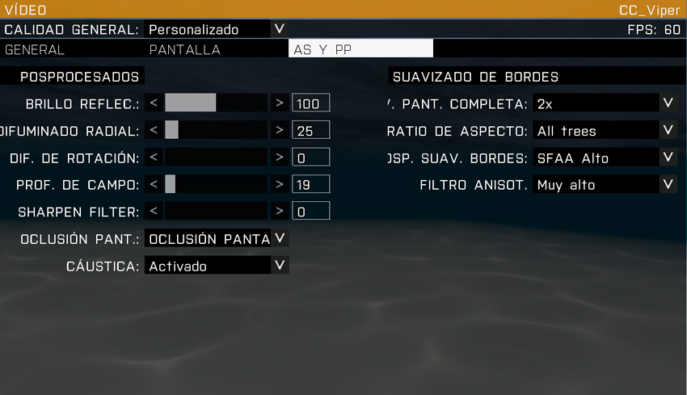
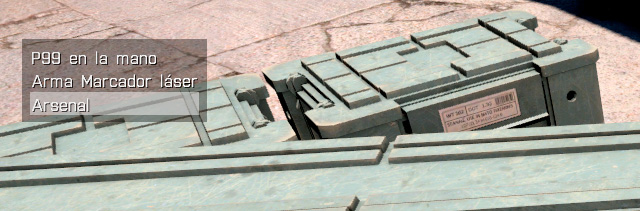
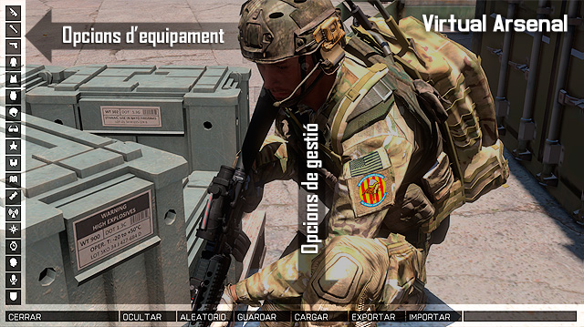
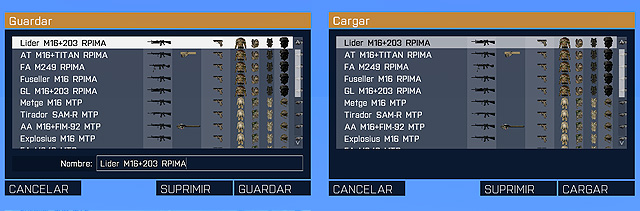
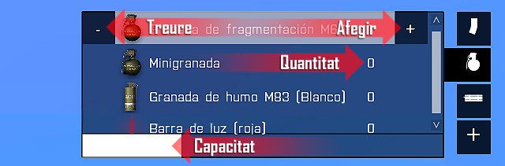

# Simulador

El simulador que fem servir actualment al grup és l'ArmA 3. És un simulador d'infanteria, amb la capacitat d'usar vehicles com a suport de la infanteria. Tot i que el simulador té un elevat realisme i complexitat pel que fa a la infanteria és molt més moderat per als vehicles.

El simulador també permet l'ús de «addons» fets per la comunitat, que modifiquen, milloren i/o inclouen noves característiques o material, com noves armes, vehicles, funcions, o sistemes.

Degut a l'alt nivell de complexitat, les partides a la saga ArmA són molt diferents de les partides en productes més comercials. Ja que requereixen de més coneixements militars, i d'actuacions més tàctiques.

ArmA 3 és un simulador molt complex, que requereix de molts mecanismes i tecles per funcionar: en aquest apartat descriurem tots aquests mecanismes.

## Configuració

Aquí et donarem unes nocions bàsiques d'alguns paràmetres importants per configurar el simulador i extreure'n el màxim de rendiment.

Per evitar possibles problemes, es recomana llançar el simulador amb permisos d'administrador. Cal que poseu el permisos al fitxer arma3.exe a la carpeta arrel del simulador.

### Joc

Es recomana ajustar el Capcineig a un nivell baix. És el que fa que el soldat mogui el cap en caminar, i a nivells més alts pot ser molest i dificultar la identificació d'amenaces.

Per saber el nivell de dificultat que cal establir, consulteu el PDB (Paquet de benvinguda) que us vam donar a l'entrar al grup.

### So

Una explicació bàsica dels paràmetres de configuració de so.

{: .center}

  - **Efectes:** És el volum de tots els efectes especials, explosions, trets, etc.
  - **Música:** Recomanem desactivar la música, perquè no molesti.
  - **Ràdio:** És el volum de les converses de guio de les missions.
  - **Veu en xarxa:** És el volum de les converses dels jugadors, amb el propi sistema de veu del simulador.
  - **Fonts de So:** És el numero d'efectes de so que poden reproduir-se al mateix moment. Recomanem posar 128 per no perdre detall.
  - **Micròfon:** És la sensibilitat del micròfon. Com més sensible, més fàcil que enviï la nostra veu per VOIP.

### Vídeo

Una explicació bàsica dels paràmetres de configuració de vídeo.

{: .center}

  - **Muestreig:** Re-escala la imatge. Si no tenim un ordinador molt potent, deixar a 100% i mai posar a menys.
  - **Textura:** Qualitat de la textura, es recomana entre Alta i Molt Alta.
  - **Objectes:** El número d'objectes que es mostren a llarga distància, es recomana entre Alta i Ultra.
  - **Terreny:** La qualitat del terreny, es recomana entre Estàndard i Alta.
  - **Ombra:** La qualitat d'ombres, es recomana Alta o superior, o Desactivat.
  - **Partícules:** La qualitat de partícules, es recomana entre Estàndard o Alta.
  - **Núvols:** Es recomana Baixa tret que tinguis un ordinador potent.
  - **PIP:** Miralls, pantalles de vídeo dels vehicles, etc. Es recomana Baix o Desactivat.
  - **Rang Dinàmic (HDR):** Entre Baix i Estàndard, canvia molt l'aspecte del simulador. Per una il·luminació més natural, deixar en Estàndard.
  - **Visibilitat (General, Objecte, Ombra):** La distància de dibuix, és una decisió personal basada en la potència de l'ordinador.

{: .center}

  - **Mode de visualització:** Es recomana Pantalla completa.
  - **Resolució:** És molt important fer servir la resolució nativa del nostre monitor.
  - **Relació d'aspecte:** Igual que en resolució, fer servir el del nostre monitor.
  - **Sincronització vertical:** Es recomana Activat.
  - **Interfície:** La mida de la interfície del simulador.
  - **Brillantor:** Regular la il·luminació de la imatge.
  - **Correcció gamma:** Regula la correcció cromàtica.

{: .center}

  - **Brillantor reflectida (Bloom):** Purament estètic, es recomana deixar a 100.
  - **Difuminat radial (Motion blur d'objectes):** Es recomana Desactivat o 25.
  - **Difuminat en rotació (Motion blur):** Es recomana Desactivat o 12.5.
  - **Profunditat de camp:** El desenfocament focal, es recomana Desactivat o 25.
  - **Sharpen Filter:** Enfoca la imatge, fent tot mes definit. Es recomana Desactivat o al gust de l'usuari.
  - **Oclusió de pantalla:** Millorar les ombres de tots els objectes, es recomana Oclusió de pantalla Baixa.
  - **Càustica:** Projecció de llum, com els raigs que travessen els copes del arbres, es recomana Activat.
  - **Suavitzat de bores a pantalla completa (Antialiasing):** Es recomana mínim x2, si l'ordinador ho permet, a mes millor.
  - **Rati d'aspecte (AToC):** Es recomana només Arbres.
  - **Post-processat suavitzat de bores (PPAA):** Es recomana de SFAA Alta a Ultra o Desactivat.
  - **Filtre anisotropic:** Es recomana Molt Alta o Ultra.

## Configuració de teclat

### Tecles bàsiques

Aquest és un recull de les tecles bàsiques del simulador, més algunes tecles d'alguns addons que fem servir. Per coneixer el llistat complet de tecles, mireu a dintre del simulador a **Opcions**->**Controls**->**Configurar addons**. O visiteu el web dels addons.

#### Infanteria

++w++++s++++d++++a++ Moure's.  
++c++ Commuta entre avançar amb l'arma preparada per disparar o no.  
++c++ Recolça l'arma.  
++c++ Desplega el bipode.  
++shift++ Córrer.  
++x++ Genoll a terra, en peu.  
++z++ Bocaterrosa, en peu.  
++v++ Sobrepassar un obstacle.  
++q++++e++ Decantar-se a esquerra o dreta, o rodolar quan estem estirats a terra.  
++ctrl+a++ Peu/cos a l'esquerra.  
++ctrl+d++ Peu/cos a la dreta.  
++ctrl+w++ Aixecar postura.  
++ctrl+s++ Abaixar postura.  
++w+s++ o ++s+w++ Commutar entre velocitats.  
++alt+"Ratolí"++ Moure només el cap.  
2x++alt++ Commutar moure nomes el cap.  
++"*"++ Commutar moure nomes el cap.  
2x++ctrl++ Abaixar-apujar arma.  
++tab++ Parlar pel VOIP. \*  
++"°"++ Menú d'ordres.  
++f1++-++f12++ Seleccionar soldats subordinats.  
++del++ Anular opció de menú / Obrir menú de comunicació.  
++spc++ Acceptar opció del menú d'usuari o del menú de comunicacions.  
++t++ Marca/desmarcar objectiu.  
++rbutton++ Apuntar, aguantar respiració, designar blancs per apuntar.  
++lbutton++ Disparar, designar blans per disparar.  
++ctrl+rbutton++ Canviar el tipus d'apuntat.  
++page-up++++page-down++ Regular elevació de les mires.  
++f++ Canviar tipus de foc.  
++r++ Recarregar.  
2x++g++ Llançar granada.\*\*  
++ctrl++2x++g++ Canviar entre tipus de granades.\*\*  
++b++ Binocles.  
++m++ Mapa.  
++ctrl+m++ GPS.  
++n++ Canviar entre modes de visió (nocturna, tèrmica), a peu com en vehicles.  
++i++ Inventari.  
++j++ Diari.  
++o++ Rellotge.  
++k++ Brúixola.  
++p++ Estadístiques.  
++num-minus+num-plus++ Zoom.  
++num1++-++num9++ girar vistes de cabina, girar cap.  
++l++ Llums, làsers.  
++minus++ Xat  
++comma++++period++ Canviar canal xat.  
++shift+"*"+num-minus++ escriure FLUSH. Refresca la VRAM. Això es útil per quan el nostre simulador comença a tenir error gràfics o baixades de rendiment.  

\* *VOIP es el sistema de de comunicació pròpia del simulador per jugadors.*  
\** *Per defecte ve diferent al simulador, cal per tant configurar-ho.*

#### Vehicles terrestres

++w++ Avançar normal.  
++shift+w++ Avançar ràpid.  
++ctrl+w++ Avançar lent.  
++s++ Frenar, marxa enrere.  
++a++++d++ Girar a esquerra i dreta.  
++"Ratolí"++ Girar a dreta i esquerra.  
++x++ Fre de ma.  
++c++ Treure el cap.  
++z++ Ficar el cap.  
++num0++ Mira òptica/pantalla.  
++t++ Marca/desmarcar objectiu.  

#### Avions

++w++ Capcineig avall.  
++s++ Capcineig a dalt.  
++a++++d++ Alabeiar a esquerra i dreta.  
++"Ratolí"++ Capcineig i Alabeig.  
++q++ Augmentar propulsió.  
++shift+q++ Propulsió extra.  
++z++ Disminuir propulsió.  
++x++ Guinyada esquerra.  
++c++ Guinyada dreta.  
++ctrl+g++ Tren d'aterratge.  
++ctrl+k++ Baixar flaps.  
++ctrl+l++ Pujar flaps.  
++g++ Contramesures.  
++num0++ Mira òptica/pantalla.  
++t++ Marca/desmarcar objectiu.  

#### Helicòpters

++w++ Capcineig avall.  
++s++ Capcineig a dalt.  
++a++++d++ Alabeiar a esquerra i dreta.  
++"Ratolí"++ Capcineig i Guinyada.  
++shift++ Augmentar propulsió.  
++z++ Disminuir propulsió.  
++q++ Pedal esquerra.  
++e++ Pedal dret.  
++g++ Contramesures.  
++num0++ Mira òptica/pantalla.  
++t++ Marca/desmarcar objectiu.  

#### Submarins

++w++ Avançar.  
++s++ Retrocedir.  
++a++++d++ Girar a esquerra i dreta.  
++"Ratolí"++ Capcineig i Gir.  
++x++ Emersió.  
++z++ Immersió  
++num0++ Mira òptica/pantalla.  
++t++ Marca/desmarcar objectiu.  

### Tecles ACE 3 (versió 3.12.1)

Per tal d'accedir al menú de configuració del mod, un cop dintre d'una partida, li doneu a ++esc++ i feu clic a Opcions ACE 3 a dalt a l'esquerra.  
Les tecles que es mostren aquí són nomes un resum, si vols coneixer totes les tecles ho pots mirar al seu [web oficial](https://ace3mod.com/wiki/user/shortcuts.html) o al propi simulador, a **Opcions**->**Controls**->**Configurar addons**.

++"Windows esquerra"++ Menú d'interacció.  
++ctrl+"Windows esquerra"++ Menú d'interacció.  
++"º"++ Posar/treure fiador a l'arma.  
++page-up++++page-down++ Variar elevació de la mira.  
++ctrl+page-up++ i ++ctrl+page-down++ Variar desviació de la mira.  
++l++ Activar/desactivar laser/lanterna acoplada.  
++ctrl+c++ Canviar entre laser o llanterna.  
++shift+"Inici"++ Canviar entre aparells electrònics.  
++"Inici"++ Obrir l'aparell electrònic seleccionat. Canviar la mida.  
++ctrl+"Inici"++ Tancar l'aparell electrònic.  
++tab++ Il·luminar objectiu (laser).  
++shift+k++ Mostrar informació del vent.  
++ctrl+shift+k++ Mostrar el transportador.  
++page-up++++page-down++ Ajustar FCS a dalt abaix.  
++ctrl+shift+t++ Netejar ulleres.*  
++8++ Canviar mode de llançament primari de granada.  
++shift+g++ Utilitzar el mode de llançament secundari de granada.  
++ctrl+g++ Canviar el mode de llançament secundari de granada un cop seleccionat.    
++ctrl+t++ Tocar espatlla.    
++shift+r++ Desencasquetar l'arma.    
++ctrl+r++ Verificar munició.  
++tab++ Vector – Tecla d'azimut.  
++r++ Vector – Tecla de distància.  
++ctrl+v++ Escalar obstacle.  
++del++ Limitador de velocitat.  
++1++ Seleccionar pistola.  
++2++ Seleccionar fusell.  
++3++ Seleccionar llança-granades.  
++4++ Seleccionar llançador.  
++5++ Seleccionar binocles.  
++6++ Seleccionar granades ofensives (fragmentació, cegadora...)     
++7++ Seleccionar granada defensives (fum, llum química...)  
++0++ Enfundar arma.    

* *Per defecte ve diferent al mod, cal per tant configurar-ho.*

### Tecles ACRE 2 (versió 2.5.1)

Les tecles que es mostren aquí són nomes un resum, si vols coneixer totes les tecles ho pots mirar al propi simulador, a **Opcions**->**Controls**->**Configurar addons**.

++"Bloq Majúscules"++ Transmetre per radio.  
++shift+"Bloq Majúscules"++ Seleccionar ràdio 1 (AN/PRC-343).  
++ctrl+"Bloq Majúscules"++ Seleccionar ràdio 2 (AN/PRC-152).  
++alt+"Bloq Majúscules"++ Seleccionar ràdio 3 (AN/PRC-117F).  
++shift+alt+"Bloq Majúscules"++ Canviar entre radios.  
++tab++ Control del volum de la teva veu (afecta la detecció de la IA).  
++ctrl+alt+"Bloq Majúscules"++ Obrir/tancar la interfície de la ràdio.  
++shift+period++ Intercomunicador.  

## Multijugador

### Cercar servidors

Si volem cercar servidors ja creats, al l'explorador de servidors tenim diferents opcions.

{: .center}

Aquí podeu seleccionar a dalt a la dreta, on posa direcció, si voleu veure els servidors d'Internet, o els interns de la vostre LAN.

Els servidors del llistat poden tenir a l'esquerra quatre tipus d'icones de colors.

-  Totalment compatible amb la nostre versió de l'ArmA 3.
-  Incompatible amb la nostre versió de l'ArmA 3.
-  Diferencies de versió que el podria fer incompatible, però sovint funciona.
-  Servidor amb contrasenya.

Degut a que fem servir un estàndard d'addons propis a la comunitat, la majoria sortiran al llistat com Grocs o Vermells, però els grocs funcionen moltes vegades.

Si volem cercar un servidor en concret, com el de la nostra comunitat, el millor és fer servir el botó Filtre que veieu a la captura.

{: .center}

Aquí tenim diferents paràmetres a configurar, tot i que en realitat normalment es deixen tots tal com es veu a la pantalla, i l'únic que fem és a Amfitrió posar el nom del servidor que volem cercar, en aquest captura, cavallers.

### Crear servidors

Si el que vols és crear partida, tens dues opcions. Muntar un servidor dedicat, més orientat a qui tingui un bon ample de banda a casa i a ser possible (però no indispensable) un ordinador extra que porti la partida i faci de host. O crear una partida multijugador normal, més ràpid i fàcil, però sense donar-nos tanta potència de servidor.

Aquí només t'explicarem com muntar una partida normal multijugador.

Per crear la partida, primer cal obrir els ports necessaris al teu router. Per saber com obrir ports adreçat al manual del teu router, a les pàgines d'internet sobre ADSL/Fibra Òptica o al teu proveïdor.

Els ports necessaris son:
 
<table style="width:58%;">
<colgroup>
<col style="width: 20%" />
<col style="width: 18%" />
<col style="width: 19%" />
</colgroup>
<thead>
<tr class="header">
<th>Aplicació</th>
<th>Protocol</th>
<th>Prot</th>
</tr>
</thead>
<tbody>
<tr class="odd">
<td>Battleye</td>
<td>TCP/UDP</td>
<td>2344</td>
</tr>
<tr class="even">
<td>Battleye</td>
<td>TCP</td>
<td>2345</td>
</tr>
<tr class="odd">
<td>ArmA 3/Steam</td>
<td>UDP</td>
<td>2302-2305</td>
</tr>
<tr class="even">
<td>Steam</td>
<td>UDP</td>
<td>27000-27030</td>
</tr>
<tr class="odd">
<td>Steam</td>
<td>UDP</td>
<td>4380</td>
</tr>
<tr class="even">
<td>Steam</td>
<td>TCP/UDP</td>
<td>8766</td>
</tr>
</tbody>
</table>

Un cop tinguis els ports oberts, a l'explorador de servidors fes clic al botó Nova, i veuràs aquesta pantalla.

{: .center}

Aquí has d'escriure el nom del servidor, si vols que funcioni a Internet o a LAN, el port que vols fer servir, normalment sempre entre el port 2303 i 2305, el nombre de jugadors màxims i la contrasenya si vols.

## Virtual Arsenal

El Virtual Arsenal o VA, és l'eina que integra el simulador Arma 3 que et permet modificar el teu equipament d'una manera ràpida i eficaç.

Per accedir a l'eina és necessari que la missió on et trobis hagi estat editada afegint aquesta opció. Normalment trobaràs l'opció del Virtual Arsenal a les caixes de munició designades.

{: .center}

Un cop seleccionada l'opció d'Arsenal et veuràs en tercera persona amb diverses opcions en pantalla. Classificarem la informació que veiem en pantalla en *Opcions d'equipament* i *Opcions de gestió*.

{: .center}

### Opcions de gestió

Les opcions de gestió et permeten fàcilment intercanviar diversos perfils per minimitzar el temps necessari per equipar-te.

  - **Close / Tancar:** Tanca l'eina i tornes al simulador amb l'equipament que hagis escollit
  - **Hide / Amagar:** Amaga la interfície gràfica per deixar-te la vista en tercera persona. En fer clic a qualsevol punt de la pantalla tornes a la pantalla d'Arsenal
  - **Random / Aleatori:** Aquesta opció realitza una configuració aleatòria del teu equipament. No és una opció que fem servir al nostre estàndard ja que sempre tindràs control sobre el teu equipament abans d'entrar en missió
  - **Save / Desar:** Permet guardar tot l'equipament actual que portis. Et demanarà el nom del perfil per desar i si ja existeix el sobreescriurà. És recomanable que per cada missió un cop personalitzat l'equipament et guardis en un perfil 'actual' de manera que podràs carregar-ho cada cop que sigui necessari durant la missió
  - **Load / Carregar:** Aquesta opció et permet carregar l'equipament d'un perfil desat anteriorment. A l'estàndard pots trobar un conjunt de perfils ja personalitzats pels diferents rols que pots assolir. Actualment et pots trobar amb alguns elements del teu equipament que encara que els desis en un perfil en carregar no s'afegeixen al teu equipament de manera que convé fer una comprovació ràpida del teu equipament. És un error del simulador.
  - **Export / Exportar:** Permet exportar al porta-papers la configuració actual del teu equipament per poder compartir-ho amb altres usuaris.
  - **Import / Importar:** Permet importar la configuració de l'equipament del porta-papers.

{: .center}

### Opcions d'equipament

Les opcions d'equipament les tens distribuïdes en diferents icones que fan referència a **l'armament** (fusell, llançador i pistola), **uniformació** (uniforme, armilla, motxilla i casc), **accessoris** (ulleres/passamuntanyes, dispositius de visió nocturna, binocles, mapa, terminal, comunicacions, navegació i rellotge) i **personalitzacions** (cara, veu i insígnia).

#### Armament

Dintre de les tres opcions d'armament pots escollir tant l'arma com els seus accessoris (mires, afegits de rail i afegits de canó).

{: .center}

#### Uniformació

Dintre de les opcions d'uniformació pots seleccionar tipus d'uniformes, armilles i motxilles que et permeten afegir material al seu interior.

{: .center}

Per cada element que vulguis afegir o treure fes ús dels símbols + i -.

La numeració a la dreta de l'element et diu quantes unitats portes de d'aquell element a l'inventari de la peça d'uniforme seleccionada. Per exemple, portes 10 granades M67 a l'armilla.

La capacitat de càrrega disponible i ocupada es mostra mitjançant una barra blanca a la part inferior del quadre d'inventari de la peça d'uniforme seleccionada.

{: .center}

#### Acessoris

Els accessoris no permeten multiplicitat a través del Virtual Arsenal, de manera que per cada element d'accessori només es permet un element. Si vols carregar més d'un element d'aquest tipus, hauràs de moure l'element a l'uniforme/armilla/motxilla i tornar a seleccionar-lo al VA.

  - **Ulleres / passamuntanyes:** Elements accessoris de cara.
  - **NVGs:** Dispositius de visió nocturna.
  - **Binocles:** Binocles, designadors laser i altres dispositius de telemetria.
  - **Mapa:** Mapes.
  - **Terminal:** Tablets i dispositius per UAV.
  - **Navegació:** Brúixoles.
  - **Rellotge:** Rellotges.

#### Personalitzacions

Els elements de personalització et permeten diferenciar el teu personatge per la seva cara, veu, així com afegir una insígnia ja sigui la del grup 1RA, rang associat o qualsevol altre.

En aquesta segona fase, començaràs a aprendre els conceptes bàsics que ha de saber un soldat, com les RDC o Regles de combat (ROE en anglès "Rules of Engagement"), la navegació a peu, patrullar o les primeres nocions sobre fer servir armes de foc.

La informació que es dóna està limitada al què es vol ensenyar, i es deixa de banda la informació més ampliada per següents capítols o cursos i/o monogràfics més avançats.