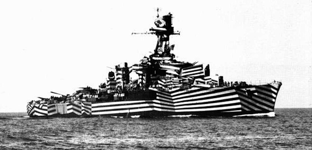

# Camuflatge i ocultació

Una de les principals funcions, si no la més important, que has de tenir en compte quan inicies una missió i especialment quan entres en combat, és la de fer tot el possible per sobreviure al combat duent a terme la teva missió. Probablement el millor que pots fer d’entrada és evitar que et disparin. I és poc probable que et disparin si no et veuen. Aquest és l’objectiu fonamental d’aquesta secció, prendre consciència de la teva situació en combat i maximitzar les possibilitats de supervivència i èxit.

Per evitar ser vist, disposes fonamentalment de dues eines:

* Evitar ser vist interposant quelcom entre tu i l'observador.
* Evitar que l'observador et detecti intentant passar desapercebut en l'entorn.

## Fonament del camuflatge

L'ésser humà té la predisposició per detectar formes antropomorfes on mira. A la natura no hi ha res completament rodó i si veus una cosa rodona, ràpidament veuràs una cara i si a sobre aquesta forma es mou d'una forma característica (a sobre d'una estructura allargada), ràpidament pensaràs que estàs veient un altre humà. Aquest fet, és a dir, ressaltar en l'entorn, és el que anomenarem disrupció.

Quan observes l’entorn el teu cervell no para atenció en allò que esperes veure. Per tant el primer que detectes no és allò que veus si no la interrupció sobtada d'allò que esperes seguir veient. I en el nostre cas particular, el primer que detectes són humans.

{: .center}

En aquest cas, el soldat ressalta completament sobre l'entorn. Està dret sobre la línia de l’horitzó amb tota la silueta ressaltada.

### Conceptes

#### Camuflatge

El camuflatge consisteix en intentar en la mesura del possible fer que l'objecte o ésser en qüestió s'assembli tant com es pugui al seu entorn, de manera que es desdibuixi tant com es pugui en el seu entorn. Per tant, l'objectiu del camuflatge no és altre que evitar la disrupció.

{: .center}

Observa com el soldat presenta colors similars al del fons on es troba i gairebé no ressalta en l’entorn. Les ombres del seu entorn l’ajuden a no presentar reflexos ni contrastos que el facin massa visible. Si no es mogués, podria passar hores ocult en aquesta posició.

#### Camuflatge disruptiu

Hem conclòs que el fet de ressaltar en l’entorn és el que anomenem disrupció. Per sí mateix, aquest concepte et pot permetre no tant ocultar-te com alterar la percepció de distància, forma i orientació.

{: .center}

Un cas històric: Camuflatge Razzle Dazzle. Emprant alts contrastos i trencant les línies pròpies de la nau, dificulta enormement la percepció de l’orientació i de la silueta del vaixell.

Pots emprar la disrupció, combinada amb altres tècniques de camuflatge pròpiament dit per tal de crear una alteració de la percepció del contorn i la forma i el color de tal manera que, en conjunt, l’objecte o soldat passi desapercebut quan el poses en un entorn determinat. Aquest concepte és el que més utilitzaràs, sense adonar-te'n. El pots veure sovint en la majoria de patrons de camuflatge multi-terreny, en els maquillatges, així com al camuflatge de la major part de blindats i vehicles militars, inclosos en molts casos els aeris.

{: .center}

El patró MTP és un paradigma del camuflatge disruptiu. Cal observar com crea un efecte de difuminació del contorn jugant amb la llum i la ruptura del contorn amb elements de contrast. Aquesta és la clau del camuflatge disruptiu i en general dels patrons actuals multi-terreny.

#### Mimetisme

El mimetisme és un concepte que se sol confondre amb el de camuflatge. En aquest cas el que es pretén és fer que un objecte o ésser viu s'assembli a una altre objecte o ésser viu, no a l'entorn en si. Per tant, un objecte o ésser mimetitzat pot crear o no disrupció en el seu entorn. És quan el mimetisme t'ajuda a confondre't amb l'entorn que actua com a mètode de camuflatge.

{: .center}

En aquesta imatge dones un pas més en la ruptura de la disrupció, assimilant les plantes de l'entorn, de forma mimètica, et fas passar per un matoll.

{: .center}

Observa com, tot i estar completament exposat, pràcticament no destaca sobre l’entorn perquè s’assembla molt a l’herba sobre la qual es troba.

#### Ocultació

Aquí el que es pretén no és altra cosa que trencar la línia de visió entre observador i observat. Simplement aconsegueixes que quelcom opac estigui entre tu i l'observador. Sovint aquest concepte ve associat amb el de cobertura, però no és necessàriament així. La cobertura implica que dificultes el fet que l'observador et pugui disparar directament, doncs l'objecte que tens al davant és prou sòlid per tal d'aturar o minimitzar l'impacte dels projectils. En canvi si l'objecte que tens al davant no aconsegueix aquest efecte, estàs obtenint ocultació, però no cobertura.

Entén que l’ocultació dependrà de la perspectiva i per tant una bona ocultació endavant es perd ràpidament si l’observador et mira des del costat.

{: .center}

En aquesta imatge el matoll bloqueja la visió des de les 12, deixant-te completament ocult. Malgrat això, no et genera cap cobertura del foc enemic.

{: .center}

És vital entendre i no caure en el parany de confondre aquests dos conceptes. Tenir bona cobertura sempre és bo, però sovint una ocultació adequada pot compensar la manca de cobertura.

#### Moviment

El moviment és un factor molt important, directament lligat al funcionament ocular des humans. L'ull humà percep millor el moviment que no pas la forma, especialment a la visió perifèrica. Per tant, els moviments ràpids o sobtats atreuen més l'atenció de l'observador. Per evitar ser detectat, en situacions d'alt risc cal que es mantinguin els moviments al mínim, aprofitant el moviment dels ulls, o fent servir només el cap per tal de no moure tot el cos.

També cal evitar els moviments ràpids o massa sobtats, que podrien atraure ràpidament l'atenció dels enemics. De la mateixa manera, si vols detectar més fàcilment el moviment enemic, s'ha de fer servir la visió perifèrica, més adaptada a aquesta tasca. Cal tenir en compte per això que les aplicacions d'aquestes tècniques al simulador són limitades.

## Camuflatge al nostre simulador

Al simulador cal tenir en compte que la IA omet aquest detalls, i per tant no és capaç de distingir entre colors o formes, però si ens enfrontem a altres jugadors humans aquestes qüestions poden ser de gran importància.

La IA pot distingir entre les postures verticals, com més vertical estiguis més visible seràs. Rodolar per terra equival a una posició vertical elevada. Les diferents velocitats del nostre soldat també amplien la capacitat de detecció de l'enemic.

Hi han atenuants de la detecció. La foscor i la boira redueix el rang de visió de la IA, la pluja dificulta la percepció auditiva de la IA, el fum en bloqueja la línia de visió així com les branques de matolls o arbres (amb un sistema no massa precís ni eficaç). Estar sota l'aigua també dificulta la detecció.

## Elements a tenir en compte per aconseguir un bon camuflatge i ocultació

### Contrast i il·luminació

Un element que es ressalta sobre el fons, es fa molt fàcilment detectable.

  - Sempre que estiguis en una posició elevada, hauries d'evitar els pics de les muntanyes i les crestes, especialment en posició bípeda. Sempre serà preferible agafar una posició "a mitja muntanya", és a dir, descendir una mica per tal que no ressaltis contra el cel.
  - De la mateixa manera, camins i carrers són elements plans on qualsevol element que s'hi estigui cridarà l'atenció, és a dir, generarà disrupció. Per tant, si has d'estar o avançar per un camí o carrer, especialment si està asfaltat, procura sempre mantenir-te als borals, entre la brossa i la vegetació que s'hi acumula i si això no és possible, cerca ocultar-te en estructures properes.
  - Els llindars dels boscos són crítics. Mai t’aturis al mateix llindar doncs és una zona de molt contrast entre l’ombra del bosc i la il·luminació ambiental. Intenta, al contrari, aturar-te un parell de metres dins del bosc, on encara predomina l’ombra. Hi tindràs la mateixa visió i destacaràs molt menys.
  - Sempre que cerquis passar desapercebut, cal pensar que és més difícil veure un objecte que està en una àrea poc il·luminada que un objecte a la llum del sol. Si pots triar, la part ombrívola d'un arbre, per exemple, ofereix millor ocultació que la part assolellada. La teva ombra també és un element que genera contrast, a part de ser visible ella mateixa, pot ressaltar la teva silueta. A més, l'impacte del sol sobre el nostre equip pot generar reflexes que cridin l'atenció sobre la teva posició.
  - El moviment pot trencar qualsevol mesura d’ocultació, per bona que sigui. L’ull humà n’és especialment sensible. És més fàcil detectar un moviment a la visió perifèrica, per petit que sigui que un objecte ben ocult a la visió central. Per tant, fins i tot quan pensis que l’observador no et veu pots trencar tot l’esquema visual amb un moviment.

### Terreny

Analitza el terreny que ocupes i que ocupa el teu enemic.

  - Aprèn a detectar barrancs, línies de cases, canyars, boscos, muntanyes, que et permetin avançar maximitzant l'ocultació i disminuint la disrupció. No és convenient avançar per terrenys oberts o descoberts si és previsible la detecció. L’aproximació a un objectiu ben defensat farà que sigui primordial aquest aspecte per tal d’obtenir el màxim avantatge a l’hora de passar tan desapercebut com sigui possible.
  - Les posicions elevades, tot i que et donen una magnifica visió solen ser en sí mateix zones que despunten i per tant on hi esperaries un observador, pel que et faran vulnerable si hi romans molta estona o si t’hi mous. Evita els llocs obvis.

### Equip

Un cop equipats, has de tenir en compte també elements del teu equip que et poden fer visible o ajudar-te en l’ocultació.

  - **Elements que de forma passiva et fan visible.** per exemple un llançador AT4 a l'esquena no és un element fàcilment ocultable.
  - **Elements que de forma activa poden revelar la teva posició.** Quan obres foc, especialment amb baixa il·luminació ets una petita font de llum fàcilment detectable. L’ús de traçadores revela la teva posició. Encendre el làser a la nit si l’enemic porta visió nocturna crea un camí que ineludiblement porta cap a tu.
  - **Elements que de forma activa t'ajuden a ocultar-te.** Pots afavorir la teva ocultació amb l’us correcte i actiu de les granades de fum com a mesura d’ocultació dels teus moviments.
