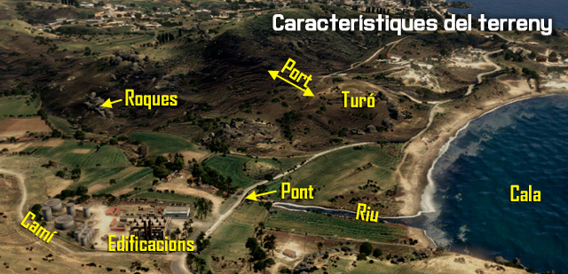
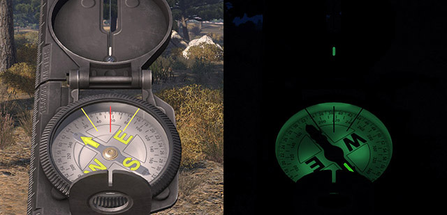
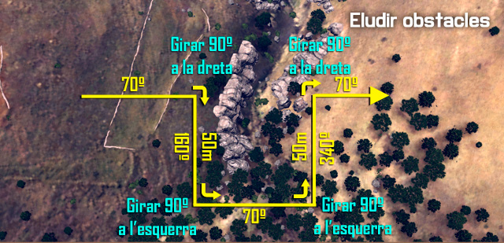
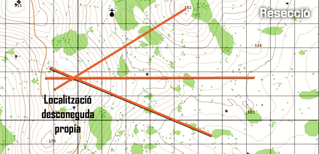

# Navegació terrestre desmuntada

Per tal de moure's pel camp de batalla, un soldat ha de saber reconèixer el terreny, orientar-se, interpretar coordenades. Per facilitar aquesta tasca, hi han diferents tècniques i eines que et permetran fer-ho de forma ràpida i efectiva.

## Característiques del terreny

El terreny és una part vital del combat, determina la ruta de patrulla, la zona d'ocultació i l'avantatge en combat. Saber reconèixer el terreny i marcar mentalment els punts d'interès és important per mantenir-te en tot moment en una posició de seguretat.

En aquesta imatge pots veure un exemple d'imatge mental que s'ha de fer de la zona.

{: .center}

### Punts clau

Els terrenys, principalment als simuladors, solen tenir uns punts habituals, que et poden ajudar ràpidament a orientar-te. Són punts de fàcil reconeixement, i molts significatius.

  - Carreteres i vies.
  - Rius, rierols i llacs o basses.
  - Edificis.
  - Grups d'arbres.
  - Pics de muntanya.

Aquests punts son freqüents, molt característics i ajuden molt a l'orientació.

## Brúixola

El millor mètode per trobar la direcció, de dia o de nit, és la brúixola. Aquesta et permet orientar-te en tot moment fent servir el nord magnètic. Per treure la brúixola cal polsar la tecla ++k++, o fer 2x++k++ si volem que es quedi en pantalla.

{: .center}

La brúixola està graduada de tres formes. La primera i més simple és amb el sistema cardinal, Nord, Sud, Est, Oest, que permet una orientació ràpida. També està graduada per graus del 0 al 359, que et dóna un sistema precís, però una mica més lent. I per últim amb el sistema de "Mils", que és exclusiu dels militars, i està pensat per orientar atacs d'artilleria o similars. En el sistema Mils has de recordar que s'ha de posar dos zeros al número. És a dir si la marca a l'anella exterior és 2, s'han de donar 200 mils.

Com qualsevol altre objecte, només podem fer servir la brúixola si la portem equipada a l'inventari.

### Llegint l'azimut

L'anell interior de la brúixola et dóna els graus, de 0 a 359. Per una ràpida referència, el Nord és 0, l'Est 90, el Sud 180 i l'Oest 270.

#### Llegint un azimut invers

Si vols obtenir ràpidament el rumb invers del que llegeixes, si l'azimut és menor de 180, li has de sumar 180 graus. I si l'azimut és major de 180, li has de restar 180 graus.

### Eludint obstacles

Si t'estàs movent i et trobes un obstacle, com un pantà, un camp de mines, etc... les passes a seguir, anomenades Desplaçament de 90 graus, per sortejar l'obstacle i continuar amb el rumb original són:

1.  Anar cap a l'obstacle i fer un gir de 90 graus cap a dreta o esquerra.
2.  Caminar seguint l'obstacle, mesurant la distància en metres o peus.
3.  Aturar-te al final de l'obstacle, mirar cap al rumb original, i seguir l'azimut fins passar l'obstacle.
4.  Fer un gir de 90 graus a dreta o esquerra i caminar la distància mesurada abans.
5.  Girar 90 graus a dreta o esquerra i seguir la senda original de la marxa.

{: .center}

### Intersecció

La intersecció és la localització d'un punt desconegut per l'ocupació successiva de com a mínim dos, preferiblement tres punts coneguts. Es fa servir per localitzar punts no llegibles al mapa o no fàcilment identificables. Per determinar la intersecció, segueix aquestes passes:

1.  Orientat al mapa fent servir la brúixola.
2.  Localitza i marca la teva posició al mapa.
3.  Mesura l'azimut magnètic fins al punt desconegut.
4.  Dibuixa una línia al mapa des de la teva posició seguint l'azimut llegit.
5.  Mou-te fins a una nova posició coneguda des d'on tinguis visual del punt desconegut. Localitza aquest punt al mapa i torna a orientar-te fent servir la brúixola. La segona posició ha d'estar com a mínim a 30 graus de la primera en referencia al punt desconegut.
6.  Repetir les passes 4 i 5.

{: .center}

Per comprovar la precisió, mou-te fins a una tercera posició, i repeteix les passes de l'1 al 4. On es creuen les línies és la localització del punt desconegut. Fent servir tres línies, de vegades es forma un triangle, que es coneix com a Triangle d'error. Si el triangle és gran, torna a comprovar la teva feina per trobar l'error. No assumeixis que el mig del triangle és el punt desconegut.

### Resecció

La resecció és la localització desconeguda del soldat mirant dos o tres punts coneguts al mapa. Per determinar la intersecció, segueix aquestes passes:

1.  Orientat al mapa fent servir la brúixola.
2.  Localitza dos o tres posicions conegudes al terreny, i marca-les al mapa.
3.  Mesura l'azimut magnètic fins a la posició coneguda.
4.  Canvia l'azimut, a l'azimut invers i dibuixa una línia al mapa des de la posició coneguda.
5.  Repeteix les passes 3 i 4.

{: .center}

Per comprovar la precisió, repeteix les passes de dalt per la tercera posició coneguda. La intersecció de les tres línies és la teva localització. Fent servir tres línies, el triangle d'error es pot formar. Si el triangle és gran, torna a comprovar la teva feina per trobar l'error.

## Determinar distàncies

La determinació de distàncies és el mètode per calcular la distància entre l'observador i un objectiu enemic o un objecte. La determinació correcta de la distància impacta sobre l'efectivitat d'una unitat al disparar a un enemic. La precisió en el calcul depèn de molts factors, com el terreny, el clima, i l'experiència de l'observador.

### Estimació mental

L'estimació mental de distàncies es fa agafant com a referència una unitat de distància coneguda. La distància s'estima a prop dels 100 metres per agafar una unitat de referència. Per exemple, un camp de futbol, amb uns 100m aproximadament, pot ser agafat com a unitat de referència per determinar distàncies entre l'observador i l'objectiu. Per distàncies més llargues, l'observador determina quantes d'aquestes unitats cobreixen la distància, així per exemple 350m serien tres camps de futbol i mig.

## Llegint el mapa

La lectura d'un mapa és fàcil un cop has aprés els fonaments. Per poder veure el mapa, que ha d'estar al teu inventari, cal prémer la tecla M. El més important a recordar és que la quadricula ha de ser llegida cap la dreta i, després cap amunt. A causa del fet que la quadricula del mapa es compon en la seva totalitat de números, és important que no confonguis el sentit de lectura, o donaries unes dades totalment equivocades.

{: .center}

Tingues en compte que depenent del zoom del mapa, pots veure dos, tres, o fins i tot quatre números per quadrícula horitzontal o vertical. Això reflecteix la precisió de la coordenada. Per exemple, una quadrícula de sis dígits (3+3) defineix un quadrat que és de 100 metres de costat. Una quadrícula de quatre dígits (2+2) defineix un quadrat que es de un quilòmetre de costat. Una quadrícula de vuit dígits és de 10 metres de costat, mentre que una quadrícula de deu dígits és d'1 metre de costat.

Tanmateix, si tens una quadricula amb precisió insuficient, sempre pots subdividir tu la quadricula a quadrats més petits, per ampliar la precisió. Així per exemple, si tens un objectiu al ben mig de la coordenada 093175, pot donar la coordenada 09371756, ja que si subdividim el quadrat en 10 caselles més horitzontals i verticals, el mig d'ambdues seria el 5.

{: .center}

Depenent dels nivells de dificultat i addons usats, pots tenir una etiqueta al ratolí que mostra l'elevació i les coordenades d'on es troba el cursor. Si bé aquesta és una eina molt útil, saber llegir quadricules correctament és una habilitat essencial.

### Interval de contorn

L'Arma 3 compta amb un sistema de quadrícula que dinàmicament re-escala la malla segons el zoom que tens. L'interval de contorn vol dir que cada línia de contorn representa X metres d'espai vertical. Per tant, si hi ha tres corbes de nivell de diferència entre la teva posició i l'altra posició, es multiplica aquest nombre per l'escala de contorn per arribar a la quantitat de diferència vertical entre les posicions. L'escala de quadricula i contorn no sempre està disponible.

{: .center}

### Punts d'elevació i números de cotes

Els números repartits per tot el mapa indiquen els punts d'elevació. Aquests es produeixen ja sigui en la part superior d'un sortint (tal com un turó) o el fons d'una depressió (com una vall). En comunicar localitzacions al mapa, els números de cota poden ser referits com "Cota 123". Presta atenció a si un turó específic es pot veure amb qualsevol nivell de zoom o no, ja que això pot confondre al receptor del missatge si no s'especifica. Si el terreny en el que està és molt muntanyós, assegura't que especifiques sobre quin et refereixes, ja que sovint hi haurà diversos punts d'elevació amb la mateixa altitud.

{: .center}

### Marcar al mapa

El mapa és molt útil per a finalitats de planificació i coordinació. Un dels principals mètodes de transmetre informació és mitjançant l'ús de "marcadors de mapa" per indicar els punts d'interès, els punts de referència, els objectius, les zones d'aterratge, les posicions enemigues, i més. A continuació tens algunes pautes per marcar al mapa.

#### Com marcar al mapa

  - **Per posar una marca al mapa**, fes doble clic. Escrius el que vols, i prems la tecla ++enter++.
  - **Per canviar la icona de la marca**, prem ↑↓ fins que trobis la icona.
  - **Per canviar el color de la marca**, mantén ++shift++ i prem ++up++++down++ per rotar entre colors.
  - **Per esborrar una marca**, posa el ratolí sobre la marca i prem ++del++.

#### Consells

  - **Les marques al mapa només seran visibles al canal de xat en el que estiguis a l'hora de posar la marca**. Així si poses una marca al canal Vehicle, només la veuran aquells que estiguin al mateix vehicle.
  - **Totes les marques han de ser el més acotades possibles**, fent servir abreviacions i acrònims. Per exemple, AA és Antiaèria, INF és infanteria, IE és infanteria enemiga, l'equip Alfa és A, i més.
  - **Prova de fer servir símbols lògics quan posis les marques**, sempre que el temps i la situació ho permetin.
  - **Posar l'hora a la qual es col·loca la marca pot ser útil** per conèixer el temps de vida de la marca.

## GPS

L'ArmA 3 a més del mapa, incorpora un senzill GPS. Per poder veure el GPS cal prémer ++ctrl+m++, però segons el nivell de dificultat pot no estar disponible. També cal portar-lo a l'inventari per poder fer-lo servir.

El GPS no marca enemics, ni aliats, només t'indica la teva posició al mapa. Incorpora una serie de dades, com les coordenades, l'azimut al qual estàs orientat i l'hora. El nivell de zoom no es pot controlar manualment, i canvia segons la velocitat de desplaçament teva, com més ràpid vagis, menys zoom farà.

En el cas de no estar disponible el GPS per defecte del simulador, caldrà fer servir altres sistemes de GPS més avançats i realistes.
