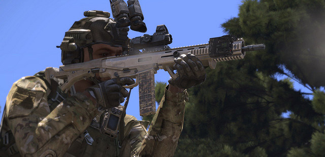
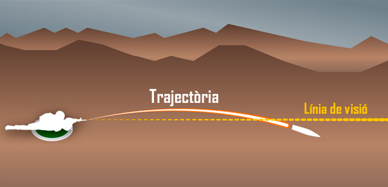
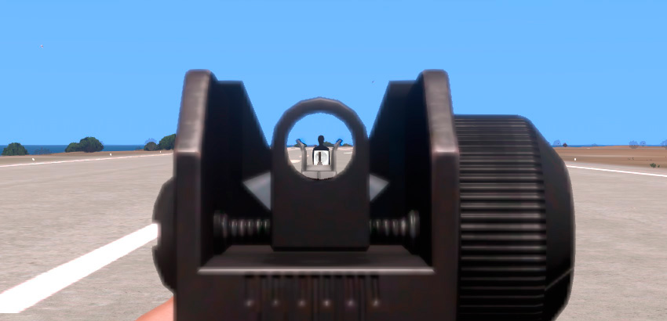

# Balística i fonaments de la punteria amb fusell

Cada jugador és, sobretot, un fuseller bàsic. Pots tenir planejat volar helicòpters, tancs , o actuar com un metge, però al final del dia necessites saber com manejar amb soltesa l'eina més bàsica de la infanteria: el fusell. Arribarà un moment en què serà l'únic que tindràs per salvar la teva vida virtual o la vida virtual d'un company d'equip.

Els tancs poden quedar inoperatius, els helicòpters poden caure, els equips de morter poden ser atacats, en aquell moment, voldràs ser un fuseller eficaç per tu i els teus companys.

{: .center}

## Arma assegurada

Per fer servir armament, el primer que s'ha de fer és tenir cura de les normes de seguretat, per evitar accidents. Si bé en un simulador no tens el problema moral de ferir o matar per accident una persona, si que tens implicacions tàctiques. Eliminar al teu metge, descobrir la teva posició a l'enemic, malbaratar l'únic antitanc que et queda, res d'això vols que passi durant una missió de combat.

Els soldats reals, per tal d'evitar prémer el gallet per accident, mantenen en tot moment el dit index fora del gallet, en línia recte amb l'arma, i només el col·loquen en el moment de disparar. Al simulador, pots fer una cosa semblant, que és mantenir el dit index fora del botó del ratolí, pots posar-lo al damunt del botó central per exemple.

Per tal de controlar encara més l'arma, has de mantenir el fiador en la posició de `SAFE` en tot moment, inclòs en una situació de combat. Per posar el fiador a la posició de `SAFE` has de prémer ++shift+"°"++. Per tornar el segur a la posició de foc, pots tornar a prémer ++shift+"°"++ que col·loca el fiador a l'ultima posició seleccionada, o ++f++ que selecciona una nova posició, però en aquest segon cas, s'ha d'anar amb molt de compte, perquè pots seleccionar el llançagranades per exemple, sense que te n'adonis. El fiador en la posició de 
`SAFE` l'has de tenir a la base, en patrulla, en maniobra i bàsicament en tot moment, només el pots treure en el moment previ a disparar, o en una situació d'alt risc d'atac enemic proper.

Per últim, hi ha una altra eina de control, que és la possibilitat d'abaixar i apujar l'arma. Per poder fer-ho, has de prémer 2x++ctrl++. La norma a seguir és que sempre has de tenir l'arma abaixada, excepte quan estàs preparat per disparar un possible objectiu o quan vas a disparar. D'aquesta manera, evitem foc accidental, a l'hora que indiquem sense parlar als companys si poden o no creuar la nostre línia de foc.

## Punteria bàsica

Clicar el botó del ratolí, es fàcil. Qualsevol pot fer-ho. Tothom sap disparar armes als videojocs. Però no tothom sap fer-ho de la millor manera. Del que es tracta, és d'aprofundir en la mecànica de disparar a un simulador, anant més enllà de lo obvi i aparent.

El primer que has d'entendre, és el vol de la bala en ser disparada. Aquesta no va en línia recta, si no que fa una paràbola, o arc balístic, determinat per la gravetat, la resistència de l'aire, el disseny de la bala, les condicions climatològiques, etc. A diferència del que molta gent creu, la bala no comença una caiguda en sortir del fusell, si no que primer comença una petita pujada. Això fa que la bala creui dos cops la línia de visió del fusell, primer en ascens a menys 50 metres, i després en descens quan creua el rang zero, o creu filiar, que és a la distància que està calibrada la mira de l'arma. En aquesta imatge pots veure el concepte bàsic.

{: .center}

És important entendre que quan regulem les mires de les armes, per disparar a diferents distàncies, no estem variant la trajectòria de la bala en res, el que estem fent es modificar la mira perquè aquesta apunti a la distància on volem «veure» la bala creuar la mira, per tant, l'arma sempre tindrà el mateix abast màxim.

## Ús de la mira

El terme "imatge de mira" es refereix a com la mira frontal, el punt de mira o el punt hologràfic és orientat en relació a l'objectiu que volem atacar.

La imatge de mira que vols és al centre de la massa corporal, és a dir al mig del pit, o al centre de la massa visible. Es fa així per obtenir la màxima probabilitat d'encert, de manera que si l'objectiu estava més lluny del que et pensaves, la bala encara podria tocar per sota l'objectiu, o si estava més a prop, per dalt.

Amb una clara superfície corporal per tocar, podràs impactar objectius amb facilitat a 300-400 metres, però si l'objectiu és més petit, hauràs de compensar els trets, mecànicament amb la mira, o manualment elevant el nostre fusell.

{: .center}

Per regular les mires que així ho permeten, has de prémer les tecles ++page-up++ per augmentar la distància i ++page-down++ per disminuir la distància. Això fa que la mira quedi centrada a l'angle allà on la bala creuarà la línia de visió marcada en metres. Tingues en compte que algunes mires es regulen en metres, normalment les mires de ferro i les mires òptiques més senzilles, i que d'altres fan servir sistemes especials, com els MOA.

## Compensar anima

Una qüestió important a entendre és que l'origen de la bala en ser disparada, serà des del fusell, i no des del centre de la mira com a la majoria de jocs comercials. Per aquest motiu, has de tenir en tot moment en ment que si be tu pots estar veient clarament l'objectiu amb la mira, potser el canó de la teva arma esta tapat pel mur que tens davant, o per la cantonada on treus el cap.

{: .center}

A mes d'això, també hem de valorar que el disseny del terreny i dels objectes del simulador no és pas perfecte, i degut al funcionament gràfic que implementa, de vegades podrem veure com les bales impacten al damunt del terra que tenim al davant, com si hi hagués una capa invisible de terra.

## Elements d'un bon tret

Diferents coses afecten a la precisió al simulador. Com més elements tinguis al teu favor, millor serà el teu tret.

  - **Postura:** Hi han tres tipus bàsics de posicions de foc. Cos a terra, que et dóna la millor precisió. De genolls, que fa disminuir la precisió. I dret, que dóna la precisió més baixa. El balanceig de l'arma, es veu afectat per aquestes posicions, i d'aquí ve la seva diferència de precisió.
  - **Resistència:** Si estàs cansat d'esprintar, o de carregar massa pes, el teu pols serà elevat, i per tant la tremolor de la mira elevada, fent difícil apuntar.
  - **Control de la respiració:** Si fas servir el control de la respiració de manera correcte, pots augmentar la precisió quan dispares, ja que tu controles el teu pols, i no et controla ell a tu.
  - **Ferides:** Les ferides fan disminuir la precisió, i només es poden arreglar amb l'ajuda d'un metge.
  - **Suport de l'arma:** Les armes es poden recolzar, al terra, en un mur, en un company o desplegant els bípodes. Fer servir aquesta característica fa disminuir el balanceig i n'augmenta la precisió.

{: .center}

## Balística terminal

Balística terminal al simulador consisteix en diferents aspectes: Penetració, rebots, ferides, etc.

Primer de tot, el **model de penetració** del simulador es basa en el calibre i la velocitat de la bala en impactar. Per això podràs veure com una metralladora pesada crivella un mur sense massa complicacions, mentre fusells i pistoles tenen mes dificultat per fer-ho. Com hem dit, segons el calibre i la velocitat, les bales poden travessar diferents tipus d'objectes, com murs de ciment, parets de fusta o planxes de metall. De vegades una posició aparentment segura, no ho és.

{: .center}

També cal tenir en compte que quan una bala travessa un objecte, encara que pugui continuar el seu vol, ho farà amb menor velocitat i per tant menor energia, i el dany sofert en aquest cas serà molt menor.

Els **rebots** són un altre aspecte del model de balística terminal. Quan una bala impacta en una superfície en un angle determinat, aquesta té la possibilitat de sortir rebotada, en comptes de travessar la superfície. Aquests rebots posen en perill a qualsevol que es trobi al seu pas, tot i haver perdut gran part de la seva força letal.

Finalment, la **balística terminal en cossos humans** es basa en la zona d'impacte. Un soldat ferit a les cames o braços patirà menys mal que si hagués sigut ferit al cos o al cap, aquest últim letal molt sovint. Les armadures personals com les armilles o els cascs, disminueixen el dany.

## Encasquetaments i avaries

Les armes de foc de vegades tenen tendència a encasquetar-se, això es produeix per diversos factors, relacionats amb la qualitat de la fabricació de l'arma, el manteniment que se li faci, i les condicions d'ús de l'arma (pols, sorra, fang, aigua,...). Quan passa això, sentiràs un clac en comptes de disparar la bala. Per desencasquetar l'arma has de prémer ++shift+r++, combinació que també serveix per comprovar aproximadament el nivell de bales del carregador.

A més a més d'això, les armes poden patir algun tipus d'avaria, si el simulador ho té modelat o els addons ho inclouen. En aquestes situacions, has de decidir ràpidament si pots solucionar el problema in situ, o has de cercar una posició més segura. Les armes encasquetades normalment es solucionen ràpidament i per tant es pot fer al lloc si cal, però altres tipus d'avaries poden requerir una posició de cobertura.

En situacions d'alt risc, com en combat MOUT o CQB, avisa els companys del problema perquè vigilin el teu sector i et cobreixin.
