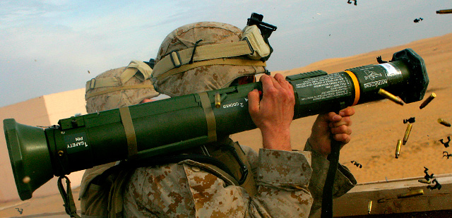

# Llançador antitanc AT4

El M136 AT4 va ser dissenyat en la dècada de 1980 per al seu ús contra de la el blindatge millorat dels blindats lleugers. És una arma anti-blindatge lleugera i autònoma. Es compon d'un coet de vol lliure, estabilitzat per aletes, empacat en un cartutx d'una sola peça de fibra de vidre i d'un sol ús. El M136 AT4 és portable per infanteria i és disparat només des de l'espatlla dreta. El llançador és a prova d'aigua per facilitar el seu transport i emmagatzematge.

Tot i que el M136 AT4 es pot emprar amb visibilitat limitada, el tirador ha de ser capaç de veure i identificar l'objectiu i estimar el rang del mateix.

{: .center}

| **Característiques**        | **Descripció**     |
|-----------------------------|--------------------|
| **Llançador**               |                    | 
| -- **Longitud**             | 102 cm             |
| -- **Pes**                  | 6,7 kg             |
| **Projectil**               |                    |
| -- **Calibre**              | 84 mm              |
| -- **Velocitat de sortida** | 466 Km/s (950 fps) |
| -- **Longitud**             | 460 mm             |
| -- **Pes**                  | 1,8 Kg             |
| -- **Rang mínim**              |                    |
| -------- **Entrenament**    | 30 metres          |
| -------- **Combat**         | 10 metres          |
| -------- **Armat**          | 10 metres          |
| -- **Rang màxim**           | 2100 metres        |
| -- **Rang màxim efectiu**   | 300 metres         |

## Munició

El M136 AT4 és un projectil de munició amb un cartutx de tipus coet integral. El cartutx consta d'un conjunt d'aletes amb l'element traçador; amb iniciador de cap, detonació de base, espoleta amb peça elèctrica, un cos ogiva amb revestiment i una càrrega explosiva formada amb precisió.

### Descripció

L'Ogiva de l'AT4 té una capacitat de penetració excel·lent i letals efectes després al blindatge. Els extremadament destructius 440 grams de càrrega en forma explosiva penetren més 35,6 cm de blindatge.

## Fonaments de la punteria

Molts factors contribueixen a la punteria amb una arma antiblindatge. Els soldats que combinen aquests factors bé, i segueixen practicant aquesta manera, poden conservar les seves habilitats.

### Procediments d'apuntat

Els objectius estàtics inclouen els que es desplacen directament cap o des del tirador. Ajusta la mira del darrere per al rang correcte i posa el pal central de la mira al centre de l'objectiu.

Els vehicles lents són els que tenen una velocitat estimada de 4,47 m/s o menys, o aquells que es mouen en una direcció obliqua. Col·loca el pal central de la mira en la vora davantera o davanter del vehicle.

Els vehicles de moviment ràpid són aquells que s'estima que es mouen més ràpid de 4,47 m/s. Col·loca el pal lateral de l'esquerra o dreta al centre de l'objectiu. Per exemple, si l'objectiu està en moviment d'esquerra a dreta, posa el pal de l'esquerra en el centre de la massa de l'objectiu, i viceversa.

{: .center}

#### Control de la respiració

El control de la respiració és tan important quan es dispara una arma anti-blindatge com quan es dispara una arma individual. Respirar mentre dispares pot causar una fallada. Per al control de la respiració, has de prémer el ++"Botó dret"++ i aguantar. Recorda que només pots aguantar la respiració 8 segons al simulador, després necessitaràs esperar-ne 2 perquè la precisió torni al seu estat normal.

### Rang i velocitat

Hi han diferents sistemes per determinar la distància fins a l'objectiu, cal emprar el sistema correcte en cada situació, i normalment serà el líder immediat qui s'encarregarà de fer aquests càlculs, perquè el llançador un cop tingui tota la informació només s'hagi d'encarregar d'apuntar i disparar.

En el cas de la velocitat, hi ha un sistema visual fàcil d'aplicar en 1 segon en una situació de combat.

1.  Inicia quan l'extrem davanter del vehicle passa l'objecte.
2.  Compta, "Un mississipí" (triga aproximadament un segon).
3.  Si més de la meitat del vehicle passa l'objecte, estimar com un vehicle de moviment ràpid (4,47 m/s o més ràpid). Si és menys de la meitat del vehicle el passa l'objecte, estimar com un vehicle de moviment lent (menys de 4,47 m/s).

{: .center}

Per regular la distància a la mira de l'AT4, cal prémer ++page-up++++page-down++ per augmentar o disminuir la distància. Un cop s'ha fet servir l'AT4, aquest no es pot tornar a carregar, i s'ha de llençar el tub al terra perquè el seu pes mort no sigui una molèstia.

## Debilitats dels vehicles blindats

Els vehicles blindats solen tenir més protecció al davant que no pas als costats o darrera, ja que són dissenyats per a operacions ofensives, normalment contra altres blindats. Tots els vehicles són vulnerables a impactes repetitius als flancs o al darrera. Els tiradors han d'apuntar al centre de la massa per augmentar la probabilitat d'encertar. Com més antic és el vehicle, pitjor protecció té.

## Mètodes d'atac

Els quatre mètodes d'atac inclouen el foc individual, seqüencial, en parel·lel, i la salva. El líder avalua la situació sobre el terreny per determinar quin d'aquests mètodes cal utilitzar. Independentment de si s'utilitzen sols o en combinació, les comunicacions són vitals.

1. Foc individual. Un sol soldat amb una arma anti-blindatge pot atacar un vehicle blindat, però aquest no és el mètode preferit d'atac. Diverses armes anti-blindatge es requereixen per destruir un vehicle blindat. Un únic tirador disparant ha de colpejar una part vital de l'objectiu per danyar-ho seriosament.
    
	1. Rang desconegut. Un únic tirador ha d'atacar només els objectius dins dels 200 metres quan ell no coneix el rang real. La probabilitat d'impactar a un objectiu més enllà de 200 metres amb un sol projectil és petita.
	2. Rang conegut. Un únic tirador pot atacar objectius a més de 300 metres quan coneix el rang real. El tirador ha de fer-ho només quan té un tret de flanc o posterior, o quan no té una altra opció d'atac.

2. Foc seqüencial. Un únic tirador, equipat amb dos o més armes anti-blindatge preparades per disparar, s'ataca l'objectiu. Després d'atacar amb el primer projectil i observar l'impacte, el tirador ajusta el seu punt de mira, ataca amb un altra projectil, i així successivament fins que es destrueix l'objectiu o es queda sense projectils.

3. Foc en parella. Dos o més tiradors, equipats amb dos o més armes anti-blindatge preparades per disparar, es dediquen a un sol objectiu. Abans de disparar, el primer tirador informa als altres de la velocitat estimada i la distància a l'objectiu. Si l'impacte del seu projectil mostra que la seva estimació és correcta, els altres tiradors ataquen l'objectiu fins que es destrueix. Si l'impacte del projectil mostra que la seva estimació és incorrecta, el segon tirador informa els altres de la seva pròpia estimació, llavors ell s'ataca a l'objectiu. Això continua fins que l'objectiu és destruït o tots els projectils es gasten.

4. Foc en salva (descàrrega).Dos o més tiradors poden atacar a un sol objectiu quan es coneix la distància. Aquests tiradors ataquen l'objectiu al mateix temps en un senyal convinguda, com una ordre, un xiulet, una trampa explosiva, mina o PRT.

5. Comunicacions. Els líders controlen tot el foc de la unitat i han de comunicar aquesta informació a tota la unitat. Els tiradors d'armes anti-blindatge han de saber:
        
	* Tiradors designats.
	* Prioritat d'objectius.
	* Mètode d'atac.
	* Distància i desviació de l'objectiu (si es coneix).
	* Ordre o senyal per disparar.
	* Ordre o senyal per cessar el foc.

## Atacar des d'un recinte

Disparar des d'un recinte crea perills únics. Per tant, abans de col·locar soldats en recintes (només en combat), els líders han de tenir en compte diversos factors que afecten la seguretat. Només en el combat, quan no hi hagi una altra opció tàctica, l'AT4 ha d'atacar dins d'un recinte. Si s'ha d'emprar aquesta manera, el recinte ha de complir amb els següents requisits mínims:

1. Construcció. L'edifici ha de ser construït sòlidament per reduir els danys estructurals que es produirien en un recinte dèbilment construït tal com un de fet de fusta o estuc. (Difícilment aplicable al simulador).

2. Mida del recinte. Les mesures mínimes per al recinte són 5 x 7,5 metres i 2,5 metres d'alçada.

3. Espai d'armes. Posicionar correctament les armes dins del recinte és vital per a la seguretat i la supervivència de tot el personal al recinte. Les armes han d'estar col·locades de manera que no hi hagi parets a menys de 5 metres a la part posterior o lateral de l'arma.

4. Posicions del personal. Si qualsevol altre soldat hi ha d'estar present, han de romandre davant i/o al costat del llançador.

## Elements de seguretat

A l'hora de fer servir una arma anti-blindatge, s'han de tenir en compte alguns conceptes de seguretat.

### Fiador

Igual que amb el fusell, has de tenir tenir en tot moment posat el fiador per evitar un tret accidental, i només treure el fiador quan vagis a disparar.

### Deflagració posterior

Quan dispares un arma anti-blindatge, aquesta crea un con posterior conegut com a àrea de perill. Qualsevol persona en aquesta àrea de perill pot resultar ferida o morta. El con forma un angle de 90º en l'AT4 i té un abast d'uns 100m.

{: .center}

A més, no hi ha d'haver cap mur o obstacle darrera del llançador a menys de 5 metres, incloent la pròpia pendent del terreny, ja que el rebot de la deflagració pot ferir el propi tirador.

### 6 lliures

Quan vagis a disparar has de dir **AT4!** i els teus companys han de repetir per avisar de la situació de perill. Llavors quan estiguis preparat per disparar has de cridar **Sis lliures?**, i el teu assistent (si en tens) o qualsevol altre company al teu costat t'ha de confirmar que tinguis la part de darrera lliure de personal que pugui resultar ferit degut a l'àrea de perill.

En cas afirmatiu, t'han de respondre amb un **Sis lliure!** i és llavors, i només llavors, quan pots disparar.

En cas negatiu, t'han de respondre amb un **Negatiu!** o **Espera!**.

| **Seqüència**                                               |
|--------------------------------------------------------------------|
| **AT4!**                                                           | 
| **Sis lliures???**                                                 |
| Sis lliures!!! (o *Negatiu!*, o *Espera!* si no estàn lliures) |
| **Disparant!** (o *AT4!*)                                          |

!!! danger "Perill"

	No seguir aquesta regla de seguretat pot comportar companys **ferits o morts**.

!!! note "Nota"

	Per altres llançadors feu el primer avís amb els seus noms respectius: Javelin, M72, etc
