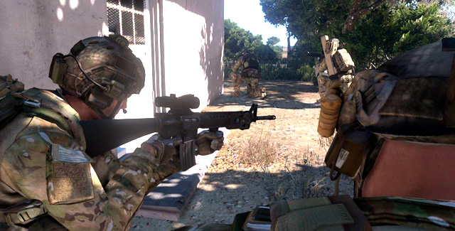
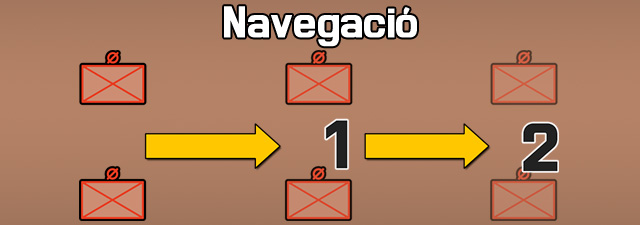
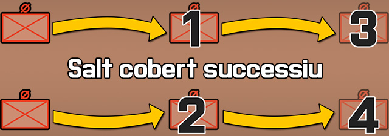
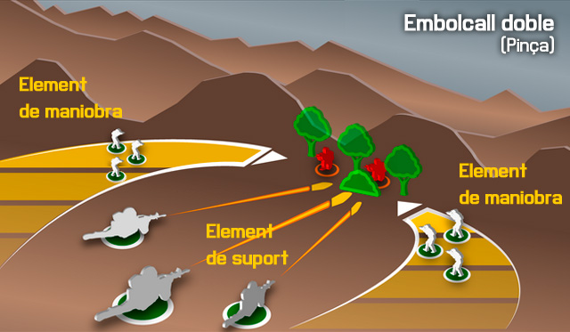
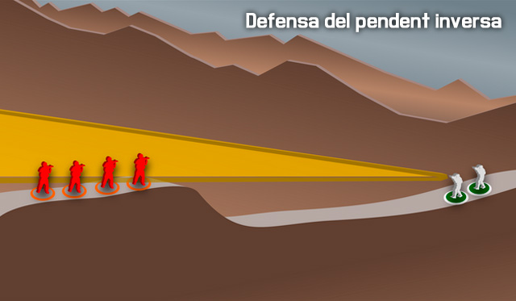

# Maniobrar i atacar objectius com a part d'una esquadra

Com a fuseller, ets l'element més fonamental de la força de combat. L'eficàcia que demostris és la clau per la supervivència de tu mateix, el teu equip, la teva esquadra i tot el teu escamot. Tota persona juga un petit rol en una pintura gegant, i som tant forts com la nostra baula més dèbil. Per tant el teu objectiu sempre haurà de ser convertir-te en un soldat expert. I Una força de combat composada per soldats experts forma una gran unitat de combat. Un ens coordinat i eficaç és un gran efectiu.

## Equips de foc

L'equip de foc és l'element més fonamental de la nostra estructura d'escamot. Cada equip de foc està composat per 4 membres (actualment estem provant temporalment un sistema de 3 membres), un líder d'equip i tres subordinats. Els equips de foc estan composats per.

| **Rol**                | **Rangs**            | **Armes**                                                  |
|------------------------|----------------------|------------------------------------------------------------|
| **Líder d'equip**      | SGT, EPC.            | Fusell (M16/M4) amb llançagranades (M203/M320).            |
| **Fuseller**           | EPC, SDT1, SDT, RCA. | Fusell (M16/M4).                                           |
| **Granader:**          | EPC, SDT1, SDT, RCA. | Fusell (M16/M4) amb llançagranades (M203/M320) i bengales. |
| **Fuseller automàtic** | EPC, SDT1, SDT, RCA. | Fusell automàtic (M249) o metralladora (M240).             |

!!! note "Recordatori de rangs"

    - **Oficials**
        
		- OF-2. Capità (CPT)
		- OF-1. Tinent (TN)

    - **Soldats**
        
		- OR-5. Sergent (SGT).
		- OR-4. Especialista (EPC).
		- OR-4. Especialista (EPC).
		- OR-3. Soldat de primera (SDT1).
		- OR-2. Soldat (SDT).
		- OR-1. Recluta (RCA).

Recorda que tres equips de foc estan a les ordres d'un líder d'esquadra, i que tres Esquadres estan a les ordres d'un líder d'escamot.

### Tasques dintre de l'equip de foc

Dintre d'un equip de foc tenim diferents rols, els quals tenen diferents tasques i que a més poden variar segons la missió. És important mantenir-nos fidels al rol assignat, ja que la duplicitat de tasques pot comportar problemes. O dit d'una altra manera, un tirador designat no pot fer de fuseller antitanc, o et dediques a una cosa o a una altra.

**Líder d'equip**  
El líder d'equip ha de dirigir els seus soldats, a l'hora que manté les comunicacions amb el resta d'equips i el líder d'esquadra. Ha de fer servir el llançagranades com una eina tàctica principalment, no com una eina ofensiva. És a dir ha de marcar blancs amb fum i llançar bengales a la nit. Normalment es situarà a prop del FA per controlar el seu foc. El líder d'equip més veterà serà l'assistent del líder d'esquadra a la patrulla.

**Fuseller**  
Sol ser el membre més novell de l'equip, i bàsicament és un soldat per tot. És la parella del líder i està a les seves ordres.

**Granader**  
Equipat amb llançagranades, fa servir aquesta arma de manera ofensiva. És la parella del FA i està a les seves ordres. Tercer en la jerarquia de l'equip.

**Fuseller automàtic**  
Proporciona la principal potència de foc de l'equip, i està a les ordres del líder d'equip a l'hora que dirigeix al granader. Segon en la jerarquia de l'equip.

Degut a que el FA (AR en anglès) gasta molta munició i el LE (TL en anglès) ja porta llançagranades, molt sovint es pot substituir el LG (GL en anglès) per un **Assistent de fuseller automàtic** (AFA, o AAR en anglès). L'AFA porta munició addicional pel FA.

### Responsabilitats bàsiques d'un equip de foc

Per mantenir l'efectivitat de l'equip, cal seguir unes guies bàsiques que assegurin un nivell mínim de disciplina de combat.

* **Coneix la teva esquadra i el teu equip de foc.** Recorda a quin equip i esquadra estàs assignat (número, lletra), així com les freqüències de ràdio i els membres.
* **Escolta el teu líder d'equip i segueix les seves ordres.** El líder d'equip de foc i d'esquadra solen ser els membres més experimentats. La seva tasca és mantenir-te a tu amb vida, i acomplir la missió, per tant és vital parar atenció a les seves indicacions i completar ràpidament les tasques que t'assignin.
* **Practica la disciplina de foc i coneix les Regles de Combat.** No siguis el que es carrega l'avançament sigil·lós disparant accidentalment o disparis sense permís en una situació d'alto el foc. Un cop sobre foc o perdut l'element sorpresa, normalment ja es pot fer foc lliure, però fins aquell moment, has de mantenir la disciplina de foc. Recorda també les RC, per evitar matar civils per exemple.
* **Mantingues la distància entre companys.** Mantenir les distàncies en les formacions es vital per evitar que més d'un soldat mori per culpa d'atacs explosius, i per mantenir l'eficàcia de la formació.
* **Mantingues la consciència situacional, evita la visió de túnel i sàpigues on són les forces amigues.** Entendre què passa al teu entorn i no ofuscar-te amb l'enemic és vital per evitar ser abatut, no hi ha res pitjor que perdre la perspectiva del combat. Saber on estan les forces amigues evitarà accidents.
* **Cobreix el teu sector. 360º de cobertura són necessaris en tot moment.** Cada membre ha de cobrir una part d'aquest espectre, en el moment que deixes de cobrir el teu sector, per poc temps que sigui, estas posant en perill tota la unitat. No cal mirar-se per parlar entre soldats.
* **Escaneja per cercar enemics i avisa sobre ells.** En tot moment s'han de cercar enemics, per molt tranquil·la que sigui la zona, l'enemic sempre pot aparèixer en qualsevol moment.
* **Identifica abans de disparar.** No es pot disparar si no estàs segur que l'objectiu que veus és un enemic, podria ser un civil o un amic. Si tens dubtes, pregunta als companys o al teu superior, existeixen moltes vies per verificar la identitat d'un contacte.
* **Ser concís a les comunicacions.** Com més clar, curt i net siguis a l'hora de parlar, més clara quedarà la informació i menys temps tindràs la ràdio ocupada si la fas servir.
* **Evita creuar les línies de foc.** Sempre que hagis de superar un company, fes-ho per darrera d'ell. I si no és possible, avisa primer i espera la seva confirmació per creuar.
* **No lluitis mai en solitari.** El nombre mínim sempre és la parella, el binomi. Si no tens un company, no pots combatre.

## Equip de foc i maniobra

La unitat més petita és el binomi. Un soldat mai operarà de manera solitària al camp de batalla, com a mínim sempre anirà amb parella, i és aquest binomi que forma l'Equip de foc i maniobra, just per sota de l'Equip de foc. Per tant, un equip de foc està compost per dos equips de foc i maniobra.

L'equip de foc i maniobra sempre ha de procurar actuar conjuntament, ja que s'han de cobrir mútuament, i han de controlar-se. El millor exemple pot ser la parella formada pel FA i el AFA.

### Responsabilitats bàsiques d'un equip de foc i maniobra

Per mantenir l'efectivitat de l'equip, cal seguir unes guies bàsiques.

**Estigues amb el teu company.** Si ell es mou tu et mous amb ell, si ell salta tu el cobreixes, si ell és ferit tu el mous a una posició segura i crides al metge. **Comunicat amb el teu company.** Informa'l de la teva situació, si et queda poca munició, si estàs ferit, si necessites foc de cobertura per moure't. **Cobreix al teu company.** Si ell cobreix un sector tu cobreix el contrari, si ell salta tu li cobreixes el moviment.

## Esquadra

Una esquadra està formada per catorze soldats, el líder d'esquadra amb el metge de l'esquadra, i tres equips de foc de quatre membres cadascun.

{: .center}

L'esquadra és una força de combat formidable per enfrontar-se amb l'enemic, és suficientment gran per aplicar tàctiques efectives de combat, però suficientment petita per ser flexible i ràpida. No obstant això, en el món de la simulació, per si sola no pot fer front a qualsevol enemic, i és més vulnerable que no pas a la realitat, on normalment tens tot un exèrcit que et dóna suport de foc, et subministra munició, equipament i menjar i en general fa el que tu sol no pots fer com a esquadra.

### Responsabilitats bàsiques d'un líder d'esquadra

Un líder d'esquadra té unes responsabilitats similars a les d'un líder d'equip de foc, només que enlloc de controlar soldats individualment, controla equips de foc. Ha de coordinar-se amb els altres líders d'esquadra mentre segueix les ordres del líder d'Escamot.

* **Seguir les indicacions del comandant d'escamot.** Es pressuposa que ha de saber acomplir els objectius donats per la comandància de l'escamot, transformant les ordres en un pla efectiu de combat que pugui passar als seus líders d'equip de foc. Això inclou establir les RC, formacions, punts de ruta, punts de reunió, velocitats de moviment i qualsevol altre informació rellevant.
* **Assegurar-se que els líders d'equip i tots els membres de l'esquadra coneixen el pla general.** La intenció del líder és que tothom estigui informat de forma general del pla de combat, la situació actual, baixes, regles, i qualsevol informació rellevant a nivell general.
* **Posicionar-se al millor lloc on controlar els equips de foc.** La feina del líder d'esquadra no és disparar, és dirigir l'esquadra, i per tant s'ha de situar a una zona on tingui una bona visual dels equips.
* **Comunicar la informació rellevant als altres líders d'esquadra i a la comandància de l'escamot.** Això inclou baixes, contactes enemics, estat de la munició, i qualsevol altre informació important.
* **Mantenir una consciència situacional d'on està l'escamot i d'on estan els enemics.** Per tal d'evitar el foc amic, i potenciar l'efectivitat de l'escamot, ha de mantenir informat als seus soldats d'on està l'enemic i on estan les forces amigues.
* **Dirigir els seus equips de foc per maximitzar l'efectivitat en el combat.** És clau que el líder de l'esquadra no faci simplement d'informador i/o observador. La seva feina és dirigir tota l'esquadra, ell té tota la informació, i per tant ha de dirigir els seus equips per mirar de neutralitzar l'enemic de la millor manera, a l'hora que manté vius als seus soldats. Pot recolzar-se en les traçadores o les granades de fum per exemple per marcar objectius o posicions.
* **Conèixer la integritat de l'esquadra quan hi han baixes.** Una de les coses més importants és saber quan la teva esquadra ha passat de ser una força efectiva de combat a un llast per la resta d'esquadres. Has de ser conscient en tot moment si degut a la munició, baixes, i estat general, la teva esquadra pot continuar efectivament el combat, o s'ha de replegar per poder re-composar-se.

### Responsabilitats bàsiques d'un metge

El metge és una peça clau en qualsevol esquadra, és l'únic que té les eines, capacitats i coneixements necessaris per mantenir viu un soldat ferit, per tant, s'ha de cuidar.

* **Ha de preocupar-se més de la salut dels companys que no del combat.** Tots els altres soldats poden combatre, però només el metge pot curar de forma efectiva, per tant, la seva tasca principalment és mantenir una constant atenció a la salut de la resta de soldats. El metge normalment només fa servir la seva arma en autodefensa.
* **Mantenir-se fora de la línia del front.** Això dóna la capacitat al metge de tenir una bona visual de la resta de soldats, a l'hora que minimitza la possibilitat de ser ferit pel foc enemic.
* **Proporcionar seguretat del flanc i rereguarda al líder quan no ha de curar.** Si no ha de curar cap soldat, el metge ha de mantenir una especial atenció a la seguretat perimetral del propi líder.
* **Sentir-se còmode fent servir fum per proveir ocultament als companys ferits.** Els metges han de carregar granades de fum per fer servir en cas de necessitar curar un company i evitar que l'enemic vegi el teu moviment. Tot i així, normalment el metge s'ha de mantenir a una posició segura, i ha de ser el ferit o un altre soldat que el porti al metge.
* **Triatge de pacients.** El metge ha de saber discriminar entre ferits segons la seva gravetat. El primer en curar-se sempre ha de ser ell mateix, i després ha d'avaluar la gravetat del pacient i el seu rol. Un ferit greu és més important que un ferit lleu, però un líder és més important que un fuseller.

## Foc i maniobra

Tant important és saber disparar, com entendre com funciona un combat, per portar la teva unitat a la victòria.

### Tècniques de moviment d'equips

Hi ha una varietat de tècniques de moviment diverses. Fent servir la millor per a cada situació, et donarà la capacitat per protegir l'equip i proporcionar seguretat, així com la flexibilitat necessària.

#### Navegació

Navegar és simplement el moviment del punt A al punt B sense res luxós. L'espaiat entre elements és típicament petit per mantenir un bon control sobre la unitat. El moviment de navegació s'utilitza quan és poc probable el contacte amb l'enemic. La lògica et diu que la 'navegació' té poca aplicació al nostre simulador, ja que el contacte amb l'enemic és gairebé sempre molt probable.

{: .center}

#### Navegació coberta

La navegació coberta és on les coses comencen a ser més aplicables al simulador. Aquest mètode de moviment simplement augmenta la distància entre els elements. L'espai extra permet un major marge de maniobra i disminueix la densitat de les forces amigues, que al seu torn augmenta la seguretat de la unitat pel que és més difícil per a un enemic infligir grans baixes a través d'una emboscada sobtada o un parany explosiu.

Quan et mous amb navegació coberta, sobretot en una formació de columna d'esquadra o escamot, un element és designat com a avantguarda o l'element de guia. Aquest element controla la velocitat de moviment o la velocitat d'avanç. Si aquest element s'atura, tota la formació s'atura. Si es mou, la formació es mou. Això ajuda a assegurar que la formació global no sobrepassi els companys o s'allunyin massa.

{: .center}

#### Salt cobert

El salt cobert és la "Tècnica de moviment estàndard de la infanteria" de fet. És una de les habilitats de moviment de combat fonamentals més practicades i passa a ser un dels més fàcils d'emprar també.

El principi bàsic del salt cobert és que un element és sempre estacionari i que cobreix el moviment de l'altre element. Hi ha dues tècniques principals disponibles - alternes i successives. L'elecció de les quals depèn del nivell de l'amenaça i la velocitat requerida. Quan no s'indica explícitament, el mètode de salt es determina pel segon equip, ja que comença al darrera. Si l'amenaça és alta, s'emprarà el salt successiu. En cas contrari, s'emprarà el salt alternat. Sovint es convertirà en una execució molt fluida que combina els salts successius i alternats segons requereixi la situació.

##### Guies pel salt cobert

Aquí hi ha algunes pautes generals a tenir en compte quan s'empra el salt cobert.

* **Els líders d'element s'han d'assegurar que els equips de salt són prou a prop de l'altre per poder recolzar-se mútuament amb el foc.** Amb això en ment, seria prudent d'evitar que dos elements d'infanteria estiguin separats per més de 300 metres, com a guia general.
* **Els líders d'element han de tractar d'aconseguir un terreny més elevat quan proporcionin cobertura.** Una bona vista del terreny augmenta l'eficàcia d'un element de cobertura.
* **La mida de cada salt s'ha de basar en el terreny, la visibilitat, la proximitat de l'amenaça enemiga, etc.** Per exemple, el salt a través de terreny relativament obert pot ser llarg. Tant en l'interès d'aconseguir travessar el camp obert tan ràpidament com sigui possible i perquè el rang de cobertura és major a causa del terreny obert. El salts urbans, d'altra banda, són típicament curts a causa de la major densitat de la zona i el desig de mantenir la seguretat i dispersar-se massa.
* **Els vehicles (i les seves armes inherentment de més llarg abast) poden tenir intervals més grans entre ells si cal,** sense que mai estiguin fora de l'abast de l'arma del l'altre element.

##### Salt cobert successiu

El salt cobert successiu és el més lent dels dos. En ell, un equip avança, s'atura, i després l'altre equip avança fins alinear-se amb l'altre equip, s'atura, i el procés es repeteix. Això proporciona un alt nivell de seguretat, però amb el problema de durar més temps la maniobra.

{: .center}

##### Salt cobert alternat

El salt cobert alternat és el més ràpid dels dos, sacrifica una mica de seguretat a canvi de velocitat addicional. Amb aquest sistema, un equip sobrepassa l'altre abans d'aturar-se, i llavors és l'altre que fa el mateix moviment.

{: .center}

## Atacant

Ara cal que aprenguis com atacar de manera efectiva un enemic, aplicant els principis necessaris i les tècniques corresponents per portar l'atac a la victòria.

### Principis de l'atac

Quedar-se enrere i disparar pot ser efectiu. Però per prendre i assegurar el terreny es requereix que la infanteria es mogui a la mateixa zona i amb decisió expulsi cap a fora a qualsevol ocupant enemic. Per aconseguir això, la infanteria assaltant ha d'estar coberta per les tropes amigues que han de ser capaces de fer foc efectiu contra l'enemic mentre maniobren cap a l'objectiu. No hi ha cap cita que resumeixi aquest concepte millor que la següent.

{: .center}

O, per dir-ho en altres paraules, no pots decidir una batalla quedant-te enrere i disparant a l'enemic. I no es pot guanyar tampoc simplement corrent cap a ells. Les dues s'han de combinar per obtenir els efectes desitjats. La maniobra sota un foc de cobertura amic eficaç és la clau per a un assalt victoriós.

#### Reconeixement

El reconeixement és la primera fase de qualsevol atac. Per atacar l'enemic, cal saber on és. Per atacar amb eficàcia, cal saber on és abans que ell sàpiga que hi ets, amb el major detall possible, perquè el coneixement es pot aprofitar per augmentar les possibilitats d'èxit.

#### Aïllament

L'aïllament de l'enemic és una part important de l'atac, per evitar que aquest pugui reforçar les seves línies, que pugui fugir o que pugui maniobrar amb efectivitat. Es pot fer de diverses maneres, com per exemple emprant armes pesades per tallar les seves vies de subministrament o fugida. Tot i així cal anar amb molt de compte de no arraconar massa l'enemic, un adversari acorralat, esdevé una fera que lluitarà per la seva vida fins al final, així que de vegades és bo mantenir una petita via d'escapament que no posi en perill les teves unitats.

#### Preparació

La preparació radica principalment en reduir la capacitat ofensiva de l'enemic a un estat més manejable per les teves unitats. De manera que l'assalt no sigui massa perillós. Bàsicament es tracta d'obrir foc als objectius d'alt valor, i aprofitar les armes de més potència, com pot ser el foc de morter, l'artilleria, les armes de tripulació, per dispersar, desmotivar i disminuir la força enemiga, abans de l'assalt. Quan sigui possible, aquest foc es mantindrà durant el mateix assalt per mirar de mantenir la superioritat de foc sobre l'enemic.

#### Sorpresa

Hi ha vegades que és més importat atacar sobtadament que no pas preparar l'objectiu prèviament amb foc pesat. Atacar sobtadament amb violència i velocitat d'acció, pot ser un multiplicador de força equiparable a la preparació amb foc pesat.

#### Flexibilitat

S'ha de tenir en compte el principi que diu que «Cap pla sobreviu al primer contacte amb l'enemic». Que bàsicament vol dir que el combat és tant orgànic que cal ser flexible i creatiu per poder variar les tàctiques segons sigui necessari, i no romandre en un pla estàtic, que per molt ben fet que pugui estar, pot -un cop evoluciona el combat- no ser la millor opció. «Et pots quedar sense bales però no sense idees».

### OCOCA a l'atac

#### Aspectes a considerar

Per dur a terme un atac amb èxit, cal que els líders "llegeixin" el terreny i l'utilitzin per construir un pla d'atac sòlid que tingui en compte els aspectes tàctics importants d'aquest terreny. Per a això, s'utilitza l'acrònim OCOCA (OCOKA en anglès).

##### Observació i Camps de foc

* **On es pot col·locar la base de foc o foc de suport?**
        
	* Els turons i posicions elevades són preferibles generalment, però tingues en compte que l'enemic pot ser capaç de predir els probables BF/FS i tenir-los coberts per armes defensives. Les posicions més evidents i aparentment favorables no són necessàriament les millors per la seva previsibilitat.

* **Quines unitats conformen l'element de suport, basat en el terreny, força enemiga, els amics desplegats, etc?**
        
	* A vegades és tan simple com col·locar un escamot o equip de foc donat en tal posició. En d'altres ocasions, pot ser beneficiós separar als fusellers automàtics de diversos elements i fer que s'agrupin per formar una més potent BF/FS.

* **On són els millors llocs per observar les defenses i disposicions enemigues?**
        
	* Hi ha posicions que podrien ser adequades per a una sola persona per observar i brindar reconeixement que d'altra manera no seria viable utilitzar? Col·locar un explorador individual sobre un punt de vista poc probable pot funcionar bé si l'enemic no s'ho esperava.
	* Saber quines són les disposicions enemigues abans d'entrar en contacte és un objectiu important que s'ha de procurar en cada atac.

* **On és la millor posició per observar l'assalt i coordinar les accions dels elements d'assalt i suport?**
        
	* Un líder que pugui observar l'assalt i controlar (Nota: 'controlar', i no fer 'microgestió'), tendeix a resultar en un combat amb més èxit.

* **Quines àrees és més probable que l'enemic cobreixi amb foc? Quines àrees són més propenses a ser observades?**
        
	* Es poden evitar? Si no és així, els riscos es poden reduir amb fum o mètodes de moviment més prudents?

##### Cobertura i ocultació

* **Quin tipus de cobertura i ocultació té l'enemic a les seves posicions?**
        
	* On són més propensos a ser posicionats per la seva cobertura i ocultació disponibles?
	* Hi ha edificis utilitzables en el seu sector? Si és així, generalment pots esperar que es fortifiquin en aquelles posicions?

* **Quin tipus de cobertura i ocultació està disponible al voltant de les posicions enemigues que es puguin explotar quan s'ataqui?**
        
	* Tot el que ofereix una ocultació decent pot reduir en gran mesura l'eficàcia del foc enemic.
	* Micro-terreny, com ara depressions poc profundes, rases, etc,... poden proporcionar desenfilada de l'observació i foc enemigues, permetent als atacants que es mouen prop d'una posició enemiga no ser exposats al foc.

* **Com influeixen les cobertures i ocultacions a les tàctiques, com el foc i maniobra, i el comandament i el control general?**
        
	* El terreny dens tendeix a convertir un combat en una sèrie de foc creuat de curt abast amb els diferents elements que s'involucren de manera independent, que al seu torn generalment progressen a un ritme més lent. Les víctimes poden ser majors en terrenys més densos. El terreny urbà fa d'aquest un procés encara més lent i més mortal.
	* El terreny més obert tendeix a permetre que el combat es dugui a un nivell ideal, amb cada element donant suport a d'altres elements en l'atac, el que permet un ritme més ràpid de batalla i més oportunitats de maniobra. El terreny obert també maximitza els efectes dels elements de base de foc o foc de suport, el que permet als equips assaltants ser recolzats per més temps, el que ajuda al mateix temps a reduir les víctimes.

##### Obstacles

* **L'enemic ha fortificat les seves posicions amb obstacles?**
        
	* Si és així, es poden evitar els obstacles?
                
		* Si no, quin tipus de problemes poden causar a les tropes assaltants? Com es poden minimitzar aquests riscos?
        
	* És possible trencar els obstacles?
                
		* Les càrregues de motxilla són una gran eina de voladura, suposant que les forces amigues han estat equipades amb elles.
		* Les armes antitanc es poden utilitzar per trencar alguns obstacles en cas de dificultat, des d'una ubicació segura.
        
	* On és l'enemic que probablement observarà i cobrirà els obstacles?
        
	* El fum pot emprar-se per emmascarar qualsevol potencial suport enemic, mentre que els obstacles s'estan eliminant o reduint?

##### Claus o terreny decisiu

* **Hi ha parts del terreny, estructures, etc, que poden ser utilitzades o capturades, el que redundarà en una important desavantatge per l'enemic?**
        
	* Els edificis alts són sovint clau.
	* Els objectius de missió són en si mateix terreny clau.
	* Posicions que ofereixen bons punts de vista sobre les defenses enemigues són sempre terreny clau per a un atacant.

* **Hi ha parts del terreny, estructures, etc, que són mes importants que d'altres i per tant poden ser ocupades per més tropes enemigues?**
        
	* Els edificis transitables sovint són vistos com a terreny decisiu per l'enemic que els ocupa. Els que tenen més finestres i angles de visió, poden ser inclosos als seus plans de defensa.

##### Aproximació

* **Quines són les vies d'aproximació més ocultes a la posició enemiga?**
        
	* Quants atacants podrien utilitzar una mateixa via a l'hora?
	* Hi ha múltiples vies que permetin diversos equips atacar per diferents llocs a l'hora?

* **Quines vies són més probables que cobreixi l'enemic?**
        
	* És possible una finta? Si l'enemic espera que un atac vingui d'un lloc concret, pots planificar un fals atac per aquella via, mentre ataques amb el gruix de les forces per una altra via. Tingues en compte que aquest engany només pot durar un temps petit, ja que l'enemic es preguntarà perquè els gruix de les forces no apareixen.

* **Quines vies poden no ser ideals, però poden haver sigut descuidades pels defensors?**
        
	* Si no esperen ser atacats des d'una direcció específica, poden no vigilar l'àrea molt bé, o gens en absolut.
	* De vegades, ser audaç i atacar a través d'una ruta poc probable pot resultar en una sorpresa per part de l'enemic, el que augmenta la probabilitat d'èxit.

Tingues en compte que aquestes no són les úniques coses que cal tenir en compte, però són les consideracions més comunes. **OCOCA** és una gran regla mnemotècnica per aprendre i fer servir, que pot significar la diferència entre un atac amb èxit i una derrota.

### Elements d'un atac

Per atacar un enemic es fan servir tres elements bàsics que es coordinen entre si, l'element de suport, d'assalt i de seguretat. Cadascun té una funció determinada, i en conjunt permeten un atac efectiu a l'hora que mantenen la seguretat de la unitat.

#### Element d'assalt

L'element d'assalt es la força d'atac principal de la patrulla. La seva tasca és la d'executar les accions a l'objectiu. Per tant les tasques típiques de l'element d'assalt són:

* Executar l'assalt a través de l'objectiu per destruir l'equip enemic, capturar o eliminar enemics, i la neteja dels llocs clau del terreny i posicions enemigues.
* Desplegar-se a prop de l'enemic per fer un assalt immediat si és detectat.
* Estar preparat per si l'element de suport no pot fer la seva feina.
* Proveir suport a l'element de ruptura en la reducció d'obstacles.
* Planificar un detallat control i distribució de foc.
* Executar una retirada controlada des de l'objectiu.

Tasques addicionals que poden ser necessàries per l'element d'assalt:

* Equips de cerca – cercar i recopilar documents, equipament i informació que pugui ser utilitzada per la intel·ligència.
* Equips de presoners – capturar, assegurar i comptabilitzar presoners.
* Equips de ruptura – crear obertures als obstacles de protecció per facilitar l'acompliment de la tasca principal de la patrulla.
* Equips d'ajuda i transport - per identificar, recollir, prestar ajuda immediata i coordinar l'evacuació mèdica dels ferits

#### Element de suport

L'element de suport suprimeix l'enemic a l'objectiu fent servir foc directe i indirecte. L'element de suport s'encarrega d'establir les condicions per poder executar amb èxit la missió. L'element de suport ha de ser capaç, depenent de les condicions de la zona de combat, de dona suport a l'element d'assalt. Pot ser dividit en un o més elements si és necessari.

L'element de suport és organitzat per suposar una segona amenaça a l'enemic juntament amb l'element d'assalt. Les forces de suport, suprimeixen, asseguren o destrueixen elements a l'objectiu. La responsabilitat principal de les forces de suport és suprimir l'enemic per evitar que es pugui re-posicionar i contraatacar. Les forces de suport:

* Inicien el foc i guanyen la superioritat de foc fent servir les armes de tripulació i el foc indirecte.
* Controlen la freqüència i distribució del foc.
* Canvien o cessen el foc a la senyal.
* Donen suport a la retirada de l'element d'assalt.

#### Element de seguretat

El rol principal de l'element de seguretat és proveir la seguretat perimetral a la patrulla, proporcionar el control de la zona objectiu per evitar les entrades i sortides de l'enemic i procurar que l'element d'assalt pugui desenvolupar la seva feina sense que l'enemic el pugui neutralitzar. Cada element de la patrulla és responsable de la seva pròpia seguretat, però l'element de seguretat proporciona una capa extra que engloba tota la patrulla.

### Tipus d'atacs

Ara que ja coneixes els diferents elements d'un atac, aprendràs els diferents tipus d'atacs.

#### Atac frontal

Els atacs frontals són els més bàsics dels atacs. Un atac frontal es realitza contra la posició més feble que pot ser ubicada en el front d'un enemic, aprofitant tot el terreny, la cobertura, i l'ocultació que es pot trobar, i la creació d'ocultació artificial a través dels focs d'artilleria, fum, etc., quan sigui possible.

L'èxit d'un atac frontal depèn enterament de l'eficàcia amb què l'enemic pot ser suprimit. Una combinació de fum ben col·locat i un intens foc de metralladora pot convertir un assalt «suïcida» en alguna cosa que en realitat té una oportunitat d'èxit, mentre que la manca d'aquest suport deixarà als equips d'assalt crivellats i sagnant abans que hagin fins i tot arribat a l'enemic.

El atacs frontals es fan generalment perquè no hi ha temps, ni capacitat o habilitat de fer un atac més elaborat. Els atacs frontals poden ser costosos en vides i el millor és evitar-los, llevat que la situació sigui molt favorable per la força atacant. Això es pot aconseguir amb un bon foc de suport (FS), l'ús eficaç de fum, i les bones tècniques de moviment individuals amb cobertura adequada i ocultació en la ruta d'aproximació.

Quan sigui possible, un atac frontal s'ha llançar amb tanta sorpresa i/o foc de suport com es pugui reunir. Cada força potencial posada en joc multiplica les probabilitats d'èxit. El salt cobert és essencial en fer un atac frontal, ja que permet que un element de la força d'assalt estigui sempre avançant mentre que un altre sempre està proporcionant foc de cobertura, a més del foc de suport proporcionat per l'element de suport real.

#### Embolcall simple

L'embolcall simple és on l'element de base de foc suprimeix l'enemic mentre que l'element d'assalt es mou al voltant d'un flanc vulnerable i ataca.

Igual que amb qualsevol atac de múltiples elements coordinats, l'element de suport (també conegut com base de foc) ha d'estar preparat per canviar o cessar el foc per evitar infligir baixes amigues una vegada que l'element d'assalt és l'objectiu.

És important que l'element d'assalt intenti maniobrar d'una manera que s'emmascari de l'observació el major temps possible. El xoc i la sorpresa són grans multiplicadors de força i augmentarà en gran mesura l'eficàcia de qualsevol atac.

{: .center}

#### Embolcall doble

Un embolcall doble (també conegut com a 'pinça') ataca als dos flancs de l'enemic a la vegada, mentre que l'element de suport crivella l'enemic. Això pot ser una forma molt efectiva d'atac, sempre que els elements d'assalt siguin conscients del risc de foc amic i d'abstenir-se d'utilitzar l'artilleria indiscriminadament a l'objectiu.

Tingues en compte que el tempo dels dos elements d'assalt en caure sobre l'enemic pot tenir una gran influència en la seva reacció. Si els dos flancs són atacats simultàniament, l'enemic serà presa de la confusió. Si un dels flancs és atacat primer, l'enemic pot canviar a defensar-la, deixant l'altre flanc més vulnerable, però augmenta el risc per l'element d'assalt inicial.

{: .center}

#### Embolcall profund

Un embolcall profund es fa quan la situació i disposició enemiga fa possible que un element passi per la seguretat del flanc de l'enemic i ataqui per l'esquena. Aquest tipus d'atac divideix efectivament l'atenció de l'enemic entre dues direccions completament oposades.

La principal consideració quan s'utilitza aquesta tàctica és que una acurada coordinació s'ha de mantenir entre els dos elements primaris. Si aquesta coordinació no s'ha establert i mantingut, els incidents de foc amic són molt probables en disparar els dos elements en la direcció de l'altre.

Si els números són suficients per donar-li suport, l'embolcall profund pot ser un dels tipus d'atacs més efectius. No obstant això, si els números no són els ideals, és millor quedar-se amb un embolcall més baix, ja que l'element de suport pot cobrir l'element de maniobra més efectivament d'aquesta manera, i els dos elements no estan aïllats els uns dels altres per complet. Tingues en compte també que un embolcall profund es fa millor, flanquejant l'enemic per un sol costat. Tractar de dividir l'element d'assalt en dos elements per enviar al voltant dels costats oposats per unir-se darrere de l'enemic és buscar problemes.

{: .center}

## Defensant

Igual que has de saber atacar, has de saber com defensar-te, ja que de res serveix acomplir els objectius si no sobrevius.

### Principis de la defensa

La defensa pot prendre moltes formes. Un element pot tenir la tasca de protegir alguna cosa important, com un edifici, una carretera o intersecció clau, un vehicle, o una persona d'alt valor (HVP). Pot ser simplement també que hagin de protegir-se a una posició estàtica. Una defensa pot ser precipitada, amb unitats prenent posicions ràpidament sense preparació en una zona, o deliberada, en què els obstacles especials defensius, com búnquers, murs de sacs de sorra, etc... es poden establir abans de qualsevol atac.

Qualsevol que sigui el cas, hi ha diversos temes comuns per a una defensa amb èxit.

#### Seguretat

Una defensa fallarà completament si la seguretat no s'estableix i es manté en tot moment. La seguretat va lligada amb què les posicions defensives poden observar tot el seu voltant i cobrir totes les possibles vies d'acostament.

La seguretat és encara més efectiva tenint personal en llocs d'observació avançats o col·locats en estructures elevades des de les que poden veure amb més claredat els voltants de la posició defensiva.

#### Posicionament

La defensa requereix que la força defensora prengui mesures per fer-se difícil de matar. Quan s'assigna una àrea a defensar, li correspon als líders, així com als soldats individuals agafar posicions per lluitar des d'on siguin blancs difícils d'abatre. Això s'aconsegueix mitjançant l'aprofitament de tots els aspectes de la coberta natural o artificial i l'ocultació, així com els obstacles que despleguin i estructures defensives per millorar i augmentar el terreny existent.

Cada posició de combat ha de ser escollida per minimitzar l'exposició a l'observació i el foc enemic, alhora que maximitza la letalitat del soldat.

Moltes missions defensives donaran a la força defensiva flexibilitat per decidir on desplegar-se, sent això una important consideració pels líders. En una àrea petita de 400m de diàmetre hi poden haver diverses posicions defensives des de la «més gran» fins a la més «escassa», hi s'ha de saber identificar-les.

#### Profunditat

Estendre molt la força defensora cap al front, sense mantenir una reserva i sense assegurar la profunditat, és tàcticament poc sòlid. Els defensors han d'assegurar-se que tenen profunditat a la seva defensa.

Aquesta profunditat permet una sèrie de fets:

* Les unitats d'avantguarda poden recular cap a la part posterior si les seves posicions originals es tornen insostenibles, amb el seu moviment cobert per unitats que es col·loquen darrere de la punta de llança de la línia del front.
* Assegura que una força enemiga haurà de treballar dur per aconseguir una penetració de les posicions defensives amistoses. Poden envair la primera línia només per ser crivellats per una segona línia que ara pot fer foc precisament en els llocs on s'havien col·locat els seus ex-companys.
* Un enemic que penetra part de la primera línia de defensa pot trobar-se atrapat en un entrepà, on les posicions de flanqueig i la segona línia de defensa centren el seu foc sobre ells des de tres costats alhora.

#### Suport mutu

El suport mutu es produeix quan les posicions són capaces de disparar com a suport d'altres posicions properes. L'objectiu final de l'ajuda mútua és fer que sigui impossible per a l'enemic d'atacar una posició aïllada. Al seu lloc, l'enemic sempre es troba atacat per una posició de suport, el que l'obliga a tractar d'atacar les dues posicions al mateix temps, diluint els seus esforços.

#### Flexibilitat

La flexibilitat és una part clau d'una defensa reeixida. En particular, quan es defensen grans àrees, els defensors no poden esperar al gruix del seu poder defensiu en àrees on poden ser atacats potencialment.

La flexibilitat es veu facilitada per una àmplia comprensió de la posició defensiva, les disposicions de les forces amigues, i la creació d'una posició de combat primària, així com posicions de combat secundàries i fins i tot terciàries. En una situació ideal, cada posició defensiva té una posició alternativa des d'on lluitar, així com les posicions de "replegament", que són més profundes en les àrees defensades. La flexibilitat també pot ser millorada mitjançant la separació d'una "reserva" de soldats que es mantingui allunyada de les defenses davanteres i esperin per reforçar qualsevol àrea que pugui necessitar ajuda més endavant.

La flexibilitat permet a una defensa ser capaç de:

* Canviar posicions i angles de cobertura en resposta als atacs de l'enemic, col·locant-se on sigui millor per derrotar l'enemic. Això permet a la defensa lluitar contra un atac des de qualsevol direcció, o des de diverses direccions alhora.
* Recular a posicions de replegament sense perdre la cohesió.
* Impedir que l'enemic es fixi de manera efectiva en una posició estàtica durant el transcurs d'un combat.

### OCOCA a la defensa

#### Aspectes a considerar

Per dur a terme una defensa reeixida, has de ser capaç de "llegir" el terreny i integrar-lo en els teus plans defensius. Conèixer el terreny permet a un comandant col·locar les seves defenses de manera que maximitzi els aspectes naturals i artificials de l'entorn al seu favor. Un comandant amb experiència ha de ser capaç de mirar a una secció de terreny i veure els aspectes positius i negatius de la defensa d'una àrea determinada. És ell qui ha d'escollir el millor tros de terreny per defensar i garantir que tots els líders i les unitats subordinades aprofiten al màxim tots els aspectes favorables d'aquest terreny.

Quan es tracta de treballar amb les consideracions del terreny, la regla mnemotècnica "OCOCA" és de gran importància, com es detalla a la secció anterior "Atacar".

##### Observació i Camps de foc

* **Ser capaç d'observar les rutes d'aproximació. Posicionar llocs d'observació o exploradors per veure el terreny circumdant, els flancs i la rereguarda de les posicions defensives.**
        
	* Sabent per endavant que l'enemic està tractant de flanquejar o s'acosta des d'una posició inesperada dóna temps als defensors a canviar les seves posicions o sectors de foc si cal per reaccionar a les maniobres enemigues.
	* El personal d'observació ha de tenir un pla sobre la manera de deixar el seu lloc d'observació i tornar de nou a les línies amigues abans que l'enemic els separi.

* **Els sectors de foc s'han d'entrellaçar i proporcionar suport mutu. Crear posicions defensives que es donin suport mutu és molt important\!**
        
	* El suport mutu tendeix a obligar l'enemic a atacar múltiples posicions defensives alhora, dividint els seus números i li impedeix de concentrar tota la seva potencia de foc en un sol punt.

##### Cobertura i ocultació

* **Utilitza la coberta natural o artificial com l'ocultació tant com sigui possible.**
        
	* Una bona defensa no revela tots els seus secrets una vegada que l'enemic és capaç d'observar l'àrea defensada.
	* Mantenir les armes clau fora de la vista, a través de l'ocultació o la cobertura, pot permetre d'aconseguir la sorpresa quan els enemics ataquen i inesperadament es troben sota el foc d'aquest tipus d'armes.
	* L'ocultació pot no aturar les bales, però si l'enemic no s'adona que el foc ve d'allà, no serà necessari. Les bones posicions ocultes poden causar estralls en els atacs enemics, sobretot quan es dispara a través del flanc de les forces atacants.

* **Fer un bon ús dels edificis útils.**
        
	* Els edificis són generalment una bona protecció durant un tiroteig, i aquells amb múltiples pisos permeten als defensors d'obtenir vistes de tot, des de diverses altures, amb una varietat d'obertures (finestres) a utilitzar per disparar i disminuir la seva previsibilitat.
	* Quan s'empren els edificis, garantir que tothom no es limita a apilar-se dins el mateix edifici. Diversos edificis, recolzant-nos els uns als altres, són molt més eficaços.

* **Tenen mètodes per passar d'una posició defensiva a una altra posició defensiva mentre es fa ús de la cobertura i l'ocultació en tota la ruta.**
        
	* Una bona disposició defensiva permetrà a algú de passar d'una posició de combat a una altra sense ser vist per l'enemic.
	* La possibilitat de recular a un altre "anell" de la defensa sense exposar-se al foc enemic és igualment important.

##### Obstacles

* **Els sacs de sorra, obstacles de filferro, i altres tipus d'obstacles es poden trobar en algunes missions.**
        
	* És molt important coordinar l'emplaçament d'aquests obstacles i defenses amb tot l'equip de la defensa, per assegurar que els sectors de foc s'entrellacin i les posicions es donin suport mútuament.

* **Concentrar l'enemic a través de la col·locació d'obstacles.**
        
	* Utilitza obstacles, mines i posicions amigues per canalitzar l'atac enemic d'una manera que s'adapti als teus plans defensius.

* **Vigileu els obstacles quan sigui possible. L'observació permet a les armes amigues eliminar qualsevol que intenti moure's per trencar els obstacles.**
        
	* Els obstacles no vigilats actuen com restricció o retard del moviment.
	* Els obstacles vigilats converteixen àrees en zones de mort i produeixen baixes enemigues. L'enemic, frenat pels obstacles, es torna més vulnerable a les forces amigues, que poden participar amb tot tipus de foc, mentre estan tractant de travessar aquests obstacles.

* **Els explosius són una altra forma d'obstacle.**
        
	* La presència d'explosius obvis pot forçar els atacants a maniobrar al voltant d'ells o evitar passar a través d'una àrea concreta.
	* Més subtilment ocults els explosius poden ser utilitzats per cobrir altres obstacles, així com els punts febles que poguessin existir en la defensa.
	* Quan es vigila, les càrregues explosives són molt efectives per causar víctimes en una força atacant.
	* Els explosius com les mines Claymore, col·locades amb cables trampa, poden actuar com a trampes no vigilades. La clau és assegurar-se que totes les forces amigues són conscients de les seves posicions per evitar accidents.
	* La detonació d'una trampa explosiva pot causar confusió i desordre a les files enemigues, i en general alenteix el ritme dels moviments de l'enemic, ja que han de tractar d'esbrinar el que passa, atendre les seves baixes, i mirar d'evitar que passi de nou.

##### Claus o terreny decisiu

* **Ocupar el terreny clau i un terreny elevat, o cobrir-lo amb foc si l'ocupació no és factible.**
        
	* Un terreny clau és qualsevol terreny que és probable que tingui un impacte en l'atac de l'enemic o en la teva defensa.
	* Un terreny elevat, d'altra banda, és bastant auto-explicatiu. Un terreny elevat s'ocupa perquè col·loca els defensors en una posició elevada avantatjosa contra les forces atacants, donant-los una millor observació i camps de foc.
	* És important assenyalar que els defensors a posicions elevades no han de col·locar-se directament sobre el el punt més elevat, sinó que han d'estar en la "cresta militar", que és bàsicament qualsevol posició prou lluny de la cresta topogràfica que no els retalli contra l'horitzó.

##### Aproximació

* **Identificar les possibles posicions des de les quals l'enemic pot acostar-se o atacar.**
        
	* Posicionar personal per observar aquestes vies i cobrir-les amb foc.
	* Establir artilleria o morters, si estan disponibles, per cobrir les vies més probables d'aproximació.

* **Identificar possibles posicions que l'enemic pugui utilitzar pels elements de foc de suport o foc base i cobrir-los en conseqüència.**
        
	* Ser capaç d'identificar les probables posicions de SF/BF permet als defensors la planificació de les seves posicions, per fer més efectius els actius defensius desplegats.
	* Tenir un sistema d'arma clau com una metralladora mitjana o pesada que apunti a una probable posició enemiga SF/BF pot ser decisiu si acaben lluitant des d'aquesta posició.

Així que això és OCOCA, tal com s'aplica a la defensa. Igual que amb l'atac, cal ser conscient de tots els diferents aspectes que s'han de considerar per assegurar que la defensa va tan bé com sigui possible.

### Tipus de defenses

Aquí podràs veure alguns tipus de defenses bàsiques contra l'enemic.

#### Defenses lineals

A les defenses lineals les forces amigues estan disposades en una línia perpendicular a la ruta esperada que l'enemic atacarà. Les defenses lineals s'utilitzen quan el terreny juga a favor de la defensa. Una defensa lineal permet a les forces amigues concentrar la potència de foc massiva en una sola direcció, amb els camps de foc entrellaçats i una cobertura excepcional. Les defenses lineals requereixen que hi hagi elements de seguretat a cada flanc, de manera que qualsevol intent per part de l'enemic d'atacar les posicions de flanc, serà vist per la unitat i serà capaç de reaccionar.

#### Defensa perimetral

Una defensa del perímetre es pot establir en qualsevol terreny. S'utilitza quan preveus que l'enemic pot atacar des de diferents direccions al mateix temps, o quan la direcció de l'atac enemic no es coneix amb certesa raonable.

Les defenses del perímetre han d'aprofitar l'avantatge de qualsevol ocultació natural. S'estableix normalment en una forma triangular, tot i que serà diferent depenent de la mida de la força i el terreny.

#### Defensa de la pendent inversa

Una defensa de la pendent inversa pot ser una forma molt eficaç de defensa si es fa correctament. El principi bàsic de la defensa de pendent inversa és que el terreny s'utilitza per aïllar les forces amigues del foc de l'enemic i l'observació, el que obliga apropar-se a les forces amigues i ens comprometem a un combat a curta distància on es perden molts dels avantatges que pugui haver tingut l'enemic d'una altra manera en terreny normal.

{: .center}

Alguns avantatges de la defensa del pendent inversa són els següents:

* L'enemic no pot veure les posicions o disposicions favorables fins que passen la cresta de la muntanya.
* L'enemic no pot fer servir armes de foc directe contra les posicions favorables a menys que passin la cresta de la muntanya i s'exposin al foc.
* Coronant el turó tallem el suport d'altres unitats enemigues que encara estan fora de la vista de les forces amigues.
* L'artilleria enemiga és difícil d'ajustar a causa que és necessari per aconseguir-ho un observador a la vista de les forces amigues per corregir la caiguda de les rondes. L'augment natural del turó, fins i tot pot prevenir certs tipus d'artilleria de ser capaç de colpejar les posicions favorables. Això depèn en gran mesura del grau d'inclinació del turó, i la ubicació de l'artilleria enemiga.

Hi ha també alguns inconvenients notables que poden entrar en joc i han de ser considerats per endavant.

* La retirada d'una posició defensiva de pendent inversa pot ser extremadament difícil. Si l'enemic s'estableix al cim, les forces aliades estaran en clar desavantatge quan es tracta de trencar el contacte. Aquesta és una raó per la que tenir un element de seguretat en la contrapendent pot ser de vital importància.
* Les forces aliades en la defensa no poden veure més enllà de la carena de la terra alta. Els efectes d'això però es poden disminuir amb l'ús adequat dels llocs d'observació.

És important que la defensa de pendent inversa utilitzi els llocs d'observació en l'altre costat del turó o terreny elevat perquè puguin veure l'acostament de l'enemic. Aquests llocs d'observació poden ser simplement uns quants soldats amb binoculars o armes amb mires, que vigilin de forma exhaustiva totes les rutes d'aproximació possibles. Aquests llocs d'observació han de ser retirats abans de l'atac, ja que són susceptibles de ser tallats en trossos per l'enemic.

Si un element de seguretat està disponible, i el terreny ho permet, pot ser de gran ajuda comptar amb l'element de seguretat establert en un pendent darrere de la defensa principal (coneguda com "contrapendent"). Això permet que ells puguin cobrir els flancs i la rereguarda de la principal defensa i atacar a les forces enemigues que intenten maniobrar per atacar des d'aquelles posicions.

#### L'atac preventiu

Un atac preventiu és un atac que normalment es fa per defensar-nos contra un atac enemic abans que comenci. Els atacs preventius es fan millor amb blindats, es pot sortir de la nostra defensa, atacar a l'enemic durament en els flancs, i després retirar-se a una posició defensiva. Els elements petits d'infanteria també es poden utilitzar per això, fent servir foc d'assetjament, a través d'emboscades guerrilleres. Si es fa de forma efectiva, pot sembrar la confusió i el desordre i disminuir la cohesió de l'atac enemic. L'atac preventiu només és factible si les forces amigues tenen actius de sobres. En molts casos serà massa arriscat intentar-ho ja que pots perdre aquestes forces.

### Sectors de cobertura

Una unitat de combat es efectiva quan els membres que la composen confien en els seus companys, i on més es fa palesa aquesta confiança és als sectors de cobertura personal. Cada membre ha de cobrir un sector, i confiar en què el company cobreixi l'altre, quan es trenca aquesta confiança, s'obren escletxes a les nostres defenses.

#### Cobertura 360

Cada membre de la unitat ha de cobrir un sector, de manera que es formi un camp de foc de 360º que eviti que qualsevol enemic pugui sorprendre la unitat.

En aquesta imatge pots veure com cada membre es centra en el seu sector, confiant en què el company faci el mateix.

{: .center}

#### Consells a l'hora de cobrir el teu sector

* **No cal mirar-se per parlar-se,** pots mantenir una conversa sense deixar de cobrir el teu sector.
* **Has de confiar plenament en els teus companys,** i assumir en tot moment que ells cobreixen els seus sectors igual de bé que ho fas tu.
* **Solapar els sectors una mica ajuda a evitar possibles punts morts.**
* **Si has de deixar de cobrir el teu sector per un temps (curar-te, anar a cercar munició...), avisa un company** perquè cobreixi el teu sector fins que tornis a estar operatiu.
* **Cobreix el teu sector,** cobreix el teu sector, i per si no t'ha quedat clar, cobreix el teu maleit sector.