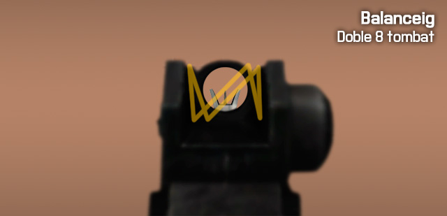
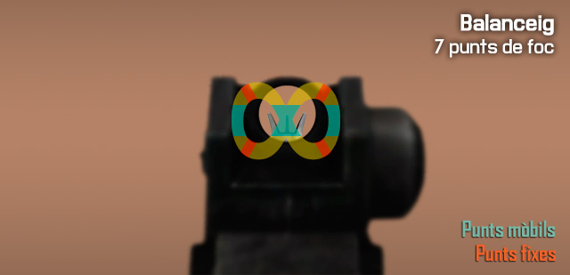
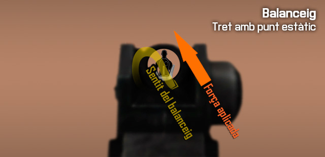
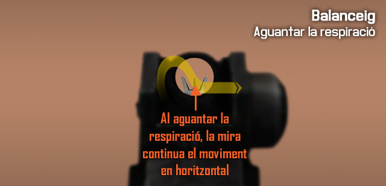
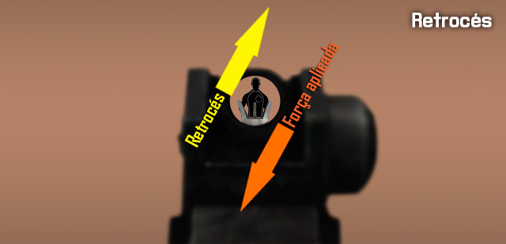

# Fonaments de la punteria amb fusell reforçats

Amb els conceptes més bàsics apresos sobre la punteria amb fusells, ara posaràs en practica aquests coneixements en entorns controlats per refinar els coneixements adquirits.

## Mecànica muscular

### Balanceig

Igual que a la vida real, el simulador implementa el comportament del nostre cos dintre del món virtual, i com afecta això a la nostra punteria. El cos humà no és estàtic, i té petits moviments involuntaris deguts al pols, la respiració, i d'altres factors. A l'hora de disparar això es tradueix en què la mira del teu fusell es mou, es balanceja, dificultant el tret.

#### El 8 tombat

El balanceig de la mira al simulador segueix un patró variable, però evident, és com un 8 tombat. La mira es mou d'un costat a un altre, i de dalt a abaix i viceversa. El patró és variable, i no es mou sempre a la mateixa velocitat ni en el mateix sentit, canvia totalment, però és fàcil de predir.

De vegades, dibuixa un doble 8 tombat, és a dir, en un dels costats, fa la vertical dos cops, i normalment amb girs més tancats en aquesta situació.

#### Els 7 punts de foc

Hi han 4 punts de foc estàtics, i 3 punts de foc mòbils. El 4 punts de foc estàtics són les quatre cantonades del 8 tombat i els 3 punts mòbils són les dues verticals laterals, i el punt central on es creua el patró. En aquests punts, la mira desaccelera la velocitat una mica, i com que ha de girar, roman una mica més en un punt fix. Has d'aprofitar aquests punts per disparar.

Per disparar fent servir els punts estàtics, com que el moviment és predictible, pots compensar el balanceig de la mira perquè apunti en tot moment a l'objectiu, i esperar al moment de gir per disparar. Aquest és el tret més estable que es pot fer, sense aguantar la respiració.

Per disparar fent servir els punts mòbils, en comptes de seguir el blanc amb la mira per esperar el gir, el que fas és moure la mira a la vertical del punt, i esperar que aquesta creui el punt per disparar. És un tret d'oportunitat, tu no ajustes la mira, simplement la poses al punt per on passarà i dispares. Amb aquest sistema, és més fàcil fer-ho amb els punts laterals que amb el central.

#### Aguantant la respiració

Quan aguantes la respiració amb el ++"Botó dret"++, el balanceig manté la vertical unes dècimes després de polsar el botó, i alenteix molt la horitzontal del moviment, però no l'elimina, de tal manera que si el balanceig anava cap a l'esquerra, la mira es mourà molt lentament cap a l'esquerra, seguint el patró.

El temps limit que pots aguantar la respiració és de 8 segons, passat aquest temps el soldat deixarà d'aguantar la respiració encara que continuïs polsant el botó, i la mira es mourà ràpidament simulant l'aspiració accelerada. El soldat en aquest punt triga 2 segons en retornar a un estat normal de balanceig.

#### Factors negatius per l'estabilitat

Hi han factors que empitjoren l'estabilitat i per tant augmenten el balanceig de la mira, i que són propis del combat, com són:

  - Haver estat corrent abans de disparar sense deixar temps per recuperar el pols normal empitjora l'estabilitat.
  - Estar dintre d'un tiroteig també afecta al soldat, amb bales enemigues i explosions o trets, al soldat li puja el pols i la respiració, a més a més la visió es torna de-saturada, perdent gamma cromàtica.
  - Les ferides també afecten molt, ja que no solament augmenten el balanceig, també provoquen efectes com empitjorament de la visió, tremolor, i d'altres efectes negatius.

### Retrocés

El retrocés es produeix a l'arma quan es dispara, com diu la tercera llei de Newton, tota acció té una reacció igual en sentit oposat. El retrocés depèn de diversos factors, el primer com està fabricada l'arma i la munició que fa servir, i després es veu afectat per factors externs, com si tenim recolzada l'arma o no. Normalment, el retrocés a les armes, sempre parlant en el supòsit que disparem amb la mà dreta, es produeix cap a dalt i cap a la dreta. Cada tret mou la mira força amunt i una mica a la dreta.

#### Compensar el retrocés

Si fas servir foc semiautomàtic, és més fàcil compensar després de cada tret el retrocés. Si fas servir fot automàtic, el retrocés és més visible, i costa més de compensar. En aquest últim cas, per compensar el retrocés amb armes automàtiques, cal moure la mira cap avall i una mica cap a l'esquerra a l'hora que disparem. Així podràs mantenir la mira relativament ben ajustada a l'objectiu.

Per mantenir l'efectivitat, hauràs de fer rafegues més curtes com més distància tinguis cap a l'objectiu.

##### Millorar el retrocés

Per millorar o reduir el retrocés, tens diferents opcions, que es poden també combinar per obtenir la millor estabilitat de foc.

  - Recolzar l'arma en qualsevol lloc amb la ++c++, (un mur, una capça, un soldat abatut, un company, un vehicle...) fa que el balanceig i el retrocés disminueixin.
  - Les postures que menor retrocés donen són per ordre de millor a pitjor, cos a terra, de genolls i d'en peus.
  - La utilització de bípodes quan és possible, millora l'estabilitat i el retrocés quan l'arma es recolza.
