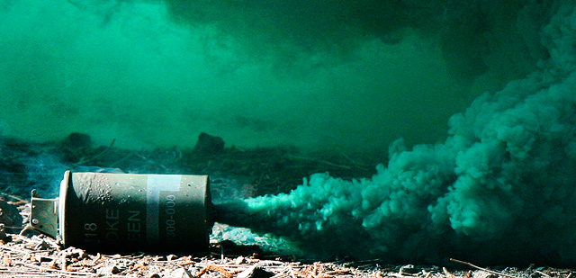

# Granades de fragmentació M67 i de fum M18

Les granades de mà proveeixen el soldat individual amb una sèrie de sistemes d'armes altament versàtils i eficaces. El soldats empren granades de mà en tot l'espectre de la guerra, des de la menor a major intensitat de conflictes, per evitar regalar posicions, per estalviar munició, i per infligir major nombre de baixes.

## Els dos tipus bàsics

Les dues granades que ha de fer servir qualsevol soldat són les de fragmentació per eliminar enemics i les de fum per negar la visual a l'oponent.

### Granada de fragmentació M67

{: .center}

| **Característiques**         | **Descripció**                                                                      |
|------------------------------|-------------------------------------------------------------------------------------|
| **Cos**                      | Esfera d'acer                                                                       |
| **Farciment**                | 184 grams de Composició B                                                           |
| **Espoleta**                 | M213                                                                                |
| **Pes**                      | 396 grams                                                                           |
| **Clip de seguretat**        | Sí                                                                                  |
| **Rang màxim de llançament** | 35 metres aproximadament                                                            |
| **Radi de danys**            | 15 metres                                                                           |
| **Radi letal**               | 5 metres                                                                            |
| **Color i marques**          | Cos verd oliva amb una banda de color groc sol a la part superior. Marques en groc. |

### Granada de fum M18

{: .center}

| **Característiques**         | **Descripció**                                                                                   |
|------------------------------|--------------------------------------------------------------------------------------------------|
| **Cos**                      | Cilindre de xapa d'acer amb quatre forats d'emissió en la part superior i un a la part inferior. |
| **Farciment**                | 326 grams de barreja de fum de colors                                                            |
| **Espoleta**                 | M201A1                                                                                           |
| **Pes**                      | 538 grams                                                                                        |
| **Clip de seguretat**        | No                                                                                               |
| **Rang màxim de llançament** | 35 metres aproximadament                                                                         |
| **Radi de danys**            | 50 a 90 segons                                                                                   |
| **Color i marques**          | Cos verd oliva amb la part superior que indica el color del fum.                                 |

## Ús tàctic

Els soldats fan servir granades de mà en missions defensives, missions ofensives i operacions retrògrades. Tots els soldats fan servir granades de mà durant les operacions properes, profundes, i posteriors, durant totes les condicions de combat, i en tot tipus de terrenys.

### Aplicació

Les granades de mà tenen les següents aplicacions específiques:

* Les granades de fragmentació s'utilitzen principalment per eliminar o ferir els soldats enemics, però també poden ser utilitzades per destruir o inhabilitar equips.
* Les granades de mà incendiàries s'utilitzen principalment per destruir l'equip i començar el foc, però també es poden utilitzar per destruir o desactivar vehicles i armes.
* El fum de color és útil sobretot per identificar o marcar posicions, però també pot ser utilitzat per marcar les zones d'operacions de terra a terra o operacions terra-aire.
* El fum blanc és útil sobretot per amagar o crear una cortina de fum per operacions ofensives o retrògrades.
* Les granades de mà antiavalots s'utilitzen per controlar les multituds o disturbis.
* Les granades estabornidores s'utilitzen per atordir o desorientar temporalment els ocupants d'una àrea tancada, com un edifici o sala.

Si bé totes les granades de mà tenen aplicació en el combat modern, la de fragmentació segueix sent la més important, ja que no només és la granada de mà primària d'eliminació, també és la més perillosa d'emprar. Les granades de fragmentació són igualment letals per als soldats amics i enemics, per tant, has de emprar-les adequadament per protegir els teus propis soldats.

### Combat proper

En el camp de batalla actual, el combat pot ocórrer en qualsevol lloc a qualsevol moment. El fusell, les armes cos a cos o les granades són armes bàsiques de combat per qualsevol soldat. El fusell et proporciona l'habilitat per eliminar enemics fora del teu voltant proper. Les granades de fragmentació et donen la capacitat d'eliminar aquests enemics a distàncies menors de 40 metres. Al no haver-hi flaix, ni so de tret, les granades mantenen la teva ocultació respecte de l'enemic.

* Molts cops al camp de batalla et pots trobar en una situació de combat proper on les tècniques normals de combat no funcionen gaire be, és en aquest moment que una descàrrega de granades sobre l'enemic et pot treure d'una situació compromesa. Tingues en compte per això que si l'enemic es troba en una pendent, la granada ha d'explotar el més a prop de l'objectiu, per evitar que rodoli cap abaix.
* La detonació sobre el terreny és especialment important quan ataques emplaçaments tipus búnquers. Per maximitzar les possibilitats d'èxit, compta UN MISSISIPI, DOS MISSISIPI i llença la granada. Això permet que la granada exploti en impactar al terra o poc després, sense deixar temps a l'enemic a reaccionar.

### Regles d'ús

Les regles per recordar abans d'emprar granades de mà, o quan et trobis a zones on es troben en ús, són els següents:

* Saber on es troben totes les forces amigues.
* Coneix al teu sector de foc.
* Fer servir el sistema de binomi o equip.
* Assegura't que l'arc projectat de la granada és lliure d'obstacles.
* Evacua les posicions en les quals planegis llançar una granada de mà de fragmentació, si és possible.

### Ús ofensiu

L'ús de granades de fragmentació a l'atac proporciona la violència, la destrucció i la potència de foc propera necessària per eliminar l'enemic. Els efectes afegits com la sordesa o la desorientació, proporcionen un avantatge tàctic que acompanyat de la violència controlada permet reduir els enemics mentre aquests encara han d'avaluar la nova situació.

#### Neteja d'habitacions

A l'hora de netejar una habitació o moure's a través d'una zona urbana, s'apliquen les següents consideracions:

* Quins tipus de granades permeten i restringeixen les RC?
* Quin efecte és el que vols aconseguir - eliminar, atordir, ocultar, destruir equipament, marcar un lloc, i així successivament?
* La integritat estructural de l'habitació i l'edifici permeten els tipus de granades seleccionades per al seu ús?
* L'esquema de maniobra permet l'ús de granades de fragmentació i no causar foc amic?

### Ús defensiu

Les granades més efectives per fer servir de forma defensiva són les de fragmentació. Proporcionen la destrucció i l'atordiment necessaris per frenar els atacs enemics. De vegades pot ser útil deixar que l'enemic es confii i s'apropi, just per llançar-li granades de fragmentació a sobre. És un eina eficaç contra la moral enemiga. Tanmateix, les granades de fum permeten emmascarar les posicions amigues, i bloquejar línies de foc enemigues, per facilitar les maniobres de les unitats amigues.

### Execució

A l'hora de llançar una granada, cal seguir un procediment que prepari a la unitat per aquesta acció. El soldat encarregat de llançar la granada, anunciarà la mateixa, i llavors llançarà la granada, amb la formula TIPUS DE GRANADA + FORA\!

!!! hint "Suggerència"

	* Fragmentadora fora!
	* Estabornidora fora!
	* Atordidora fora!

#### Tipus de llançament del simulador

Al simulador per defecte només hi ha un tipus de llançament de granada de mà, però gràcies al mod AGM disposaràs de 4 tipus. Per canviar entre tipus de llançament has de fer ús de les tecles ++alt+ctrl+g++.

* Normal. És el tipus per defecte, i es tracta d'un llançament bastant precís, que segueix una paràbola suau. Ideal per a qualsevol situació, tant a terreny obert com en entorn MOUT.
* Precís. És el tipus de llançament més precís que tens. La granada sortirà recte des de la mà cap on hagis apuntat. Ideal per llançaments d'extrema precisió, com voler fer entrar la granada per una finestra.
* Alt. És un llançament amb paràbola molt pronunciada, on la granada farà un trajecte elevat. Especialment indicada per llançar granades per sobre d'obstacles, com murs o cases.
* Deixar anar. En aquest tipus deixaràs anar la granada al terra, allà on estiguis. De reduïda utilitat i molt perillosa si fas servir granades de destrucció.
