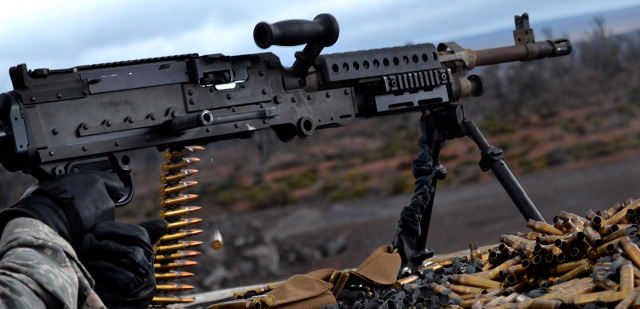

# Metralladora M240B

La M240B és una metralladora d'ús general. Es munta sobre un bípode, trípode, aeronau o vehicle. S'alimenta mitjançant una corretja, refrigerada per aire, operada gas, i totalment automàtica. La munició alimenta l'arma des d'una bandolera amb 100 bales que desintegra les baules. El gas de disparar una bala proporciona l'energia per disparar la següent. Per tant, l'arma es dispara automàticament sempre que té municions i l'artiller sosté el gallet. A mesura que l'arma es dispara, les baules es separen i s'expulsen des del costat. Els casquets buits s'expulsen des de abaix. L'artiller pot canviar el tub ràpidament. L'ànima del canó és cromada en plata, reduint el desgast del tub al mínim.

{: .center}

| **Característiques**               | **Descripció**                                                                                                 |
|------------------------------------|----------------------------------------------------------------------------------------------------------------|
| **Longitud de l'arma**             | 124,46 cm                                                                                                      |
| **Alçada de l'arma (en trípode)**  | 44,45 cm                                                                                                       |
| **Pes**                            | 10,03 kg                                                                                                       |
| **Munició**                        | Bala, traçadora, perforant de 7,62 mm en bandoleres de 100 bales.                                              |
| **Cadència de foc**                |                                                                                                                |
| -------- **Sostinguda**            | 100 trets per minut en rafegues 6 a 9 bales, amb de 4 a 5 segons entre ràfegues (canviar tub cada 10 minuts).  |
| -------- **Ràpid**                 | 200 trets per minut en rafegues 10 a 13 bales, amb de 2 a 3 segons entre ràfegues (canviar tub cada 2 minuts). |
| -------- **Cíclic**                | 650-950 trets per minut, ràfega contínua, tub canviat cada minut.                                              |
| **Carrega bàsica (equip de tres)** | 900 a 1.200 bales                                                                                              |
| **Crema de la traçadora**          | 900 m (+)                                                                                                      |
| **Rangs**                          |                                                                                                                |
| -------- **Màxim**                 | 3,725 metres                                                                                                   |
| -------- **Màxima eficàcia**       | 1,100 metre amb trípode i T+E                                                                                  |
| **Foc d'àrea**                     | Trípode 1,800 metres, bípode 800 metres                                                                        |
| **Foc puntual**                    | Trípode 800 metres, bípode 600 metres                                                                          |
| **Foc de supressió**               | 1,800 metres                                                                                                   |

La metralladora M240B dóna suport al fuseller en operacions tant ofensives com defensives. Ofereix un gran volum de foc continu i letal gràcies al calibre 7.62mm. La M240B pot atacar objectius que els fulles no poden, i ho fa amb foc precís i controlat. El llarg abast, la defensa propera, i el foc de protecció final lliurat per la M240B formar una part integral dels foc defensiu d'una unitat.

Tot i així, el seu elevat pes, incloent els carregadors, i la seva baixa mobilitat, li lliuren un efectivitat més reduïda en operacions de gran mobilitat.

## Punts forts

  - Alta cadència de foc.
  - Llarg abast del foc.
  - Alta energia i letalitat de la bala gràcies al calibre 7.62mm.
  - bona estabilitat i precisió un cop recolzada.

## Punts febles

  - Elevat pes de l'arma i carregadors.
  - Baixa mobilitat a curta distància.
  - Requereix de més d'un soldat per operar-la amb eficàcia.
