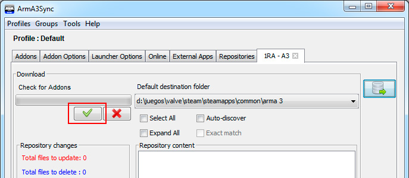
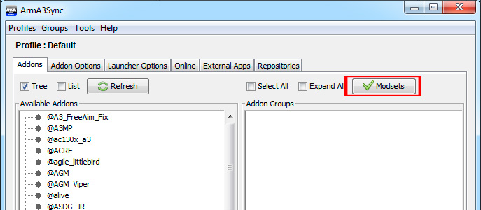
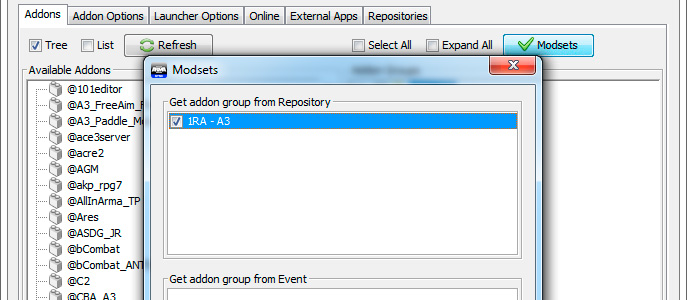

# Repositori d'addons

S'ha creat una recopilació d'addons per fer servir a les partides del grup que les pugui potenciar i millorar, a l'hora que dóna més opcions als jugadors.

En la creació de l'estàndard s'ha tingut en compte unes regles molt clares.

* Només entren els addons que tinguin una qualitat alta.
* Els addons que donen problemes queden fora.
* Que presentin a ser possible un pla de continuïtat en el temps.

I allò que s'ha volgut incloure amb els addons és.

* Millora en el realisme.
* Millorar el comportament de la IA del simulador.
* Un parc armamentístic més ampli.
* Eines que facilitin la tasca del soldat.

Amb aquestes pautes s'ha creat un estàndard pensat no sols per ampliar les coses que ens dóna el simulador, com més armes o equipament, si no també corregir les carències de realisme, dotar la IA d'un comportament més realista, i en definitiva, apropar l'Arma 3 en una experiència més propera al combat real.

## Instal·lació

Aquí et detallem com instal·lar el programa que fem servir i baixar els addons.

### ArmA3Sync

Per poder baixar l'Estàndard cal que us instal·leu l'ArmA3sync. Aquest programa permet actualitzar els nostres addons automàticament, alhora que també serveix de llançador de l'A3 amb l'Estàndard. Lo bo que te és que el programa compara els fitxers de l'Estàndard que teniu al vostre ordinador i els fitxers oficials que tenim al servidor, i si no coincideix, només baixa els fitxers que són diferents, inclosos els que faltin, i esborra els fitxers que sobren.

* Podeu baixar el programa des d'[aquest enllaç](http://www.armaholic.com/page.php?id=22199).
* *Requereix [Java](http://www.java.com/en/download)per funcionar.*

Un cop instal·lat el programa, el primer que us pregunta en executar-ho és on
teniu instal·lat l'Arma3. Li heu d'indicar la carpeta arrel de l'Arma 3, que normalment es troba dintre de la carpeta Valve `...\Valve\Steam\SteamApps\common\Arma 3`.

Un cop fet això, el primer que farem serà establir les opcions de llançament, per això cal que cliqueu a la pestanya `Launcher Options`.

{: .center}

A les opcions de l'esquerra marqueu `No Splash Screen` i `Default World Empty`. I a la casella de la dreta, escriviu `-skipintro`.

{: .center}

Ara aneu a la pestanya del final `Repositories`, i feu clic al primer botó, la creu blava.

{: .center}

Aquí heu de posar a la primera casella l'adreça que teniu just aquí a sota i li doneu al botó `Import`.

`http://www.cavallersdelcel.cat/magatzem/ArmA/repositori_a3sync/0_sencer/.a3s/autoconfig`

Això farà que s'ompli tota la informació de sota, només queda fer clic a `Ok`.

{: .center}

Ara seleccioneu el repositori que hem creat, i li doneu a l'últim botó de la dreta. Aquest és el botó que fareu servir sempre per anar a la finestra de comprovació i baixada de l'Estàndard.

{: .center}

Aquí el primer a fer es una comprovació, per veure si el vostre Estàndard coincideix amb l'oficial. Per fer això feu clic al botó de `verificació` de color verd a l'esquerra.

{: .center}

Un cop comprovat, us sortiran tots els fitxers de l'Estàndard, amb un codi de colors.

**Negre:** Ja teniu el fitxer correcte.  
**Vermell:** No teniu aquest fitxer o està modificat.  
**Blaus:** El servidor no té aquest fitxer i s'esborrarà del vostres addons.

Heu de seleccionar totes les carpetes, a dalt teniu una casella per seleccionar tot de cop. I feu clic al botó del `Play` a l'esquerra.

{: .center}

Per poder llançar l'Estàndard directament des de l'ArmA3sync, opció per cert recomanada, heu d'anar a la pestanya `Addons`, i fer clic al botó de la dreta `Modsets`.

{: .center}

En aquesta finestra seleccioneu el nostre Estàndard i feu clic en `Ok`.

{: .center}

Ara aneu a la pestanya `Addon Options` i del llistat d'addons de sota a `Addon Priorities`, seleccioneu **@CC_CBA_A3** i feu que es posi el primer de la llista amb els botons de fletxa de color verd de la dreta. El CBA es una llibreria que necessita ser llançada abans que la resta d'addons perquè funcionin be.

{: .center}

Llavors tornem a la pestanya Addons, i seleccioneu el grup **1RA-A3**, i llancem amb el botó `Start Game` de sota a la dreta.

{: .center}

## Presets

Dintre del nostre servidor, tenim diferents seleccions d'addons de tots els que fem servir, preparats per fer diferents èpoques (Guerra moderna, 2a Guerra Mundial, Vietnam, Zombis). Cadascun d'aquest és un preset que has de configurar tu.

En [aquest enllaç](http://www.cavallersdelcel.cat/forums/threads/servidor-dedicat-com-accedir-hi-i-presets.5413) trobaràs els presets que tenim actualment

## ACRE 2

Aquest és l'addon que fem servir pel sistema de comunicació. El primer cop que llancis l'Arma amb el nostre estàndard et saltarà un avís per instal·lar el pluguin al **Teamspeak 3** (que ja has de tenir instal·lat), li vas dient que sí i ja està.