# Repositori d'addons

S'ha creat una recopilació d'addons per fer servir a les partides del grup que les pugui potenciar i millorar, a l'hora que dóna més opcions als jugadors.

En la creació de l'estàndard s'ha tingut en compte unes regles molt clares.

* Només entren els addons que tinguin una qualitat alta.
* Els addons que donen problemes queden fora.
* Que presentin a ser possible un pla de continuïtat en el temps.

I allò que s'ha volgut incloure amb els addons és.

* Millora en el realisme.
* Millorar el comportament de la IA del simulador.
* Un parc armamentístic més ampli.
* Eines que facilitin la tasca del soldat.

Amb aquestes pautes s'ha creat un estàndard pensat no sols per ampliar les coses que ens dóna el simulador, com més armes o equipament, si no també corregir les carències de realisme, dotar la IA d'un comportament més realista, i en definitiva, apropar l'Arma 3 en una experiència més propera al combat real.

## Instal·lació

Aquí et detallem com instal·lar el programa que fem servir i baixar els addons.

### ArmA3Sync

Per poder baixar l'Estàndard cal que us instal·leu l'ArmA3sync. Aquest programa permet actualitzar els nostres addons automàticament, alhora que també serveix de llançador de l'A3 amb l'Estàndard. Lo bo que te és que el programa compara els fitxers de l'Estàndard que teniu al vostre ordinador i els fitxers oficials que tenim al servidor, i si no coincideix, només baixa els fitxers que són diferents, inclosos els que faltin, i esborra els fitxers que sobren.

* Podeu baixar el programa des d'[aquest enllaç](http://www.armaholic.com/page.php?id=22199).
* *Requereix [Java](http://www.java.com/en/download) per funcionar.*

Un cop instal·lat el programa, si l'executeu es possible que us pregunti on teniu instal·lat l'ArmA 3. Li heu d'indicar la carpeta arrel de l'Arma 3, que normalment es troba dintre de la carpeta Steam `...\Steam\SteamApps\common\Arma 3`.

Un cop ho tinguem fet, passarem a afegir la carpeta on volem descarregar els addons. Aquesta carpeta pot estar a qualsevol lloc, inclús en un altre disc dur diferent a on teniu instal·lat l'ArmA 3.

Per a fer-ho anirem a la pestanya `Addon Options` i dins del requadre `Addon Search Directories` li farem clic al botó `+` que hi ha a la dreta i seleccionarem el directori que vulguem. Si no sabeu quin seleccionar podeu seleccionar l'arrel de l'ArmA 3.

{: .center}

Un cop fet això, passarem a establir les opcions de llançament, per això cal que cliqueu a la pestanya `Launcher Options`.

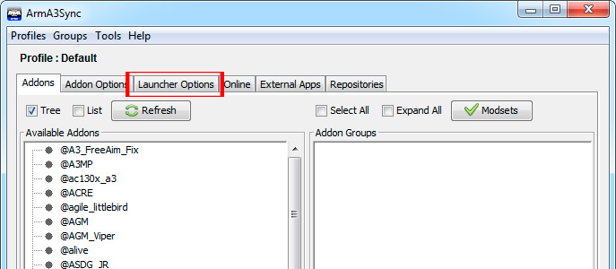{: .center}

A les opcions de l'esquerra marqueu `No Splash Screen` i `Default World Empty`. I a la casella de la dreta, escriviu `-skipintro`.

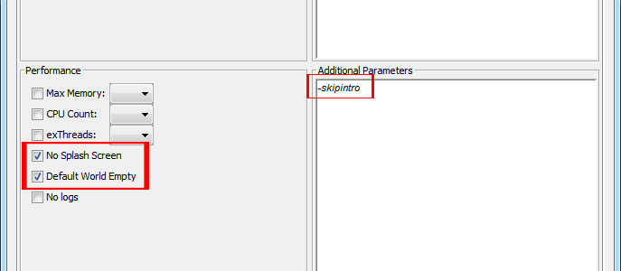{: .center}

Ara aneu a la pestanya del final `Repositories`, i feu clic al primer botó, la creu blava.

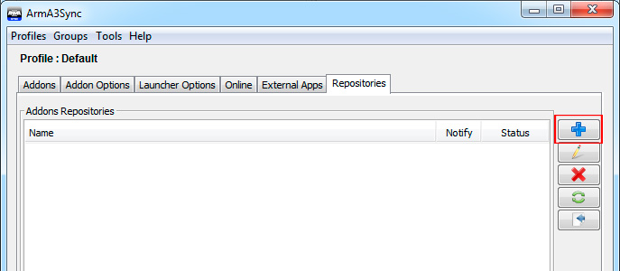{: .center}

Aquí heu de posar a la primera casella l'adreça que teniu just aquí a sota i li doneu al botó `Import`.

`http://www.cavallersdelcel.cat/magatzem/ArmA/repositori_a3sync/0_sencer/.a3s/autoconfig`

Això farà que s'ompli tota la informació de sota, només queda fer clic a `Ok`.

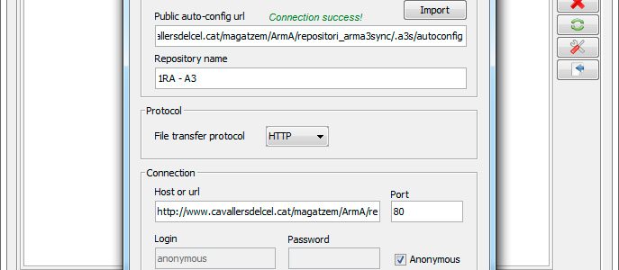{: .center}

Ara seleccioneu el repositori que hem creat, i li doneu a l'últim botó de la dreta. Aquest és el botó que fareu servir sempre per anar a la finestra de comprovació i baixada de l'Estàndard.

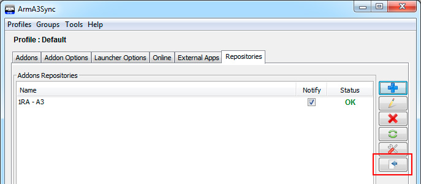{: .center}

Aquí el primer a fer es una comprovació, per veure si el vostre Estàndard coincideix amb l'oficial. Per fer això, primer heu de seleccionar la carpeta on es baixaran els addons del desplegable `Default destination folder` que hem definit previament a `Addon Options` (normalment us sortirà automàticament), seguidament feu clic al botó de `verificació` de color verd a l'esquerra.

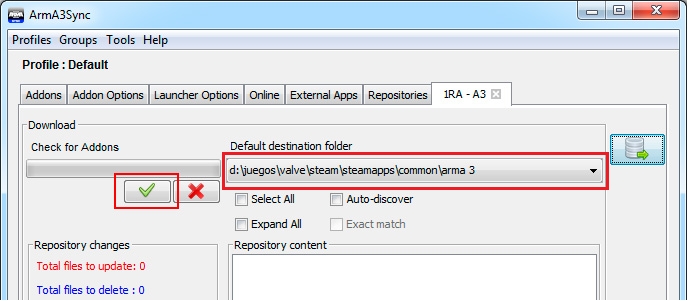{: .center}

Un cop comprovat, us sortiran tots els fitxers de l'Estàndard, amb un codi de colors.

**Negre:** Ja teniu el fitxer correcte.  
**Vermell:** No teniu aquest fitxer o està modificat.  
**Blaus:** El servidor no té aquest fitxer i s'esborrarà del vostres addons.

Heu de seleccionar totes les carpetes, a dalt teniu una casella per seleccionar tot de cop (`Select All`). I feu clic al botó del `Play` a l'esquerra.

La descàrrega sol trigar força depenent de la velocitat de la vostre connexió, si per algun motiu teniu un tall de connexió no us preocupeu perque el programa intenta reconnectar i continua per on estava. Si se us en va la llum o teniu que apagar l'ordinador, tampoc passa res ja que quan el torneu a encendre continuarà per on estava, sense haver de descarregar-ho tot de nou.

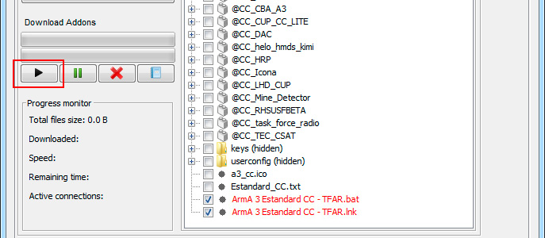{: .center}

Per poder llançar l'Estàndard directament des de l'ArmA3sync, opció per cert recomanada, heu d'anar a la pestanya `Addons`, aqui veureu dos requadres grans, a mà esquerra a `Available Addons` us surten els addons que teniu descarregats i a mà dreta a `Addon Groups` es on crearem els diferents perfils de llançament per als diferents modes (Guerra moderna, Guerra de Vietnam, Segona Guerra Mundial, etc).

Heu de fer clic dret sobre el requadre `Addon Groups` i seguidament a `Add Group` dins el desplegable. 

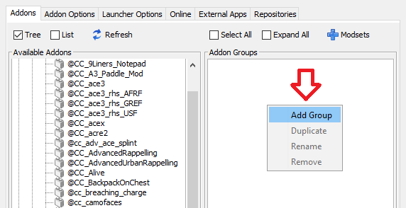{: .center}

Heu de crear 4 carpetes:

- Guerra Moderna
- Guerra Moderna Ampliada
- Vietnam
- Segona Guerra Mundial

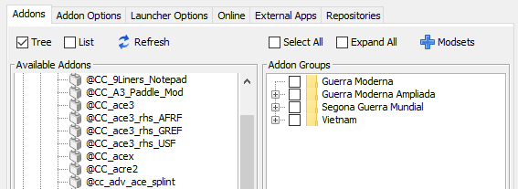{: .center}

Cal arrossegar els addons des de la llista de l'esquerra, fins a dins de cada carpeta per a crear el que nosaltres anomenem Presets. Per saber quins addons van a cada carpeta consulta-ho [aquí](http://www.cavallersdelcel.cat/forums/threads/servidor-dedicat-com-accedir-hi-i-presets.5413).

Ara aneu a la pestanya `Addon Options` i del llistat d'addons de sota a `Addon Priorities`, seleccioneu **@CC_CBA_A3** i feu que es posi el primer de la llista amb els botons de fletxa de color verd de la dreta. El CBA es una llibreria que necessita ser llançada abans que la resta d'addons perquè funcionin be.

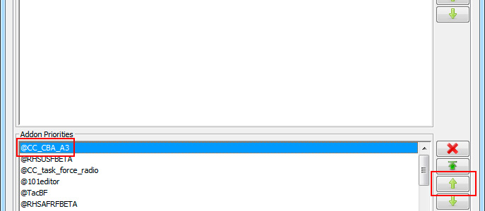{: .center}

Llavors tornem a la pestanya Addons, i seleccioneu el preset d'addons que vulgueu (carpeta), i llancem amb el botó `Start Game` de sota a la dreta.

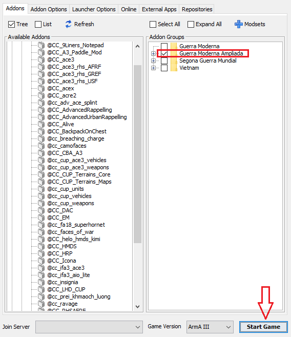{: .center}

## ACRE 2

Aquest és l'addon que fem servir pel sistema de comunicació. El primer cop que llancis l'Arma amb el nostre estàndard et saltarà un avís per instal·lar el pluguin al **TeamSpeak 3** (que ja has de tenir instal·lat), li vas dient que sí i ja està.

Si tens el TeamSpeak 3 obert en el moment de llançar el simulador, et saltarà un error conforme no s'ha pogut instal·lar. En aquest cas simplement has de llançar el joc la primera vegada amb el TeamSpeak 3 apagat i després ja podràs obrir-lo.

## Ja ho he fet tot

Si ja has fet tot el que es diu en aquest tutorial, ja estàs llest per a realitzar el curs CIB que et donarà els fonaments bàsics per a poder participar a les missions del grup. Per a passar el curs, passa't per al nostre canal de Discord i demana per a un reclutador.

Et recomanem que donguis un cop d'ull a [aquest enllaç](http://arma.cavallersdelcel.cat/ebc/fase1/simulador/) on s'expliquen els controls, configuracions gràfiques i d'altres coses interessants si es la primera vegada que toques ArmA 3. També es interessant que facis un cop d'ull als tutorials i al Bootcamp del simulador.