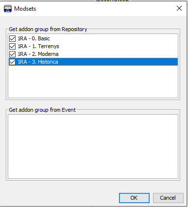

# **Benvingut al 1er Regiment Amfibi**

El 1er Regiment Amfibi som un grup de **simulació militar moderna i històrica**, sense formalitats excessives. Formem part de la comunitat catalana de simulació **Cavallers del Cel**.

Ens regim per els valors de seriositat, responsabilitat, eficàcia i realisme.

La nostra especialització és simular unitats de **reconeixement amfibi**, en especial els **Force Recon** dels Marines americans. Son unitats molt petites (4-6 persones) on tots saben de fer tot. 

**Horaris**

Fem missions oficials internes regulars cada dimecres de 22h a 00h (CET) i els dissabtes de 22h a 02h (CET). L'Assistència no es obligatòria per cada activitat del grup, però sí que es demana un compromís mínim d'assistència. 

**Requisits bàsics**

Per tant, els únics requisits que demanem és:

* Interès per la simulació militar.
* Comprometre's a participar de forma regular.
* Ser major d'edat. O majors de 16 anys si demostres maduresa. 

Si tens clars els punts anteriors, a continuació tens els passos a completar per convertir-te en un nou membre del grup. Si tens algun dubte, pots comunicar-te amb nosaltres per mitjà del nostre canal de Discord.

## Pas 1: Requisits tècnics

Cal tenir una copia legal dels següents jocs i expansions:

* [ArmA 3](https://store.steampowered.com/app/107410/Arma_3/)
* [ArmA 3 Apex](https://store.steampowered.com/app/395180/Arma_3_Apex/)
* [ArmA 3 Global Mobilization](https://store.steampowered.com/app/1042220/Arma_3_Creator_DLC_Global_Mobilization__Cold_War_Germany/)

Necessitaràs també:

* [TeamSpeak 3](https://www.teamspeak.com/en/downloads/) instal·lat (versió 64 bits)
* Micròfon i auriculars funcionals.
* PC que compleixi els requisits mínims de l'ArmA 3 (consulta pàgina de Steam)
* Connexió a Internet estable.
* Com a mínim 150 Gb d'espai de disc lliures.

Ja ho tens tot? Doncs continuem.

## Pas 2: Fòrums

La comunitat disposa d'uns potents fòrums on pengem tota la informació sobre missions, cursos, documentació, etc.

1. [Registra't als nostres fòrums](http://www.cavallersdelcel.cat/forums)
2. [Presenta't a la comunitat sencera](http://cavallersdelcel.cat/forums/forums/%EF%BB%BFallistament.5/)
3. [Presenta't al grup d'ArmA 3](http://cavallersdelcel.cat/forums/forums/allistament.36/)

Ja ho has fet? Seguim doncs.

## Pas 3: Discord

Per a les comunicacions diàries i habituals utilitzem [Discord](https://discordapp.com/), que es un xat semblant a una barreja entre Whatsapp i Skype. El pots instal·lar al PC i al mòbil i també disposa de versió de navegador.

El nostre canal de Discord: [https://discord.gg/4RGJdTv](https://discord.gg/4RGJdTv)

Es important que abans de continuar, et connectis al canal de Discord i et presentis.

Ja t'has presentat? Seguim doncs.

## Pas 4: Funcionament i normativa

Abans de començar, és important que coneguis [com funciona el grup](http://cavallersdelcel.cat/forums/threads/1er-regiment-amfibi-milsim-presentaci%C3%B3-i-funcionament.5934/). És important que tinguis present quins membres formen part del staff i quins  s'encarreguen de les diferents seccions.

D'altra banda, abans de participar a les nostres missions és imprescindible que llegeixis la nostra [normativa de convivència](http://www.cavallersdelcel.cat/forums/threads/normes-de-conviv%C3%A8ncia-b%C3%A0sica-de-les-missions-internes.5086/).

## Pas 5: Perfil

Obre l'ArmA 3.

Dins el menú principal del simulador, ves al botó de perfil que hi ha a dalt a la
dreta (és la icona d’un cap).

{: .center}

Selecciona el teu perfil i s'obrirà una finestra com la següent.

{: .center}

Al perfil per defecte no pots canviar-li el nom, així que hauràs de crear un de nou i posar-li el `CC_` davant, com en la imatge anterior.

!!! danger "Important"

	No li posis ni ulleres ni maquillatge, això ho podràs fer a cada missió.

Un cop fet això, clica sobre `Unit` i s'obrirà la pantalla següent.

{: .center}

Has de copiar el número que hi ha destacat en vermell. Després has d'anar [aquí](http://cavallersdelcel.cat/forums/threads/id-jugador-url-squad-de-larma-3.425/) i deixar un missatge amb aquest.

Més endavant se't assignarà un enllaç que hauràs d'enganxar al camp `SQUAD XML`. Per ara, no et preocupis per això. Pots passar al següent pas.

## Pas 6: Bootcamp (Opcional)

Si no has jugat mai a l'ArmA 3, et recomanem que facis la mini-campanya introductòria "Bootcamp". A més, si pots, els entrenaments virtuals. Allà aprendràs a utilitzar els controls d'una manera pràctica i divertida.

{: .center}

Aquest pas és opcional. No cal que esperis a completar-lo per a continuar amb els següents passos.

## Pas 7: Descàrrega de mods

S'ha creat una recopilació de mods per fer servir a les partides del grup per tal de potenciar i millorar el realisme, alhora que dona més opcions al grup.

* Millora el realisme.
* Millora el comportament de la IA del simulador.
* Ofereix un parc armamentístic immens.
* Ofereix una quantitat immensa de vehicles.
* Ofereix eines que faciliten la tasca del soldat.
* Cobreix diferentes èpoques històriques.

### Instal·lació ArmA3Sync

Per poder descarregar els mods cal que instal·lis l'aplicació ArmA3Sync. Aquesta permet actualitzar els nostres "mods" de forma automàtica, alhora que serveix de llançadora de l'ArmA 3. 

Un dels seus principals atractius, és que compara els fitxers dels teu ordinador amb els fitxers oficials del servidor. Si no coincideixen, només descarrega els fitxers que son diferents.

* Podeu descarregar l'Arma3Sync a través d'[aquest enllaç](http://www.armaholic.com/page.php?id=22199).
* *Requereix [Java](http://www.java.com/en/download) per funcionar.*

Instal·lat el programa, quan l'executis és possible que et pregunti on tens instal·lat l'ArmA 3. Li has d'indicar la carpeta arrel de l'Arma 3, sovint es troba dintre de la carpeta Steam `...\Steam\SteamApps\common\Arma 3`. Si has de seleccionar l'executable del simulador, assegura't de seleccionar el de 64 bits, es a dir `arma3_x64.exe`.

### Configuració ArmA3Sync

Fet això, escollirem la carpeta on vols descarregar els "addons". Aquesta carpeta pot ser a qualsevol lloc, inclús en un disc dur diferent al que tens instal·lat l'ArmA 3.

Per a fer-ho ves a la pestanya `Addon Options` i dins del requadre `Addon Search Directories` clica el botó `+` que hi ha a la dreta i selecciona el directori que vulguis. Si no saps quin seleccionar, pots seleccionar el mateix de l'ArmA 3.

{: .center}

Un cop fet això, has d'establir les opcions de llançament. Clica la pestanya `Launcher Options`.

{: .center}

A les opcions de l'esquerra marca `No Splash Screen` i `Default World Empty`. A la casella de la dreta, escriu `-skipintro`.

Aprofita per verificar que l'executable de l'ArmA 3 sigui `arma3_x64.exe`.

### Descàrrega

A partir d'aquí has de configurar i descarregar tots els nostres repositoris de mods. Has de repetir els passos següents per a cadascun dels següents repositoris:

`http://www.cavallersdelcel.cat/magatzem/ArmA/repositori_a3sync/0_basic/.a3s/autoconfig`

`http://www.cavallersdelcel.cat/magatzem/ArmA/repositori_a3sync/1_terrain/.a3s/autoconfig`

`http://www.cavallersdelcel.cat/magatzem/ArmA/repositori_a3sync/2_moderna/.a3s/autoconfig`

`http://www.cavallersdelcel.cat/magatzem/ArmA/repositori_a3sync/3_nam/.a3s/autoconfig`

1- Has d'anar a la pestanya del final, `Repositories`. Fes clic al primer botó, el signe + blau.

{: .center}

2- A la primera casella has de posar l'adreça del repositori i clicar el botó `Import`.

{: .center}

3- Això farà que s'omplin les caselles restants. Ara només queda clicar `Ok`.

{: .center}

4- Per accedir al repositori que acabes de configurar, selecciona’l a la llista i fes clic al botó de la fletxa blava.

Nota: Si ho desitges, pots marcar les caselles `Notify` i `Auto` per a que t'avisi de quan hi ha novetats i intenti actualitzar-lo de forma automàtica. Tingues present que solem avisar amb antelació quan cal actualitzar.

{: .center}

5- Ja al repositori, has clicar el botó verd `Check for addons`. Aquest comprova si tens els mods descarregats correctament. Després comprova que tens seleccionada la adreça on es descarregaran els mods. Marca la casella `Select All` i seguidament clica el botó `Play`.

{: .center}

El procés descarrega fitxer a fitxer. Si tens algun error, pots esperar uns 10 minuts i tornar-ho a intentar. No et preocupis, ho continuarà descarregant allà on s'havia quedat. Si es repeteix sovint, contacta a un company del grup. 

!!! danger "Important"

	És habitual que el proces de descàrrega doni errors amb codi 503, això sol passar quan hi ha algú més a part de tu descarregant els mods. Com hem dit, espera 10 minuts i torna-ho a intentar fins que es descarregui tot.

Més endavant quan hagis d'actualitzar els mods, hauràs de seguir el mateix procés.

### Configuració dels modsets

Un cop tinguis els mods descarregats, és el moment de configurar els modsets. Els modsets son una mena de "carpetes" virtuals que permeten agrupar els mods per grups. És important ja que no sempre carreguem els mateixos mods per a totes les missions.

Per a configurar els modsets simplement has d'anar a la pestanya `Addons` i clicar el botó `Modsets`.

{: .center}

S'obrirà una finestra com la següent. Marca totes les caselles i clica `Ok`.

{: .center}

Fes clic dret al requadre de la dreta i crea un nou grup que es digui `Global Mobilization`.

{: .center}

Seguidament fes clic a la pestanya `DLC` (a mà dreta) i arrossega `GM` dins la carpeta que acabes de crear.

{: .center}

Ja gairebé ho tens!

## Pas 8: Instal·lació de l'ACRE2

*Abans de seguir aquest pas has d'assegurar-te que tens instal·lada l'aplicació `TeamSpeak 3`. I que no està **oberta**.*

L'ACRE2 és un "mod" per simular comunicacions de ràdio i veu. Utilitza TeamSpeak 3 com a servidor de veu.

Per fer-lo servir és necessari instal·lar un `plugin`. Aquest plugin s'instal·larà de forma automàtica quan arranquem el simulador amb el mod ACRE2 posat.

Per fer-ho, dins de l'ArmA3Sync has de sel·leccionar les caselles del modset `Basic` i `Global Mobilization`, i seguidament `Start Game`.

{: .center}

Espera a que l'ArmA 3 carregui. En un moment donat, apareixerà el següent missatge informant que l'ACRE2 s'ha instal·lat correctament:

{: .center}

Un cop instal·lat i sense apagar l'ArmA 3, obre el TeamSpeak 3 i connecta't al servidor de Cavallers del Cel.

Servidor: ts.cavallersdelcel.cat

Contrasenya: *demana-la als companys*

Fixa't en l'apartat de la dreta, t'ha d'apareixer quelcom simil·lar això:

{: .center}

Si és així, ja ho tens.

## Pas 9: Curs d'Infanteria Bàsic (CIB)

Com a pas previ a poder participar a les nostres missions, tothom ha de superar el Curs d'Infanteria Bàsic (C.I.B) per adquirir els coneixements i procediments bàsics. Té una duració aproximada de 2 hores. No té cap examen formal, però s'avalua el comportament dels futurs membres així com la seva predisposició a aprendre.

Per a passar el curs has de contactar amb el personal del grup d'ArmA 3 a través del canal de Discord per a determinar el dia i hora que vagi millor.

## Pas 10: La primera missió

Un cop superat el C.I.B se't donarà accés als canals privats de l'ArmA 3 del servidor de Discord i podràs apuntar-te a les missions del grup. Per fer-ho, has de consultar el canal `#arma-assistència`.

Al final de tot, veuràs les missions programades per als següents dies. Per marcar la teva assisència has de *reaccionar* al missatge.

{: .center}

* `Vist verd`: Assisteixo.
* `Interrogant`: Sóc dubte, encara no ho se segur.
* `Creu vermella`: No podré venir.

!!! danger "Important"

	Si no t'apuntes a una missió (encara que sigui per dir que no podràs venir), es considerarà una falta de compromís. A més, és probable que se't comptabilitzi i fins i tot que no tinguis lloc. Per això el personal del grup que et recomanem que revisis aquest apartat cada dos o tres dies.

Un cop arribi el dia de la missió: has d'entrar 15 minuts abans al TeamSpeak 3, repassar que tinguis els mods ben actualitzats i que l'ACRE2 funcioni. Si tens algun dubte, pots preguntar als companys abans d'entrar.

## Ja ets tot un Marine

A partir d'ara ja ets un membre més del 1er Regiment Amfibi i podràs seguir formant-te amb els cursos avançats (pots trobar les convocatories al fòrum o al Discord).

Se't obrirà una fulla de servei [aquí](http://cavallersdelcel.cat/forums/forums/membres.171/), on de forma periòdica s'apuntarà la teva assistència, cursos i reconeixements.

Et recomanem que vagis repassant poc a poc el nostre manual de l'[Entrenament Bàsic de Combat (EBC)](http://arma.cavallersdelcel.cat/ebc/).

{: .center}
