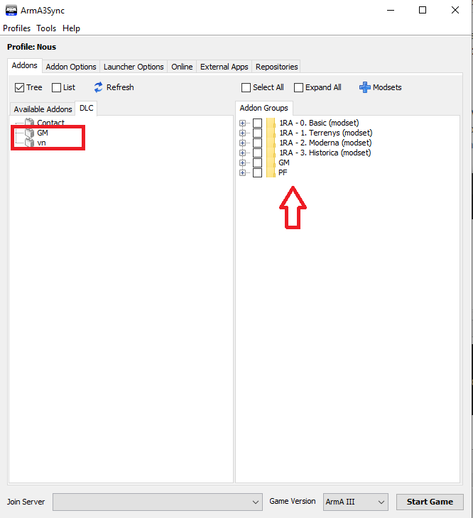

# **Benvingut Marine al 1er Regiment Amfibi**

Si estas llegint això es que d'alguna manera t'has interessat per entrar al nostre grup. Abans de començar cal que tinguis clars alguns punts:

* El 1er Regiment Amfibi es un grup de Simulació Militar, això vol dir que simulem tàctiques, protocols i material de la manera més realista possible a les nostres missions i en diferents èpoques històriques, com Segona Guerra Mundial, Vietnam, Guerra Freda, guerra moderna o futur proper.

* Com indica el nom del grup, ens especialitzem en Infanteria de Marina de Reconeixement, principalment simulem els Force Recon del Cos de Marines dels Estats Units d'Amèrica.

* Els horaris de partida son els Dimecres de 22.00h CET a 00.00h CET i els Dissabtes de 22.00h CET a 01.00h CET. L'Assistència no es obligatòria però si que es premia la regularitat, si ets nou et recomanem que assisteixis regularment.

* El 1er Regiment Amfibi no te quotes obligatòries de membre ni límits d'edat.

* Per a poder participar al grup cal entendre i parlar català amb un mínim de fluidesa. No es permet l'ús de cap altre llengua en les activitats del grup.

Si tens clars els punts anteriors i estas d'acord amb ells, podem continuar. A continuació tens una serie de passos que has de completar per a poder començar a participar amb el grup. Recorda que si tens algun dubte, pots comunicar-te amb nosaltres per mitjà del nostre canal de Discord.

## Pas 1: Requisits tècnics

Necessites tenir comprats legalment els següents jocs i expansions. No cal que compris més DLCs dels que hi ha llistats a aqui:

* [ArmA 3](https://store.steampowered.com/app/107410/Arma_3/)
* [ArmA 3 Apex](https://store.steampowered.com/app/395180/Arma_3_Apex/)
* [ArmA 3 Global Mobilization](https://store.steampowered.com/app/1042220/Arma_3_Creator_DLC_Global_Mobilization__Cold_War_Germany/)

També necessites:

* [TeamSpeak 3](https://www.teamspeak.com/en/downloads/) instal·lat (versió 64 bits)
* Micròfon i auriculars funcionals.
* PC que compleixi els requisits de l'ArmA 3 (consulta pàgina de Steam)
* Connexió a Internet estable.
* Com a mínim 150 Gb d'espai de disc lliures.

Ja ho tens tot? Doncs continuem.

## Pas 2: Fòrums

Registra't als nostres fòrums: [http://www.cavallersdelcel.cat/forums](http://www.cavallersdelcel.cat/forums)

Presenta't a la comunitat sencera: [http://cavallersdelcel.cat/forums/forums/%EF%BB%BFallistament.5/](http://www.cavallersdelcel.cat/forums)

Presenta't al grup d'ArmA 3: [http://cavallersdelcel.cat/forums/forums/allistament.36/](http://www.cavallersdelcel.cat/forums)

Ja ho has fet? Seguim doncs.

## Pas 3: Discord

Per a les comunicacions diàries i habituals utilitzem [Discord](https://discordapp.com/), que es un xat semblant a una barreja entre Whatsapp i Skype. El pots instal·lar al PC i al mòbil i també disposa de versió de navegador.

El nostre canal de Discord: [https://discord.gg/4RGJdTv](http://www.cavallersdelcel.cat/forums)

Es important que abans de continuar, et connectis al canal de Discord i et presentis.

Ja t'has presentat? Seguim doncs.

## Pas 4: Funcionament i normativa

Abans de començar, es important que coneixis [com funciona el grup](http://cavallersdelcel.cat/forums/threads/1er-regiment-amfibi-milsim-presentaci%C3%B3-i-funcionament.5934/) i quins son els membres que s'encarreguen de les diferents seccions.

Per altra banda, abans de participar a les nostres missions es imprescindible que llegeixis la nostra [normativa de convivència](http://www.cavallersdelcel.cat/forums/threads/normes-de-conviv%C3%A8ncia-b%C3%A0sica-de-les-missions-internes.5086/).

## Pas 5: Perfil

Dins el menú principal del simulador, ves al botó de perfil que hi ha a dalt a la
dreta (és la icona d’un cap).

{: .center}

Seleccioneu el vostre perfil i se us obrirà una finestra com la següent.

{: .center}

Al perfil per defecte no se li pot canviar el nom, així que haureu de crear un de nou i posar-li el `CC_` davant, com en la imatge anterior.

Un cop fet això feu clic sobre `Unit` i s'obrirà la pantalla següent.

{: .center}

Has de copiar el numero que hi ha destacat en vermell, seguidament vas a [aqui](http://cavallersdelcel.cat/forums/threads/id-jugador-url-squad-de-larma-3.425/) i deixes un missatge amb el número.

Mes endavant se't donarà un enllaç que hauràs d'enganxar al camp `SQUAD XML`, però de moment no et preocupis per això. Pots passar al següent pas.

## Pas 6: Bootcamp (Opcional)

Si no has jugat mai a l'ArmA 3, et recomanem que facis la mini-campanya introductòria Bootcamp i, si tens temps, els entrenaments virtuals, així aprendràs a utilitzar els controls d'una manera pràctica i divertida.

{: .center}

Aquest pas es opcional i no cal que esperis a completar-lo per a continuar amb els següents passos.

## Pas 7: Descàrrega de mods

S'ha creat una recopilació de mods per fer servir a les partides del grup per tal de potenciar i millorar el realisme, alhora que dona més opcions al grup.

* Millora el realisme.
* Millora el comportament de la IA del simulador.
* Ofereix un parc armamentístic immens.
* Ofereix una quantitat immensa de vehicles.
* Ofereix eines que faciliten la tasca del soldat.
* Cobreix diferentes èpoques històriques.

### Instal·lació ArmA3Sync

Per poder baixar els mods cal que t'instalis l'ArmA3Sync. Aquest programa permet actualitzar els nostres mods automàticament, alhora que també serveix de llançador de l'ArmA 3. La part positiva és que el programa compara els fitxers dels mods que teniu al vostre ordinador amb els fitxers oficials que tenim al servidor, i si no coincideixen, només baixa els fitxers que son diferents, inclosos els que faltin, i esborra els fitxers que sobren.

* Podeu baixar el programa des d'[aquest enllaç](http://www.armaholic.com/page.php?id=22199).
* *Requereix [Java](http://www.java.com/en/download) per funcionar.*

Un cop instal·lat el programa, si l'executes es possible que et pregunti on tens instal·lat l'ArmA 3. Li has d'indicar la carpeta arrel de l'Arma 3, que normalment es troba dintre de la carpeta Steam `...\Steam\SteamApps\common\Arma 3`. Si has de seleccionar l'executable del simulador, assegura't de seleccionar el de 64 bits, es a dir `arma3_x64.exe`.

### Configuració ArmA3Sync

Un cop ho tinguem fet, passarem a afegir la carpeta on volem descarregar els addons. Aquesta carpeta pot estar a qualsevol lloc, inclús en un altre disc dur diferent al que teniu instal·lat l'ArmA 3.

Per a fer-ho ves a la pestanya `Addon Options` i dins del requadre `Addon Search Directories` fes clic al botó `+` que hi ha a la dreta i selecciona el directori que vulguis. Si no saps quin seleccionar, pots seleccionar el mateix de l'ArmA 3.

{: .center}

Un cop fet això, passarem a establir les opcions de llançament, per això cal que facis clic a la pestanya `Launcher Options`.

{: .center}

A les opcions de l'esquerra marca `No Splash Screen` i `Default World Empty`. I a la casella de la dreta, escriu `-skipintro`.

Aprofita per verificar que l'executable de l'ArmA 3 sigui `arma3_x64.exe`.

### Descàrrega

A partir d'aqui has de configurar i descarregar tots els nostres repositoris de mods. Has de repetir els passos següents per a cadascun dels següents repositoris:

`http://www.cavallersdelcel.cat/magatzem/ArmA/repositori_a3sync/0_basic/.a3s/autoconfig`

`http://www.cavallersdelcel.cat/magatzem/ArmA/repositori_a3sync/1_terrain/.a3s/autoconfig`

`http://www.cavallersdelcel.cat/magatzem/ArmA/repositori_a3sync/2_moderna/.a3s/autoconfig`

`http://www.cavallersdelcel.cat/magatzem/ArmA/repositori_a3sync/3_nam/.a3s/autoconfig`

1- Ves a la pestanya del final `Repositories`, i fes clic al primer botó, la creu blava.

{: .center}

2- Aquí has de posar a la primera casella l'adreça del repositori i li dones al botó `Import`.

{: .center}

3- Això farà que s'ompli tota la informació de sota, només queda fer clic a `Ok`.

{: .center}

4- Ara selecciona el repositori de la llista i fes clic al botó de la fletxa blava.

Nota: Si ho desitges, pots marcar les caselles `Notify` i `Auto` si vols que t'avisi de quan hi ha una actualització i intenti actualitzar-te'l automaticament. Tingues en compte però, que sempre solem avisar amb antelació quan cal actualitzar.

{: .center}

5- Un cop connectat al repositori, has de fer clic al botó verd de `Check for addons` (comprova si tens els mods descarregats), després comprova que tens seleccionada la carpeta on es descarregaran els mods, marca la casella `Select All` i seguidament fer clic al botó de `Play`.

{: .center}

El procés de descàrrega es fitxer a fitxer, si tens algun error, pots esperar uns 10 minuts i tornar-ho a intentar. No et preocupis ja que continuarà descarregant a on s'havia quedat.

!!! danger "Important"

	Es habitual que el proces de descàrrega doni errors amb codi 503, això sol passar quan hi ha algú més a part de tu descarregant els mods. Com hem dit, espera 10 minuts i torna-ho a intentar fins que es descarregui tot. Si t'es impossible fer-ho posa't en contacte amb nosaltres.

Mes endavant quan toqui actualitzar els mods, hauràs de seguir el mateix procés.

### Configuració dels modsets

Un cop tinguis els mods descarregats es moment de configurar els modsets. Els modsets son una mena de "carpetes" virtuals que permeten agrupar els mods per grups. Això es important ja que no sempre carreguem els mateixos mods per a totes les missions.

Per a configurar els modsets simplement has d'anar a la pestanya `Addons` i fer clic al botó `Modsets`.

{: .center}

Se t'obrirà una finestra com la següent. Marca totes les caselles i fes clic a `Ok`.

{: .center}

Ara fes clic dret al requadre de la dreta i crea un nou grup que es digui `Global Mobilization`.

{: .center}

Seguidament fes clic a la pestanya a ma dreta que posa `DLC` i arrossega el `GM` dins la carpeta que acabes de crear.

{: .center}

Ja gairebé ho tens!

## Pas 8: Instal·lació de l'ACRE2

**Abans de seguir aquest pas t'has d'assegurar que tens instal·lat el `TeamSpeak 3`.*

L'ACRE2 es el mod de comunicacions (radio i veu) que utilitza el TeamSpeak 3 com a servidor de veu.

Per a poder fer-lo servir es necessari instal·lar un `plugin`. Aquest plugin s'instal·la automàticament quan arranquem el simulador amb el mod ACRE2 posat.

Ves a l'ArmA3Sync un altre cop i sel·lecciona les caselles del modset `Basic` i `Global Mobilization`, i seguidament `Start Game`.

{: .center}

Espera a que l'ArmA 3 carregui. En un moment donat t'apareixerà el següent missatge conforme l'ACRE2 s'ha instal·lat correctament:

{: .center}

Un cop instal·lat i sense apagar l'ArmA 3, obre el TeamSpeak 3 i
connecta't al servidor de Cavallers del Cel.

Servidor: ts.cavallersdelcel.cat

Contrasenya: cat

Fixa't en l'apartat de la dreta, t'ha d'apareixer quelcom simil·lar a la imatge:

{: .center}

Si es així, ja ho tens.

## Pas 9: Curs d'Infanteria Bàsic (CIB)

Com a pas previ a poder participar a les nostres missions, tothom ha de superar el Curs d'Infanteria Bàsic de 2 hores de duració. Es tracta d'un curs sense exàmen on s'introdueix al jugador a la Simulació Militar i s'evalua el seu comportament i predisposició a aprendre.

Per a passar el curs has de contactar amb el personal del grup d'ArmA 3 a través del canal de Discord per a determinar el dia i hora que vagi millor.

## Pas 10: La primera missió

Un cop superat el CIB se't donarà accés als canals privats de l'ArmA 3 al servidor de Discord.

Per apuntar-te a una missió, has de consultar l'apartat `#arma-assistència`.

Al final de tot, veuràs les missions programades per als següents dies. Per a marcar la teva assisència has de reaccionar al missatge.

{: .center}

* `Vist verd`: Assisteixo.
* `Interrogant`: Sóc dubte, encara no ho se segur.
* `Creu vermella`: No podré venir.

!!! danger "Important"

	Si no marques la teva assistència a una missió, encara que tingui una X i després canviïs d'opinió, pot ser que no es comptabilitzi o bé que no tinguis lloc a la missió. Així que et recomanem que revisis aquest apartat almenys un cop cada dos dies.

Un cop arribi el dia de la missió, entra 15 minuts abans al TeamSpeak 3, repassa que tinguis els mods ben actualitzats i que funcioni l'ACRE2. Si tens algun dubte, t'el resoldràn els companys mateixos abans d'entrar.

## Ja ets tot un Marine

A partir d'ara ja ets un membre més del 1er Regiment Amfibi i podràs seguir forman-te amb els cursos que tenim preparats.

Se t'obrirà una fulla de servei [aqui](http://cavallersdelcel.cat/forums/forums/membres.171/). I podràs lluïr que ets un membre allà on vagis amb la identitat especial de Cavallers del Cel integrada a l'ArmA 3.

Et recomanem que vagis repassant poc a poc el nostre manual de l'[Entrenament Bàsic de Combat (EBC)](http://arma.cavallersdelcel.cat/ebc/).

{: .center}
