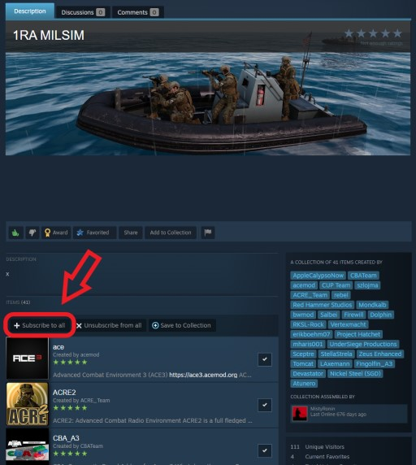
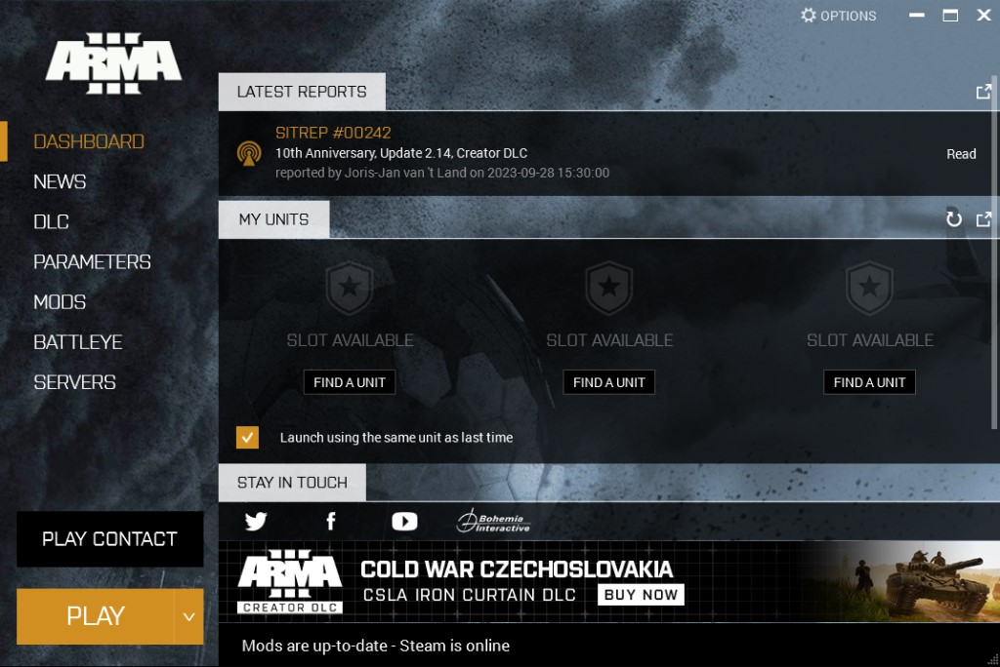
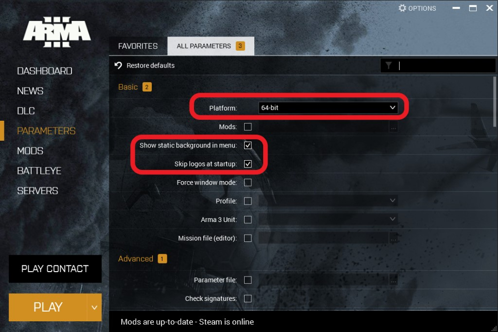
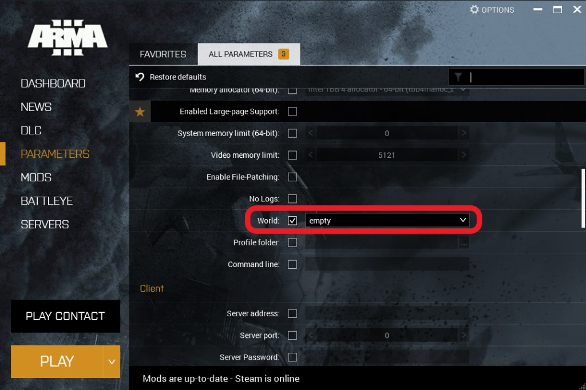

# Pas 2: Descàrrega de mods

El següent pas es descarregar-te els mods que utilitzem per les nostres partides. Aquests son gratuïts i ens permeten disposar d'una gran varietat de material, armament i mapes per les nostres missions.

## Steam Workshop

Per poder descarregar els mods cal que vagis al següent enllaç de la `Steam Workshop` i facis clic al botó `Subscribe to all`.

[Llista de mods oficials](https://steamcommunity.com/sharedfiles/filedetails/?id=3166393484)

{: .center}

La descàrrega dels mods es fa automàticament en segon pla, com qualsevol altre joc de Steam.

## Paquets de compatibilitat

Si disposes dels DLC `S.O.G Prairie Fire` i `Western Sahara`, et pots saltar aquest pas. En cas contrari caldrà que et subscriguis als següents `paquets de compatibilitat`:

[ArmA 3 S.O.G Prairie Fire](https://steamcommunity.com/sharedfiles/filedetails/?id=2477276806)

[ArmA 3 Western Sahara](https://steamcommunity.com/sharedfiles/filedetails/?id=2636962953)

Es important que només et subscriguis al paquet del DLC que no tinguis comprat, si més endavant el compres hauràs de cancel·lar la subscripció.

## Configuració del llançador

Un cop hagi finalitzat la descàrrega de mods, cal que configuris les opcions de llançament de l'Arma 3.

1- Obre `Arma 3` des de `Steam`. Veuràs que s'obre una finestra com la següent:

{: .center}

Espera que carregui els mods.

2- Fes clic al botó `Battleye` i desmarca la casella `Enable Battleye anti-cheat software`.

{: .center}

3- Fes clic al botó `Parameters` i seguidament a la pestanya `All parameters`.

{: .center}

Assegura't que `Platform` està a `64-bit`.

Marca les caselles `Show static background in menu` i `Skip logos at startup`.

4- Desplaçat més avall, marca l'opció `World` i seguidament sel·lecciona `empty` al desplegable.

{: .center}

[Següent pas >](http://arma.cavallersdelcel.cat/gn/pas3)
