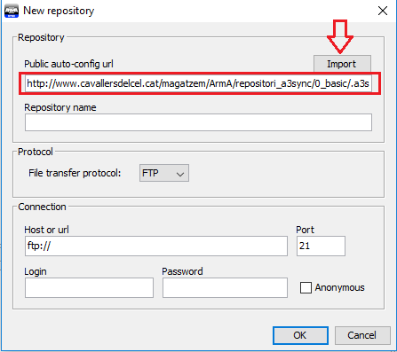
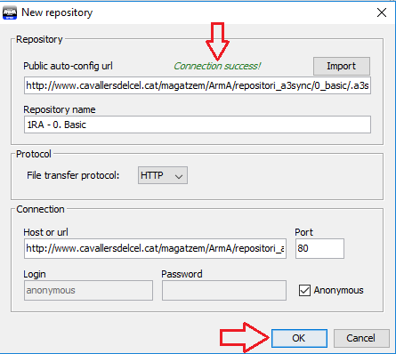
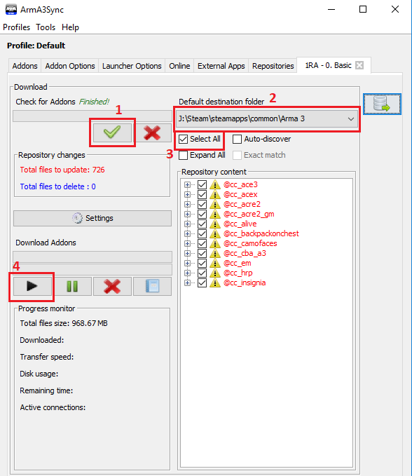
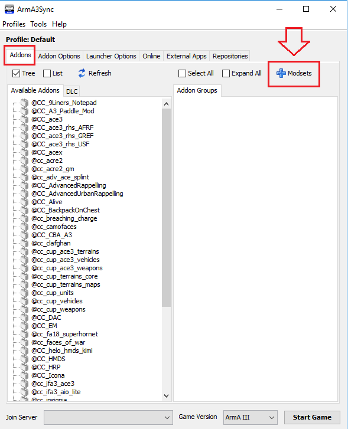
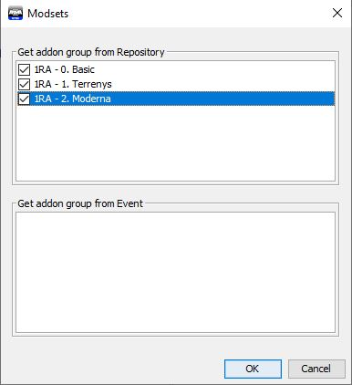
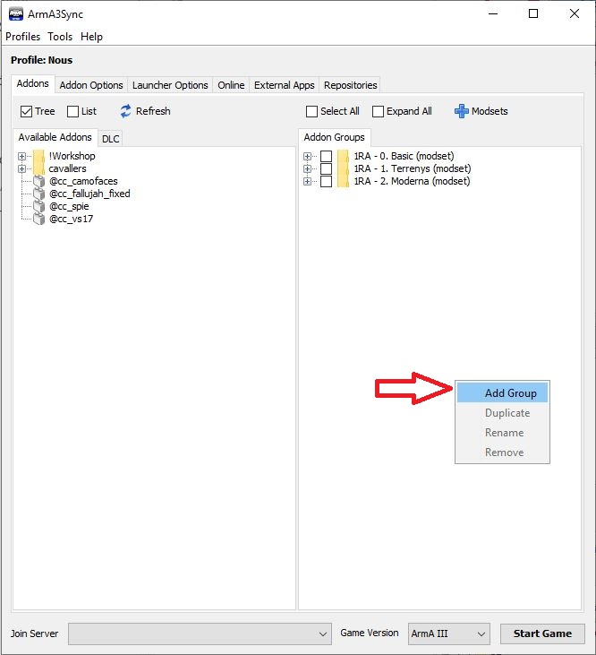

# Pas 5: Descàrrega de mods

El següent pas es descarregar-te els mods que utilitzem per les nostres partides. Aquests son gratuïts i ens permeten disposar d'una gran varietat de material, armament i mapes per les nostres missions.

## Instal·lació ArmA3Sync

Per poder descarregar els mods cal que instal·lis l'aplicació ArmA3Sync.

* Podeu descarregar l'última versió de l'Arma3Sync a través d'[aquest enllaç](http://hosted.anrop.se/arma3sync.exe).
* *Requereix [Java](http://www.java.com/en/download) per funcionar.*

Un cop instal·lat el programa, quan l'executis és possible que et pregunti on tens instal·lat l'ArmA 3. Li has d'indicar la carpeta arrel de l'Arma 3, sovint es troba dintre de la carpeta Steam `...\Steam\SteamApps\common\Arma 3`. Si has de seleccionar l'executable del simulador, assegura't de seleccionar el de 64 bits, es a dir `arma3_x64.exe`.

## Configuració ArmA3Sync

Fet això, escollirem la carpeta on vols descarregar els "addons". Aquesta carpeta pot ser a qualsevol lloc, inclús en un disc dur diferent al que tens instal·lat l'ArmA 3.

Per a fer-ho ves a la pestanya `Addon Options` i dins del requadre `Addon Search Directories` clica el botó `+` que hi ha a la dreta i selecciona el directori que vulguis. Si no saps quin seleccionar, pots seleccionar el mateix de l'ArmA 3.

{: .center}

Un cop fet això, has d'establir les opcions de llançament. Clica la pestanya `Launcher Options`.

{: .center}

A les opcions de l'esquerra marca `No Splash Screen` i `Default World Empty`. A la casella de la dreta, escriu `-skipintro`.

Aprofita per verificar que l'executable de l'ArmA 3 sigui `arma3_x64.exe`.

## Descàrrega

A partir d'aquí has de configurar i descarregar tots els nostres repositoris de mods. Has de repetir els passos següents per a cadascun dels següents repositoris:

`http://www.cavallersdelcel.cat/magatzem/ArmA/repositori_a3sync/0_basic/.a3s/autoconfig`

`http://www.cavallersdelcel.cat/magatzem/ArmA/repositori_a3sync/1_terrain/.a3s/autoconfig`

`http://www.cavallersdelcel.cat/magatzem/ArmA/repositori_a3sync/2_moderna/.a3s/autoconfig`

1- Has d'anar a la pestanya del final, `Repositories`. Fes clic al primer botó, el signe + blau.

{: .center}

2- A la primera casella has de posar l'adreça del repositori i clicar el botó `Import`.

{: .center}

3- Això farà que s'omplin les caselles restants. Ara només queda clicar `Ok`.

{: .center}

4- Per accedir al repositori que acabes de configurar, selecciona’l a la llista i fes clic al botó de la fletxa blava.

Nota: Si ho desitges, pots marcar les caselles `Notify` i `Auto` per a que t'avisi de quan hi ha novetats i intenti actualitzar-lo de forma automàtica. Tingues present que solem avisar amb antelació quan cal actualitzar.

{: .center}

5- Ja al repositori, has clicar el botó verd `Check for addons`. Aquest comprova si tens els mods descarregats correctament. Després comprova que tens seleccionada la adreça on es descarregaran els mods. Marca la casella `Select All` i seguidament clica el botó `Play`.

{: .center}

Més endavant quan hagis d'actualitzar els mods, hauràs de seguir el mateix procés.

## Configuració dels modsets

Un cop tinguis els mods descarregats, és el moment de configurar els modsets.

Per a configurar els modsets simplement has d'anar a la pestanya `Addons` i clicar el botó `Modsets`.

{: .center}

S'obrirà una finestra com la següent. Marca totes les caselles i clica `Ok`.

{: .center}

Fes clic dret al requadre de la dreta i crea una carpeta nova que es digui `GM`.

{: .center}

Seguidament fes clic a la pestanya `DLC` (requadre de l'esquerra) i arrossega `GM` dins el grup `GM`.

{: .center}

Ja gairebé ho tens!

[Següent pas >](http://arma.cavallersdelcel.cat/gn/pas6)
