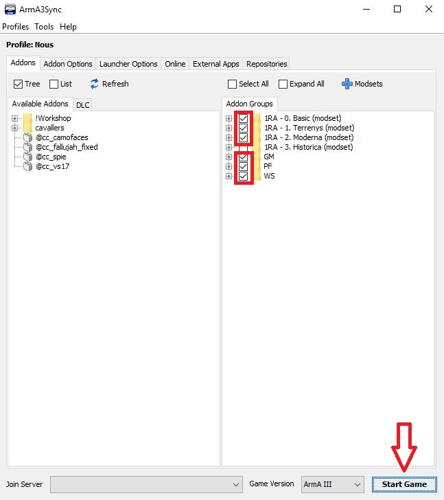

# Pas 8: Instal·lació de l'ACRE2

*Abans de seguir aquest pas has d'assegurar-te que tens instal·lada l'aplicació `TeamSpeak 3`. I que no està **oberta**.*

L'ACRE2 és un "mod" per simular comunicacions de ràdio i veu. Utilitza TeamSpeak 3 com a servidor de veu.

Per fer-lo servir és necessari instal·lar un `plugin`. Aquest plugin s'instal·larà de forma automàtica quan arranquem el simulador amb el mod ACRE2 posat.

Per fer-ho, dins de l'ArmA3Sync has de sel·leccionar les caselles del modset `Basic` i `Global Mobilization`, i seguidament `Start Game`.

{: .center}

Espera a que l'ArmA 3 carregui. En un moment donat, apareixerà el següent missatge informant que l'ACRE2 s'ha instal·lat correctament:

{: .center}

Un cop instal·lat i sense apagar l'ArmA 3, obre el TeamSpeak 3 i connecta't al servidor de Cavallers del Cel.

Servidor: ts.cavallersdelcel.cat

Contrasenya: *demana-la als companys*

Fixa't en l'apartat de la dreta, t'ha d'apareixer quelcom simil·lar això:

{: .center}

Si és així, ja ho tens.

[Següent pas >](http://arma.cavallersdelcel.cat/gn/pas9)
